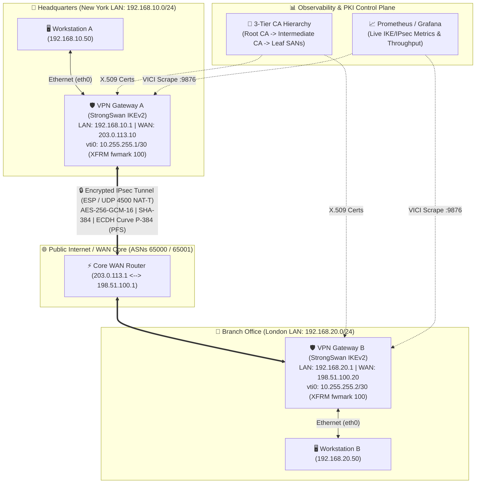

# TunnelPoint — Enterprise Secure Site-to-Site VPN Platform 🛡️🚀

[](.github/workflows/ci.yml)
[](config/strongswan.conf)
[](pki/openssl.cnf)
[](cloud/)
[](monitoring/)

**TunnelPoint** is a complete, production-grade, enterprise Site-to-Site VPN platform and engineering reference architecture built from first principles. Designed for network engineers, cybersecurity architects, DevOps specialists, and site reliability engineers, this repository provides an exhaustive 27-part engineering masterclass, a self-contained 5-node simulation lab, automated PKI infrastructures, kernel hardening suites, and multi-cloud Infrastructure-as-Code blueprints.

---

## 🏛️ System Architecture Diagram



---

## ✨ Enterprise Feature Matrix

* **Zero-Legacy Cryptography**: Enforces IKEv2 strictly. Prohibits IKEv1, 3DES, MD5, SHA-1, and ModP Diffie-Hellman. Uses **AES-256-GCM-16**, **SHA-384**, and **ECDH Curve P-384 (NIST Group 20)**.
* **100% Perfect Forward Secrecy (PFS)**: Negotiates independent ephemeral Diffie-Hellman keys for every Phase 2 (`CHILD_SA`) rekeying event.
* **Route-Based Virtual Tunnel Interfaces (VTI / XFRM)**: Replaces legacy policy-based IPsec with modern kernel Netlink XFRM interfaces (`vti0` tied to `fwmark 100`) and Policy-Based Routing (`ip rule`).
* **Zero-Trust Perimeter Firewall**: Hardened `iptables` / `nftables` rulesets dropping all default traffic, enforcing TCP MSS Clamping (`--clamp-mss-to-pmtu`), and managing NAT IPsec exemptions.
* **3-Tier Offline/Online PKI**: Automated generation of an air-gapped Root CA, online Intermediate CA, and X.509v3 SAN leaf certificates with PKCS#12 client bundles.
* **Observability Stack**: Custom Python StrongSwan VICI metrics exporter scraping live SAs, rekey timers, and packet throughput directly into Prometheus and Grafana.
* **Multi-Cloud IaC Blueprints**: Production Terraform code for deploying automated gateways into AWS VPC Transit Gateway and Azure VNet VPN Gateway.

---

## 🚀 Quick Start: Spin Up the 5-Node Lab in 3 Steps!

You can launch the entire simulated enterprise network on any Linux, macOS, or Windows machine running Docker Compose:

### Step 1: Generate the Enterprise PKI Hierarchy
```bash
chmod +x pki/scripts/generate_pki.sh
sudo bash pki/scripts/generate_pki.sh
```

### Step 2: Launch the 5-Node Simulation Lab
```bash
cd docker
docker compose up -d --build
```

### Step 3: Execute the Automated Tunnel Verification Suite!
```bash
chmod +x docker/scripts/test_tunnel.sh
sudo bash docker/scripts/test_tunnel.sh
```
*This script will load VICI configs, initiate the IKEv2 tunnel, verify kernel XFRM SAD/SPD entries, execute end-to-end pings between LAN hosts, run an `iperf3` bandwidth benchmark, and perform a wire-speed packet capture proving 100% encryption!*

---

## 📚 The 27-Part Engineering Curriculum

Explore the comprehensive theoretical foundation and technical documentation in `/docs/curriculum/`:

| Part | Module Title | File Link |
| :---: | :--- | :--- |
| **01** | Networking Fundamentals & OSI Model | [01-networking-fundamentals.md](docs/curriculum/01-networking-fundamentals.md) |
| **02** | TCP/IP Architecture & Subnetting | [02-tcp-ip-and-subnetting.md](docs/curriculum/02-tcp-ip-and-subnetting.md) |
| **03** | Routing, Switching & BGP Basics | [03-routing-and-switching.md](docs/curriculum/03-routing-and-switching.md) |
| **04** | Linux Networking & Virtual Devices | [04-linux-networking.md](docs/curriculum/04-linux-networking.md) |
| **05** | Kernel vs. User Space & sk_buff | [05-kernel-user-space.md](docs/curriculum/05-kernel-user-space.md) |
| **06** | Cryptography & Perfect Forward Secrecy | [06-cryptography-fundamentals.md](docs/curriculum/06-cryptography-fundamentals.md) |
| **07** | Comparative VPN Technologies | [07-vpn-technologies.md](docs/curriculum/07-vpn-technologies.md) |
| **08** | IPsec Deep Dive (RFC 4301 / IKEv2) | [08-ipsec-deep-dive.md](docs/curriculum/08-ipsec-deep-dive.md) |
| **09** | Stateful Firewalls, IDS & IPS | [09-firewall-ids-ips.md](docs/curriculum/09-firewall-ids-ips.md) |
| **10** | TLS 1.3 vs. IPsec & HTTPS | [10-tls-and-https.md](docs/curriculum/10-tls-and-https.md) |
| **11-13** | Architecture & Installation Guide | [architecture.md](docs/architecture.md) & [installation.md](docs/installation.md) |
| **14-18** | PKI, StrongSwan & Docker Lab | [pki/](pki/) & [config/](config/) & [docker/](docker/) |
| **19-20** | Troubleshooting & Security Hardening | [troubleshooting.md](docs/troubleshooting.md) & [security-hardening.md](docs/security-hardening.md) |
| **21-25** | Monitoring, Cloud IaC & CI/CD | [monitoring/](monitoring/) & [cloud/](cloud/) & [.github/](.github/) |
| **26-27** | Career Guide & Interview Preparation | [career/](career/) |

---
*Built with passion for engineering excellence by the TunnelPoint Architecture Team.*
