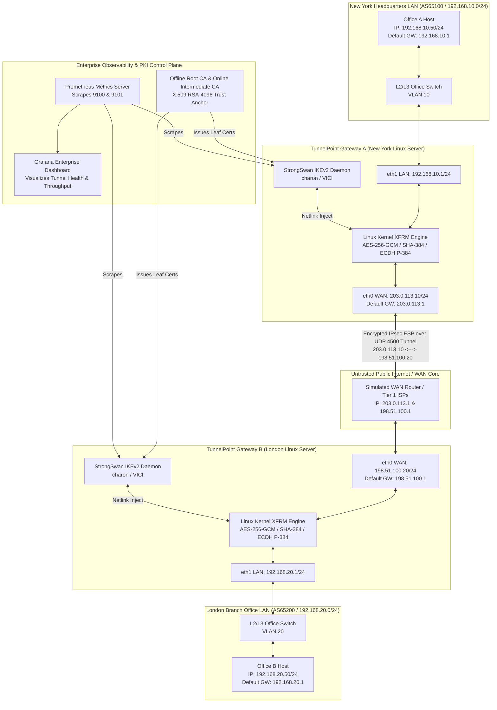

# TunnelPoint System Architecture & Setup Guide (PARTS 11, 12, 13)

## 1. Enterprise Project Architecture (PART 11)
**TunnelPoint** is engineered as a highly resilient, zero-trust, production-grade **Site-to-Site IPsec VPN Platform** connecting two independent enterprise networks across an untrusted public WAN (the Internet or Cloud Transit Gateway).



### Master IP Addressing & Network Schema Table

| Node / Device Name | Network Role & Location | Interface Name | Assigned IP Address & Subnet Mask | Default Gateway | Primary Function & Cryptographic Role |
| :--- | :--- | :--- | :--- | :--- | :--- |
| **Host A (`host-a`)** | New York LAN Endpoint | `eth0` | `192.168.10.50 / 255.255.255.0` (`/24`) | `192.168.10.1` | Simulates corporate workstation/server sending plaintext data. |
| **Gateway A (`gateway-a`)** | New York VPN Gateway | `eth1` (LAN)<br>`eth0` (WAN) | `192.168.10.1 / 24`<br>`203.0.113.10 / 24` | `203.0.113.1` (WAN Router) | StrongSwan IKEv2 initiator/responder, XFRM encryption engine, iptables firewall. |
| **WAN Router (`router`)** | Public Internet WAN Core | `eth0`<br>`eth1` | `203.0.113.1 / 24`<br>`198.51.100.1 / 24` | None (IP Forwarding enabled) | Simulates public Internet routing between Autonomous Systems across ocean. |
| **Gateway B (`gateway-b`)** | London VPN Gateway | `eth0` (WAN)<br>`eth1` (LAN) | `198.51.100.20 / 24`<br>`192.168.20.1 / 24` | `198.51.100.1` (WAN Router) | StrongSwan IKEv2 responder/initiator, XFRM decryption engine, iptables firewall. |
| **Host B (`host-b`)** | London LAN Endpoint | `eth0` | `192.168.20.50 / 255.255.255.0` (`/24`) | `192.168.20.1` | Simulates remote corporate database/server receiving plaintext data. |

---

## 2. Environment Setup & Platform Analysis (PART 12)
Where should you deploy and test **TunnelPoint**? As an Infrastructure Architect, you must understand the trade-offs across six deployment environments:

### 1. Ubuntu Server LTS (Bare-Metal / Bare-OS)
* **Pros**: Direct Ring 0 hardware access, zero virtualization overhead, 100% access to physical NIC DMA ring buffers and hardware AES-NI acceleration. The absolute gold standard for production data center gateways.
* **Cons**: Requires physical hardware or dedicated servers; not portable for laptop development.

### 2. VirtualBox & VMware Workstation / ESXi (Hypervisor VMs)
* **Pros**: Full Linux kernel isolation per VM. You can install custom kernel modules and test real-world TAP interfaces.
* **Cons**: High RAM/CPU overhead (running 5 complete Linux OS kernels simultaneously consumes >4 GB RAM). Requires complex virtual bridge and host-only adapter bridging configurations.

### 3. Docker & Docker Compose (Our Local Testing Lab Selection!)
* **Pros**: **Extreme efficiency and portability!** Uses Linux Network Namespaces (`netns`) and Virtual Ethernet pairs (`veth`) to run 5 isolated network nodes (`gateway-a`, `gateway-b`, `host-a`, `host-b`, `router`) in sub-seconds using under 200 MB of RAM!
* **Cons**: Containers share the underlying host Linux kernel. To run IPsec XFRM and iptables inside a container, you MUST grant the container `NET_ADMIN` capability and access to `/dev/net/tun`!

### 4. AWS (Amazon Web Services VPC & Transit Gateway)
* **Pros**: Enterprise cloud scale. Deploy Gateway A as an EC2 instance (or native AWS Site-to-Site VPN) connected to an AWS Transit Gateway or Virtual Private Gateway (VGW) using BGP over IPsec VTI!
* **Cons**: Cloud hosting hourly costs; requires AWS IAM and VPC routing table configuration (disabling Source/Dest Check on EC2 ENIs!).

### 5. Microsoft Azure (VNet & Virtual Network Gateway)
* **Pros**: Native integration with Azure Active Directory / Entra ID and Azure Virtual Network Gateways using IKEv2 Route-Based VPNs.
* **Cons**: Azure VPN gateways take 30–45 minutes to provision and carry fixed hourly pricing.

---

## 3. Step-by-Step Installation Guide (PART 13)
Whether installing on a bare-metal Ubuntu Server 24.04 LTS gateway or building our custom Docker container images, every single package required for **TunnelPoint** is installed and verified below with complete line-by-line explanations.

### Master Installation Script (`/docs/installation.md` & Docker Setup)
```bash
#!/usr/bin/env bash
# TunnelPoint Complete Package Installation & Hardening Script
# Target OS: Ubuntu 24.04 LTS / Debian 12 / Linux Container

set -euo pipefail

echo "===> [Step 1] Updating system package repositories and upgrading core libraries..."
# -y: Answer yes automatically; --no-install-recommends: Avoid installing unnecessary documentation/X11 packages
sudo apt-get update -y
sudo apt-get upgrade -y

echo "===> [Step 2] Installing StrongSwan IKEv2 / IPsec Daemon and Cryptographic Plugins..."
# strongswan: The core user-space IKEv2 key exchange daemon (charon)
# strongswan-pki: OpenSSL/StrongSwan PKI utility for generating Root CA and X.509 leaf certificates
# libcharon-extra-plugins: Essential cryptographic plugins (SHA-384, ChaCha20, Curve25519, OpenSSL, VICI)
# libcharon-extauth-plugins: Plugins for enterprise EAP / RADIUS / Active Directory authentication
# libstrongswan-standard-plugins: Core encryption ciphers (AES-GCM, HMAC, MODP)
sudo apt-get install -y --no-install-recommends \
    strongswan \
    strongswan-pki \
    libcharon-extra-plugins \
    libcharon-extauth-plugins \
    libstrongswan-standard-plugins

echo "===> [Step 3] Installing Linux Networking Stack, Routing, and Firewall Utilities..."
# iproute2: Modern Linux network administration suite (ip link, ip route, ip rule, ss, bridge)
# iptables & iptables-persistent: Legacy Netfilter firewall administration and boot-time rule saving
# nftables: Modern high-speed Linux kernel packet filtering engine ($O(1)$ lookup maps)
# net-tools: Legacy utilities (ifconfig, netstat, arp - installed for backward compatibility testing)
# ethtool: Physical NIC hardware inspection (DMA ring buffers, speed, duplex, offloading flags)
# conntrack: CLI utility to inspect real-time Netfilter stateful connection tracking tables in RAM
sudo apt-get install -y --no-install-recommends \
    iproute2 \
    iptables \
    iptables-persistent \
    nftables \
    net-tools \
    ethtool \
    conntrack

echo "===> [Step 4] Installing Network Diagnostic, Packet Capturing, and Troubleshooting Tools..."
# tcpdump: Command-line wire-speed packet capture analyzer (essential for debugging IKE and ESP packets!)
# tshark: Wireshark command-line network protocol analyzer (deep packet dissection)
# iputils-ping & traceroute: ICMP Echo and TTL hop-tracing diagnostics
# mtr: Modern combined ping and traceroute diagnostic tool
# curl & wget: HTTP application-layer data transfer testing utilities
# iperf3: High-speed TCP/UDP network bandwidth and jitter benchmarking tool
sudo apt-get install -y --no-install-recommends \
    tcpdump \
    tshark \
    iputils-ping \
    traceroute \
    mtr-tiny \
    curl \
    wget \
    iperf3

echo "===> [Step 5] Installing Observability & Monitoring Agents..."
# prometheus-node-exporter: Scrapes Linux system metrics (CPU, RAM, NIC network throughput, conntrack table size)
# python3 & python3-pip: Required to run our custom StrongSwan VICI Prometheus Metric Exporter!
sudo apt-get install -y --no-install-recommends \
    prometheus-node-exporter \
    python3 \
    python3-pip \
    python3-vici

echo "===> [Step 6] Verifying Daemon Installations and Version Compliance..."
strongswan --version || charon --version
ip -V
iptables --version
nft --version
tcpdump --version
python3 -c "import vici; print('StrongSwan VICI Python library successfully loaded!')"

echo "===> Installation Complete! All TunnelPoint dependencies are installed and verified."
```
