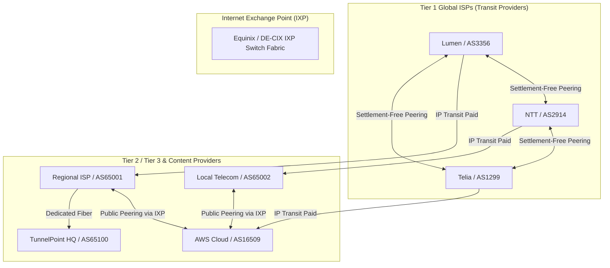
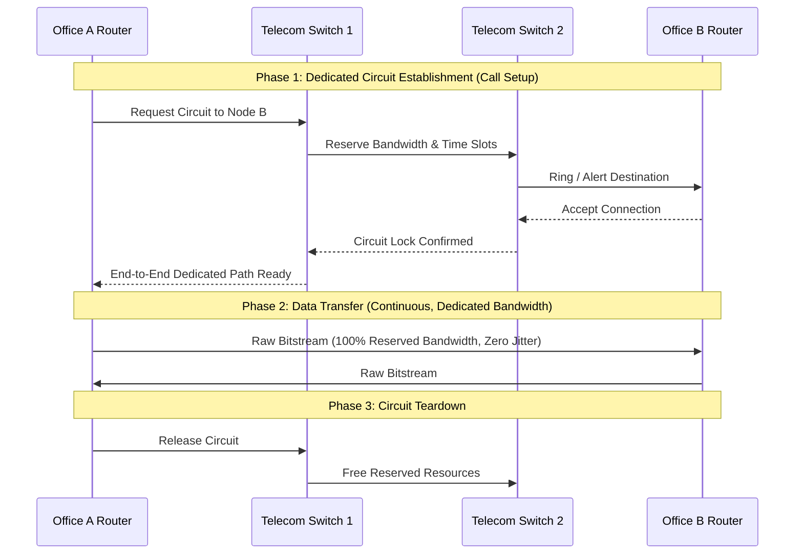
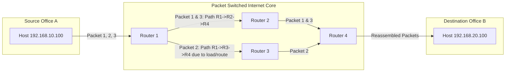
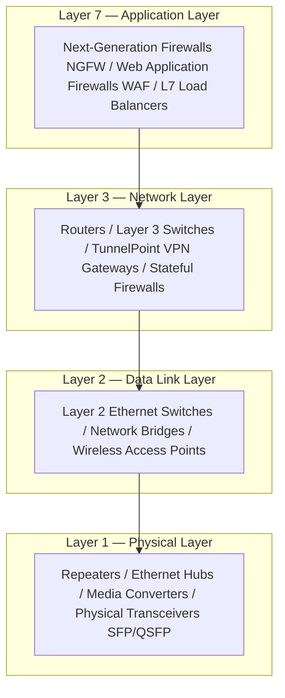

# PART 1 — Networking Fundamentals

## 1. What is Networking?
At its absolute core, **computer networking** is the engineering discipline of interconnecting autonomous computing systems to exchange data, share hardware/software resources, and provide distributed services. 

From a physics and information-theory standpoint, networking is the serialization of digital data (0s and 1s) into physical phenomena—such as electrical voltage transitions over copper wires, photons pulsing through fiber-optic cables, or electromagnetic radio waves propagating through the air—transmitting them across distance, and reliably reconstructing those digital bits at the receiver.

### Core Metrics of Network Performance
To engineer enterprise platforms like **TunnelPoint**, you must master five fundamental metrics that govern all network behavior:

1. **Bandwidth**: The theoretical maximum data transfer capacity of a network channel over a given timeframe, measured in bits per second (bps, Mbps, Gbps). *Analogy: The physical width of a highway.*
2. **Throughput**: The actual, measured rate of successful data delivery over the network channel after accounting for protocol overhead, packet loss, hardware limitations, and traffic congestion. Throughput is always less than or equal to bandwidth. *Analogy: The actual number of cars passing a toll booth per minute during rush hour.*
3. **Latency (Delay)**: The time it takes for a data packet to travel from the source node to the destination node, measured in milliseconds (ms) or microseconds (µs). Total latency is the sum of four distinct components:
   $$\text{Latency} = \text{Propagation Delay} + \text{Transmission Delay} + \text{Processing Delay} + \text{Queuing Delay}$$
   * **Propagation Delay**: Time taken for the physical signal to traverse the medium ($\frac{\text{Distance}}{\text{Speed of Light in Medium}}$). Over fiber, light travels at roughly $2 \times 10^8$ m/s ($2/3$ the speed of light in a vacuum).
   * **Transmission Delay**: Time required to push all bits of the packet onto the wire ($\frac{\text{Packet Size in Bits}}{\text{Channel Bandwidth in bps}}$).
   * **Processing Delay**: Time taken by a router or switch CPU/ASIC to inspect the packet header, check for bit errors, perform route table lookups, and determine the output interface.
   * **Queuing Delay**: Time a packet spends sitting in a router or switch output buffer waiting for the physical transmission channel to become free during periods of congestion.
4. **Jitter**: The variation in packet arrival times (latency variance). If Packet 1 takes 20ms, Packet 2 takes 50ms, and Packet 3 takes 15ms, high jitter exists. Jitter is devastating to real-time protocols like Voice over IP (VoIP), video conferencing, and synchronous database replication.
5. **Packet Loss**: The percentage of data packets transmitted by the source that fail to reach the destination. Causes include router buffer overflows (tail-drop during congestion), physical media noise/corruption, or intentional firewall/ACL drops.

---

## 2. Internet Architecture & Autonomous Systems
The **Internet** is not a single cloud; it is a decentralized, hierarchical "network of networks." It is composed of tens of thousands of independently operated networks called **Autonomous Systems (AS)**.

### Autonomous Systems (AS) and BGP
An **Autonomous System** is a collection of IP routing prefixes under the administrative control of one distinct entity (such as an ISP, enterprise corporation, university, or cloud provider like Google or AWS) presenting a common, clearly defined routing policy to the Internet.
* Each AS is assigned a unique **Autonomous System Number (ASN)** by a Regional Internet Registry (RIR) such as ARIN, RIPE NCC, or APNIC. ASNs are 16-bit or 32-bit integers (e.g., AS15169 is Google, AS16509 is AWS).
* Autonomous Systems interconnect and exchange routing tables using the **Border Gateway Protocol (BGP — specifically Exterior BGP / eBGP)**. BGP is the "glue" of the Internet, routing traffic based on path attributes, business relationships, and network policies rather than simple technical metrics like hop count.



### The ISP Hierarchy: Peering vs. Transit
The economic and routing topology of the Internet is divided into three tiers based on **Peering** and **Transit** relationships:
* **IP Transit (Customer-Provider Relationship)**: A smaller network pays a larger network for access to the rest of the Internet. The transit provider advertises the customer's IP routes to the entire global routing table.
* **Peering (Settlement-Free Peering)**: Two networks of roughly equal size and traffic volume agree to connect directly and exchange traffic destined *only* for each other and their respective customers without paying transit fees.
* **Tier 1 ISPs**: Global network operators (e.g., Lumen, NTT, Telia, Tata Communications) whose physical networks span continents. Tier 1 ISPs do not pay anyone for IP transit; they reach every other network on Earth solely through settlement-free peering with other Tier 1 providers.
* **Tier 2 ISPs**: Regional or national providers that peer with other Tier 2 networks at **Internet Exchange Points (IXPs)** but must purchase IP transit from Tier 1 providers to reach global destinations.
* **Tier 3 ISPs**: Local retail ISPs that provide last-mile connectivity to residential and enterprise customers. They purchase 100% of their upstream connectivity from Tier 1 and Tier 2 providers.
* **Internet Exchange Points (IXPs)**: Physical data centers containing massive Ethernet switching fabrics where hundreds of ISPs, CDNs, and cloud providers physically connect their routers to peer traffic locally, reducing latency and avoiding transit costs.

---

## 3. Client-Server Model vs. Peer-to-Peer (P2P)
In distributed network systems, application architectures generally follow either the **Client-Server** or **Peer-to-Peer** paradigm.

### The Client-Server Model
The **Client-Server model** is an asymmetric architecture where computing roles are divided between service requesters (**Clients**) and service providers (**Servers**).
* **The Server**: A high-availability, always-on host running daemon software listening on a specific network port (e.g., TCP port 443 for HTTPS, UDP port 500 for IPsec IKE). The server manages shared resources, database state, cryptographic keys, and authentication. It must scale horizontally or vertically to handle concurrent requests.
* **The Client**: An ephemeral or user-facing device (laptop, smartphone, branch router) that initiates requests to the server's IP address and port. Clients do not communicate directly with other clients; all state and data flow through the authoritative server.
* **In TunnelPoint**: Our Site-to-Site VPN architecture uses a peer-to-peer relationship at the network layer (both gateways are peers), but during phase initiation, the gateway initiating the IKE connection acts as the **Initiator (Client)** while the receiving gateway acts as the **Responder (Server)**. Furthermore, remote-access workers connecting to TunnelPoint act as strict clients connecting to the VPN Gateway server.

### Peer-to-Peer (P2P) Architecture
In a **Peer-to-Peer (P2P)** network (e.g., BitTorrent, Bitcoin, WebRTC, mesh VPNs like Tailscale/Tinc), all nodes (**Peers**) are symmetric. Every node functions simultaneously as both a client and a server. There is no central authority; data distribution, routing, and state maintenance are decentralized across the mesh.

---

## 4. Circuit Switching vs. Packet Switching

How does data travel from Point A to Point B across a complex intermediate network? Historical and modern telecommunications rely on two fundamentally different switching paradigms.

### Circuit Switching
**Circuit Switching** is the foundational technology of the legacy Public Switched Telephone Network (PSTN), T1/E1 leased lines, and ISDN.



* **Mechanism**: Before any data is transmitted, an end-to-end dedicated physical or logical path (circuit) must be established across all intermediate switches during a "call setup" phase. Once established, a fixed slice of bandwidth (e.g., a 64 kbps time-slot in TDM) is reserved exclusively for this connection.
* **Advantages**:
  * **Deterministic Performance**: Zero queuing delay, zero packet loss from congestion, and absolute zero jitter. The latency is purely the propagation delay of the wire.
  * **In-Order Delivery**: Bits arrive in the exact order they were transmitted because they follow an identical physical path.
* **Disadvantages**:
  * **Catastrophic Inefficiency**: If Node A and Node B pause sending data for 10 minutes, that reserved bandwidth sits 100% idle and cannot be used by anyone else.
  * **Setup Latency**: Establishing the circuit takes hundreds of milliseconds or seconds before the first byte of payload data can move.
  * **Fragility**: If a single intermediate switch or cable along the dedicated path fails, the entire connection terminates immediately and must be re-established from scratch.

### Packet Switching
**Packet Switching** is the foundation of the modern Internet, Ethernet, TCP/IP, and our **TunnelPoint VPN Platform**.



* **Mechanism**: Data streams are chopped into discrete chunks called **Packets** (typically up to 1500 bytes in Ethernet). Each packet is self-contained: its header contains the source IP address, destination IP address, sequence numbers, and protocol flags. Packets are injected into the shared network without any prior circuit setup.
* **Store-and-Forward & Statistical Multiplexing**: Intermediate routers receive a packet, store it in memory, inspect its destination header, consult their routing table, and forward it out the optimal interface toward the destination. Because multiple users share the same transmission lines on demand (**Statistical Multiplexing**), network utilization approaches 100%.
* **Advantages**:
  * **Extreme Efficiency & Scalability**: No bandwidth is wasted on idle connections. Billions of devices share the same backbone links dynamically.
  * **Resilience & Fault Tolerance**: If Router 2 crashes or a fiber cable is cut, dynamic routing protocols (like OSPF or BGP) instantly recalculate alternative paths (e.g., via Router 3), and subsequent packets route around the failure without terminating the application session.
  * **Zero Setup Delay**: Data transmission begins immediately on the first packet.
* **Disadvantages**:
  * **Variable Latency & Jitter**: Because packets share buffers in routers, heavy traffic congestion causes queuing delays, jitter, and out-of-order packet arrival.
  * **Packet Loss**: If a router's memory buffer fills up during a traffic spike, it must drop incoming packets (**Tail-Drop**).

> **Why TunnelPoint Uses Packet Switching**: Site-to-Site VPNs must operate over the public Internet. By encapsulating private office packets inside public UDP/IPsec packets, TunnelPoint leverages the immense fault tolerance and global reach of packet-switched Internet routing while using cryptography to create a "virtual private circuit."

---

## 5. In-Depth Hardware & Network Equipment Breakdown
To understand where a VPN Gateway sits in the enterprise network topology, you must understand the exact mechanical, electrical, and algorithmic operation of every piece of networking hardware across the OSI stack.



### 1. Repeaters (Layer 1 — Physical Layer)
* **Operation**: As electrical signals or light pulses travel through physical media (copper wire or fiber), they suffer from **Attenuation** (loss of signal strength over distance) and electromagnetic noise degradation. A repeater is a pure two-port physical device that receives an attenuated signal on Port 1, cleans up the electrical waveform, amplifies/regenerates it to full voltage/optical power, and retransmits it out Port 2.
* **Intelligence**: **Zero logical awareness**. A repeater does not know what a MAC address, an IP address, or an Ethernet frame is. It operates strictly on raw electrical voltage transitions or photon pulses. If it receives an electrical noise spike or a corrupted packet, it amplifies and retransmits the corruption.

### 2. Hubs (Layer 1 — Physical Layer)
* **Operation**: An Ethernet **Hub** is simply a multi-port repeater. When an electrical signal representing a data frame enters Port 1 of a 24-port hub, the hub's internal circuitry amplifies the electrical signal and broadcasts it out **every other port simultaneously** (Ports 2 through 24).
* **Broadcast Domain vs. Collision Domain**:
  * **Collision Domain**: A network segment where simultaneous data transmissions by two or more devices collide electrically on the wire, destroying both waveforms. **A hub creates a single, massive collision domain across all its ports.**
  * **Broadcast Domain**: A logical network segment where any computer can directly reach any other computer via a Layer 2 broadcast MAC address (`FF:FF:FF:FF:FF:FF`). A hub represents one single broadcast domain.
* **CSMA/CD & Half-Duplex**: Because all devices attached to a hub share the exact same electrical collision domain, devices must operate in **Half-Duplex** (they can either transmit or receive at any given nanosecond, but never both simultaneously). They use **CSMA/CD (Carrier Sense Multiple Access with Collision Detection)**:
  1. *Carrier Sense*: The network interface card (NIC) listens to the wire. If voltage is present, the wire is busy; wait.
  2. *Multiple Access*: If the wire is idle, multiple nodes can attempt to transmit simultaneously.
  3. *Collision Detection*: If two NICs transmit at the exact same nanosecond, the voltages collide and spike above normal thresholds. Both NICs detect the collision, instantly abort transmission, broadcast a 32-bit "Jam Signal" to force all devices to recognize the collision, and enter an exponential backoff algorithm (waiting a random number of microseconds before attempting retransmission).
* **Why Hubs are Obsolete**: In a 24-port hub, effective network throughput drops by over 50–80% under moderate load due to constant collisions and exponential backoffs. Furthermore, from a cybersecurity standpoint, hubs are a security nightmare: any host plugged into the hub can run a packet sniffer (like Wireshark) in promiscuous mode and capture 100% of the traffic between all other computers on the LAN.

### 3. Bridges (Layer 2 — Data Link Layer)
* **Operation**: A **Bridge** was engineered to solve the catastrophic collision domain problem of hubs. A bridge is a two-port or multi-port device that operates at Layer 2. Unlike a repeater or hub, a bridge inspects the **Ethernet Header** of incoming frames.
* **MAC Address Learning & Filtering**:
  * The bridge maintains an internal **Bridge Table (MAC Address Table)** mapping MAC addresses to physical ports.
  * When Frame F arrives on Port 1 with Source MAC `00:11:22:33:44:AA` and Destination MAC `00:11:22:33:44:BB`:
    1. **Learning**: The bridge records in its memory: `"MAC 00:11:22:33:44:AA is reachable via Port 1"`.
    2. **Forwarding/Filtering Decision**: The bridge checks its table for Destination MAC `00:11:22:33:44:BB`.
       * If the table says `00:11:22:33:44:BB` is on Port 1 (the same port the frame arrived on), the bridge **drops (filters)** the frame! It knows the destination host is on the same local segment, so retransmitting it across the bridge is unnecessary.
       * If the table says `00:11:22:33:44:BB` is on Port 2, the bridge **forwards** the frame out Port 2.
       * If the destination MAC is not yet in the table (**Unknown Unicast**), or if it is a broadcast/multicast frame, the bridge **floods** the frame out all ports except the receiving port.
* **Domain Impact**: A bridge **breaks up collision domains** (each port of a bridge is a separate, isolated collision domain), but it **maintains a single broadcast domain** (broadcast frames are flooded across all ports).

### 4. Switches (Layer 2 & Layer 3)
A modern **Ethernet Switch** is essentially a high-density, wire-speed, multi-port bridge powered by specialized hardware ASICs.

#### Layer 2 Switches
* **Hardware ASICs & CAM Tables**: While legacy bridges used CPU software to perform MAC table lookups, modern switches use **Application-Specific Integrated Circuits (ASICs)** and **Content-Addressable Memory (CAM)**. A CAM table can take a 48-bit MAC address as input and return the corresponding egress port number in a single clock cycle ($O(1)$ lookup time), enabling switches to forward hundreds of millions of packets per second at absolute wire speed with sub-microsecond latency.
* **Full-Duplex Operation**: In a modern switched network, every device connects to a switch port via dedicated twisted-pair copper or fiber. Because switches isolate every single port into its own dedicated collision domain, collisions are physically impossible! Therefore, modern NICs and switch ports operate in **Full-Duplex mode** (transmitting and receiving data simultaneously at full bandwidth, e.g., 1 Gbps TX + 1 Gbps RX = 2 Gbps aggregate throughput per port). CSMA/CD is completely disabled and unused in full-duplex switched networks.
* **VLANs (Virtual Local Area Networks - IEEE 802.1Q)**: Switches allow engineers to logically partition a single physical switch into multiple independent broadcast domains called VLANs. A broadcast sent on VLAN 10 (e.g., Engineering LAN) is physically isolated by the switch ASICs and will never be forwarded to switch ports assigned to VLAN 20 (e.g., Finance LAN).
* **Spanning Tree Protocol (STP - IEEE 802.1D / RSTP 802.1w)**: In enterprise networks, redundant physical links are installed between switches for fault tolerance. However, at Layer 2, Ethernet headers do *not* have a Time-To-Live (TTL) field! If a physical loop exists, broadcast frames will circulate infinitely, multiplying at every switch until they consume 100% of network bandwidth and crash the switches—a catastrophic failure known as a **Broadcast Storm**. STP prevents this by electing a Root Bridge, calculating loop-free paths using Dijkstra's algorithm, and logically blocking redundant physical ports until a primary link fails.

#### Layer 3 Switches
* A **Layer 3 Switch** (often called a Multilayer Switch) combines the wire-speed Layer 2 MAC forwarding of a switch with the Layer 3 IP routing capabilities of a router inside hardware ASICs using **Ternary Content-Addressable Memory (TCAM)**. While traditional routers use CPUs to route packets between VLANs (inter-VLAN routing), a Layer 3 switch can route packets between VLANs at exact wire speed (e.g., 100 Gbps+) without CPU bottlenecks.

### 5. Routers (Layer 3 — Network Layer)
While switches interconnect devices within the *same* local network or broadcast domain, **Routers** are specialized computers designed to interconnect **disparate networks** and route packets across multiple logical subnets and broadcast domains.

* **Core Function**: A router represents the exact boundary of a broadcast domain. When a Layer 2 broadcast frame (`FF:FF:FF:FF:FF:FF`) hits a router interface, **the router drops it immediately**; routers never forward Layer 2 broadcasts.
* **The Routing Table (RIB vs. FIB)**:
  * **Routing Information Base (RIB)**: The control-plane database constructed by dynamic routing protocols (OSPF, BGP) or static administrator configurations. It contains all known network destinations, metrics, administrative distances, and next-hop gateways.
  * **Forwarding Information Base (FIB)**: The data-plane, hardware-compiled version of the RIB stored in high-speed ASIC memory (TCAM). When a data packet arrives at 100 Gbps, the router data plane consults the FIB directly without interrupting the main CPU.
* **Longest-Prefix Matching**: When a router receives an IP packet destined for `192.168.10.55`, it checks its routing table. If the table contains routes for both `192.168.0.0/16` and `192.168.10.0/24`, the router *always* selects the most specific route—the one with the longest subnet mask prefix (`/24` over `/16`).
* **Packet Rewriting Across Hops (Crucial Concept!)**:
  When Router R1 forwards a packet from LAN A to Router R2 on WAN B, what changes in the packet?
  1. **IP Header (Layer 3)**: The Source IP and Destination IP **DO NOT CHANGE** (unless NAT is being performed). They remain the end-to-end source and destination hosts.
  2. **TTL (Time-To-Live)**: The router decrements the IPv4 TTL field (or IPv6 Hop Limit) by 1. If TTL reaches 0, the router drops the packet and transmits an ICMP "Time Exceeded" error message back to the source IP. This prevents routing loops from circulating indefinitely at Layer 3!
  3. **IP Header Checksum**: Because the TTL field changed, the router recalculates and updates the IPv4 header checksum.
  4. **Ethernet Header (Layer 2)**: **THE ENTIRE LAYER 2 HEADER IS STRIPPED AND REWRITTEN!** The router strips off the incoming Ethernet frame header, creates a brand new Ethernet header where the **Source MAC** is the router's egress interface MAC address, and the **Destination MAC** is the next-hop router's MAC address (obtained via ARP), and recalculates the Layer 2 Frame Check Sequence (FCS) CRC trailer.

### 6. Firewalls (Layer 3 through Layer 7)
A **Firewall** is a security enforcement appliance or software subsystem deployed at network boundaries to monitor, filter, and control ingress and egress traffic based on predefined security policies.

* **Stateless Packet Filtering (Legacy / ACLs)**:
  * Evaluates each packet individually in isolation without any memory or context of previous packets or established connections.
  * Filters purely based on Layer 3 and Layer 4 header fields: Source IP, Destination IP, Protocol (TCP/UDP/ICMP), Source Port, and Destination Port.
  * *Vulnerability*: To allow a client inside the LAN to browse the web (port 443), a stateless firewall must explicitly have an inbound rule allowing *all* incoming traffic from *any* external IP on ports `1024-65535` back into the LAN! This leaves the network wide open to external port scanning and spoofed ACK scanning attacks.
* **Stateful Inspection (Connection Tracking / `conntrack`)**:
  * Pioneered by Check Point and implemented in Linux via Netfilter's `nf_conntrack` kernel module.
  * A stateful firewall maintains a dynamic, real-time **State Table (Connection Tracking Table)** in kernel memory tracking every active TCP, UDP, and ICMP flow.
  * When an internal employee at `192.168.10.50:54321` initiates a TCP connection to an external web server at `93.184.216.34:443`, the firewall validates the outbound SYN packet against outbound rules, creates a state entry marking the session as `NEW` $\rightarrow$ `ESTABLISHED`, and dynamically permits inbound return traffic matching `93.184.216.34:443` $\rightarrow$ `192.168.10.50:54321` **without requiring an explicit inbound firewall rule!** If an external attacker sends an unsolicited TCP ACK or SYN packet that does not match an existing state table entry, the stateful firewall drops it instantly.
* **Next-Generation Firewalls (NGFW) & Deep Packet Inspection (DPI)**:
  * NGFWs (e.g., Palo Alto Networks, Fortinet, Cisco Firepower) operate up to Layer 7 (Application Layer).
  * They perform **Deep Packet Inspection (DPI)**, decrypting TLS traffic (SSL Inspection / Man-in-the-Middle proxying), inspecting the actual application payload (e.g., differentiating between a legitimate HTTP GET request and an HTTP request tunneling BitTorrent or SSH traffic over port 80), enforcing User-ID based access control, and integrating real-time **Intrusion Prevention Systems (IPS)** to block zero-day malware signatures at wire speed.

### 7. VPN Gateways (The TunnelPoint Core)
A **VPN Gateway** (Virtual Private Network Gateway) is a specialized edge routing and cryptographic enforcement appliance (or software daemon like **StrongSwan** running on a hardened Linux server) deployed at the perimeter of an enterprise network or cloud VPC.

```mermaid
graph LR
    subgraph "Office A LAN (192.168.10.0/24)"
        HostA[Host A: 192.168.10.50]
    end

    subgraph "TunnelPoint Gateway A (Linux)"
        IntA[eth1 LAN: 192.168.10.1]
        ExtA[eth0 WAN: 203.0.113.10]
        XFRMA[Kernel XFRM Cryptographic Engine]
    end

    subgraph "Untrusted Public Internet"
        WAN[Public Routers & ISPs]
    end

    subgraph "TunnelPoint Gateway B (Linux)"
        ExtB[eth0 WAN: 198.51.100.20]
        IntB[eth1 LAN: 192.168.20.1]
        XFRMB[Kernel XFRM Cryptographic Engine]
    end

    subgraph "Office B LAN (192.168.20.0/24)"
        HostB[Host B: 192.168.20.50]
    end

    HostA -->|Plaintext IP: 192.168.10.50 -> 192.168.20.50| IntA
    IntA --> XFRMA
    XFRMA ==>|Encrypted IPsec ESP Packet: 203.0.113.10 -> 198.51.100.20| WAN
    WAN ==>|Encrypted IPsec ESP Packet| ExtB
    ExtB --> XFRMB
    XFRMB -->|Decrypted Plaintext IP: 192.168.10.50 -> 192.168.20.50| IntB
    IntB --> HostB
```



#### Why VPN Gateways Exist
When an enterprise has two physical offices (e.g., New York Headquarters at `192.168.10.0/24` and London Branch at `192.168.20.0/24`), those RFC 1918 private IPv4 addresses **cannot be routed over the public Internet**. If a router on the Internet receives a packet destined for `192.168.20.50`, it drops it immediately as a non-routable private bogon address.
Furthermore, transmitting sensitive corporate database queries, financial records, or internal RPCs over public Internet routers exposes them to interception, eavesdropping, and modification by ISPs, hostile nation-states, and man-in-the-middle attackers.

#### How a VPN Gateway Works (Encapsulation & Tunneling)
1. **Interception**: When Host A (`192.168.10.50`) sends a standard packet to Host B (`192.168.20.50`), the packet is routed to Office A's default gateway—our **TunnelPoint Gateway A** (`192.168.10.1`).
2. **Policy Lookup & Encryption**: Gateway A inspects the packet against its security policies (in Linux, the **XFRM Security Policy Database / SPD**). It recognizes that traffic destined for `192.168.20.0/24` must be protected by IPsec. The Linux kernel XFRM engine takes the *entire* original IP packet (including the private IP headers and payload), encrypts it using an authenticated cipher like **AES-256-GCM**, and wraps it inside an **IPsec Encapsulating Security Payload (ESP)** header.
3. **Encapsulation (The Tunnel)**: Gateway A prepends a brand new outer IPv4 header to the packet. The new **Source IP is Gateway A's public WAN IP** (`203.0.113.10`), and the new **Destination IP is Gateway B's public WAN IP** (`198.51.100.20`).
4. **Public Transit**: The packet is transmitted out Gateway A's WAN interface into the public Internet. To every Tier 1 ISP and router along the way, this packet simply looks like an encrypted UDP/ESP data stream flowing between two public IP addresses (`203.0.113.10` $\rightarrow$ `198.51.100.20`). The public Internet has zero visibility into the private IPs (`192.168.10.50` $\rightarrow$ `192.168.20.50`) or the encrypted payload inside!
5. **Decapsulation & Delivery**: When the packet arrives at **TunnelPoint Gateway B** (`198.51.100.20`), Gateway B's kernel XFRM engine strips off the outer public IP header, validates the cryptographic authentication tag, decrypts the ESP payload using the shared session key established via IKEv2, and extracts the pristine, original private packet (`192.168.10.50` $\rightarrow$ `192.168.20.50`). Gateway B then routes the plaintext packet out its LAN interface (`eth1`) directly to Host B!

---

## 6. Summary Comparison: Hardware Equipment Matrix

| Device | OSI Layer | Primary Filtering / Forwarding Criterion | Collision Domain Impact | Broadcast Domain Impact | Typical Enterprise Use Case |
| :--- | :--- | :--- | :--- | :--- | :--- |
| **Repeater** | Layer 1 (Physical) | Electrical voltage / optical signal strength | Extends (No isolation) | Extends (No isolation) | Extending physical fiber/copper cable runs beyond standard distance limits (e.g., >100m Ethernet). |
| **Hub** | Layer 1 (Physical) | Multi-port physical signal amplification | Extends (Single collision domain) | Extends (Single broadcast domain) | **Obsolete.** Legacy networks or specialized physical packet sniffing/tap hardware. |
| **Bridge** | Layer 2 (Data Link) | Destination MAC address via Bridge Table | **Isolates** (Each port is separate) | Extends (Single broadcast domain) | Connecting two legacy Ethernet segments or wireless-to-wired bridging. |
| **L2 Switch** | Layer 2 (Data Link) | Destination MAC address via hardware ASICs & CAM Table | **Isolates** (Full-duplex per port) | Extends (Unless partitioned via **VLANs**) | Core, Distribution, and Access layer switching in every modern datacenter and office LAN. |
| **Router** | Layer 3 (Network) | Destination IP address via RIB / FIB / TCAM routing table | **Isolates** | **Isolates** (Never forwards L2 broadcasts) | Interconnecting subnets, WAN edge routing, internetwork traffic forwarding, BGP peering. |
| **Firewall** | Layer 3 — Layer 7 | IP, Port, State Table (`conntrack`), Application signature / DPI | **Isolates** | **Isolates** | Perimeter defense, network segmentation, zero-trust access control, NAT/PAT gateway. |
| **VPN Gateway** | Layer 3 — Layer 7 | Cryptographic policies (SPD), Public/Private IP encapsulation | **Isolates** | **Isolates** | Creating secure, encrypted Site-to-Site and Remote Access virtual networks over public WANs. |

---

## 7. Phase 1 Practical Exercises
To solidify your understanding of Networking Fundamentals before we advance to TCP/IP, complete these hands-on verification exercises on any Linux terminal (or your local system):

### Exercise 1: Exploring Network Interfaces and Hardware Layer Mapping
Run the following commands on a Linux terminal to observe Layer 1, Layer 2, and Layer 3 properties of your network interfaces:
```bash
# 1. View all network interfaces, operational state (UP/DOWN), MAC addresses (Layer 2), and MTU
ip link show

# 2. View IP addresses assigned to interfaces (Layer 3) and subnet masks
ip -4 addr show

# 3. Inspect physical Layer 1 link status, duplex mode, and port speed of an Ethernet device (replace eth0 with your interface)
sudo ethtool eth0 | grep -E "Speed|Duplex|Link detected"
```
**Goal**: Identify which interface connects to your local gateway, note its 48-bit MAC address, and confirm whether it is operating in Full-Duplex or Half-Duplex mode.

### Exercise 2: Mapping Broadcast Domains and ARP Resolution
Observe how your system discovers Layer 2 MAC addresses on your local broadcast domain:
```bash
# 1. View your current ARP (Address Resolution Protocol) cache table
ip neighbor show

# 2. Ping your local router/default gateway to force an ARP broadcast lookup
ping -c 2 $(ip route show | grep default | awk '{print $3}')

# 3. Re-examine the ARP cache to see the learned MAC address of your gateway
ip neighbor show
```
**Goal**: Understand that your computer cannot send an IP packet to your local router without first using a Layer 2 broadcast (`FF:FF:FF:FF:FF:FF`) to discover the router's physical MAC address.

### Exercise 3: Tracing Router Hops Across the Internet
Use `traceroute` (or `mtr`) to observe how packets traverse intermediate Layer 3 routers across Autonomous Systems:
```bash
# Trace the Layer 3 router hops from your machine to Google's public DNS (8.8.8.8)
traceroute -n 8.8.8.8
```
**Goal**: Count how many router hops your packet traverses. Notice how each line represents a distinct Layer 3 router decrementing your packet's TTL field!

---

## 8. Phase 1 Quiz Questions
Test your mastery of Part 1 without referencing the text above. Write down or formulate your answers:

1. **Switching vs. Routing**: Why can't we simply use a massive Layer 2 Ethernet switch to connect the entire global Internet instead of using Layer 3 routers and BGP? What catastrophic failure would occur at scale?
2. **Duplex Mechanics**: In an old school 10BASE-T Ethernet hub network, why is Full-Duplex communication physically impossible? What exact mechanism is triggered when two hosts transmit simultaneously?
3. **Packet Header Transformations**: A packet is sent from Host A (`192.168.10.50`, MAC `AA:AA`) to an external web server (`93.184.216.34`) via Router R1 (`192.168.10.1`, MAC `BB:BB` on LAN, MAC `CC:CC` on WAN) and Router R2 (MAC `DD:DD`). When the packet leaves Router R1's WAN interface heading toward Router R2, what are the exact Source MAC, Destination MAC, Source IP, and Destination IP in the packet header?
4. **Firewall Stateful Inspection**: How does a stateful firewall using Linux `conntrack` distinguish between a legitimate incoming TCP SYN-ACK packet from a web server and a malicious, spoofed TCP SYN-ACK packet sent by an attacker scanning your network?
5. **VPN Encapsulation**: In a Site-to-Site VPN tunnel between Gateway A (`203.0.113.10`) and Gateway B (`198.51.100.20`), why must Gateway A prepend a new outer IP header? Why can't it just encrypt the payload and send the original packet with destination IP `192.168.20.50` over the Internet?

---

## 9. Senior Engineer Interview Questions & Answers

### Question 1: "Explain the fundamental difference between a Layer 2 Switch and a Layer 3 Router. How do they handle broadcast traffic differently?"
* **Answer**: A Layer 2 switch operates at the Data Link layer and forwards Ethernet frames based on 48-bit Destination MAC addresses using hardware ASICs and CAM tables. It creates isolated collision domains per port but maintains a single broadcast domain (unless partitioned by VLANs). When a switch receives a broadcast frame (`FF:FF:FF:FF:FF:FF`) or an unknown unicast frame, it floods the frame out all ports except the ingress port. 
  In contrast, a Layer 3 router operates at the Network layer and forwards packets based on IP addresses using a Routing Information Base (RIB) and Forwarding Information Base (FIB). A router represents the absolute physical boundary of a broadcast domain. When a Layer 2 broadcast frame hits a router interface, **the router drops it immediately and never forwards it across subnets.** Furthermore, routers rewrite the Layer 2 Ethernet header at every hop (updating Source/Destination MACs) and decrement the Layer 3 IP TTL field to prevent routing loops, whereas Layer 2 switches never alter the MAC addresses or TTL of passing frames.

### Question 2: "What is BGP, why do we use eBGP between Autonomous Systems, and what is the difference between Peering and Transit?"
* **Answer**: Border Gateway Protocol (BGP) is the de facto path-vector routing protocol that governs global Internet routing between Autonomous Systems (AS). We use exterior BGP (eBGP) between different ASNs because interior routing protocols like OSPF or IS-IS are link-state protocols designed for fast convergence within a single enterprise network; they cannot scale to handle the 900,000+ routes of the global Internet table and lack the rich administrative policy controls required for inter-organizational business agreements.
  **Peering** is a settlement-free business and network agreement between two roughly equal networks (often connected at an IXP) to exchange traffic destined solely for each other and their direct customers without paying exchange fees. **Transit**, on the other hand, is a commercial customer-provider relationship where a network pays an upstream Tier 1 or Tier 2 ISP to advertise its IP prefixes to the entire global Internet and route traffic to/from any destination worldwide.

### Question 3 (STAR Method Response): "Tell me about a time you designed or diagnosed a complex network topology involving routing, firewalls, and VPN gateways."
* **Situation**: At my previous company, we were migrating our primary on-premises financial database to AWS while maintaining legacy branch office access across three continents. Users in our European branch suddenly experienced intermittent application freezes and database connection dropouts when accessing the cloud VPC over our newly deployed Site-to-Site IPsec VPN.
* **Task**: As the lead Infrastructure Engineer, I was responsible for diagnosing the root cause of the connection dropouts across our edge routers, stateful firewalls, and Linux StrongSwan VPN gateways without causing downtime during peak European trading hours.
* **Action**: 
  1. I initiated a systematic packet capture using `tcpdump` simultaneously on the branch LAN client, the Linux VPN gateway internal interface (`eth1`), the VPN gateway external WAN interface (`eth0`), and the AWS VPC cloud instance.
  2. By analyzing the TCP sequence numbers and flags in Wireshark, I discovered that small TCP handshake packets (SYN, SYN-ACK) passed perfectly, but large database query payloads (packets approaching 1500 bytes) were hanging until the TCP connection timed out.
  3. I identified an **MTU / MSS Black Hole**: The standard Ethernet MTU is 1500 bytes. However, our IPsec VPN encapsulation (outer IP header + UDP 4500 NAT-T header + ESP SPI/Sequence header + ESP padding/auth tag) added 73 bytes of cryptographic overhead! When hosts sent full 1500-byte packets with the IP `DF (Don't Fragment)` bit set, the VPN gateway could not encapsulate them without exceeding the physical WAN interface MTU of 1500. Because an upstream ISP firewall was aggressively blocking ICMP Type 3 Code 4 ("Fragmentation Needed") messages, Path MTU Discovery (PMTUD) failed completely!
  4. To resolve this immediately, I implemented **TCP MSS Clamping** on our Linux VPN gateways using Netfilter/iptables: `iptables -t mangle -A FORWARD -p tcp --tcp-flags SYN,RST SYN -j TCPMSS --clamp-mss-to-pmtu`. This dynamically modified the TCP Maximum Segment Size option during the initial SYN handshake, forcing endpoints to negotiate a maximum payload size of 1360 bytes, ensuring the final encapsulated IPsec packet never exceeded 1500 bytes.
* **Result**: Database connection dropouts ceased instantly, application latency stabilized at 35ms with 0% packet loss, and I subsequently published an enterprise network hardening standard mandating MSS clamping across all 40+ corporate VPN tunnels globally.

---

## 10. Common Mistakes & Pitfalls

1. **Confusing Collision Domains with Broadcast Domains**:
   * *Mistake*: Assuming that replacing an Ethernet hub with a 24-port Layer 2 switch eliminates broadcast traffic.
   * *Correction*: A switch eliminates *collision* domains (giving each port full-duplex wire speed), but all 24 ports remain in the *exact same broadcast domain*. To isolate broadcast domains, you must configure VLANs on the switch or implement a Layer 3 Router.
2. **Misunderstanding Stateful Firewall Return Traffic**:
   * *Mistake*: Creating redundant inbound firewall rules (e.g., opening inbound TCP ports 1024-65535 to the entire Internet) so internal users can receive web browsing or API responses.
   * *Correction*: Modern Linux firewalls (`iptables` / `nftables` / `conntrack`) are stateful. Once an outbound packet is permitted, the kernel tracks the session state (`ESTABLISHED`, `RELATED`) and automatically permits the bidirectional return traffic. Opening inbound high ports statically creates a massive vulnerability.
3. **Treating VPN Gateways as Simple Layer 3 Routers**:
   * *Mistake*: Routing traffic to a VPN gateway and assuming it will forward packets like a standard WAN router without considering packet size expansion.
   * *Correction*: VPN gateways encapsulate packets, adding 50 to 80+ bytes of cryptographic and tunneling headers. If you do not account for MTU (Maximum Transmission Unit) and TCP MSS (Maximum Segment Size) clamping, fragmented packets or PMTUD black holes will cause silent application freezes and dropped connections.
4. **Ignoring ARP in Network Troubleshooting**:
   * *Mistake*: Spending hours debugging complex routing tables or firewall rules when two hosts on the same local subnet cannot ping each other.
   * *Correction*: Always check Layer 2 first! If a host cannot resolve the destination IP to a MAC address via ARP (due to a faulty cable, switch port VLAN misconfiguration, or local OS firewall blocking ARP broadcast), Layer 3 IP communication cannot even initiate. Use `ip neighbor` or `arp -a` to verify MAC resolution.

---

## 11. Real-World Company Usage

### 1. Google & AWS (Global Backbone & IXP Peering)
Cloud giants like Google (AS15169) and AWS (AS16509) operate the largest private packet-switched WAN backbones on Earth. Instead of routing customer traffic over the public Internet where latency and jitter are unpredictable, Google connects its data centers via dedicated sub-sea fiber optics.
When a user in London accesses Gmail or an AWS EC2 instance hosted in Virginia, the packet enters Google/AWS's network at a local **Internet Exchange Point (IXP)** in London via settlement-free peering. From that exact moment, the packet travels entirely across Google's private Layer 3 MPLS/SD-WAN backbone, bypassing public Tier 1 ISPs completely to guarantee sub-millisecond jitter and maximum throughput.

### 2. Enterprise Financial Institutions (Site-to-Site VPN Resilience)
Global investment banks and fintech corporations cannot rely on single physical WAN links. In real-world enterprise architectures, branch offices deploy **Dual-Homed VPN Gateways** connected to two independent Tier 3 retail ISPs (e.g., AT&T fiber + Comcast coax).
Using Linux VPN platforms like **TunnelPoint** running StrongSwan and dynamic routing protocols (BGP over IPsec or OSPF over GRE/IPsec VTI tunnels), the gateway establishes two simultaneous encrypted Site-to-Site VPN tunnels to the corporate datacenter. If ISP 1 suffers a fiber cut, BGP routing timers detect the loss of keepalives and automatically converge traffic onto the secondary ISP 2 encrypted tunnel within sub-seconds, maintaining seamless financial transaction processing without human intervention.
