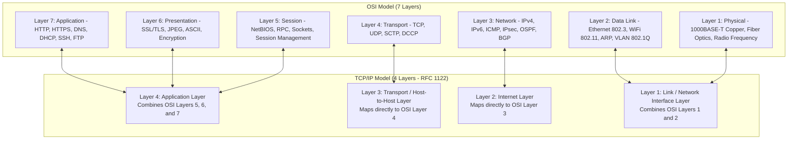
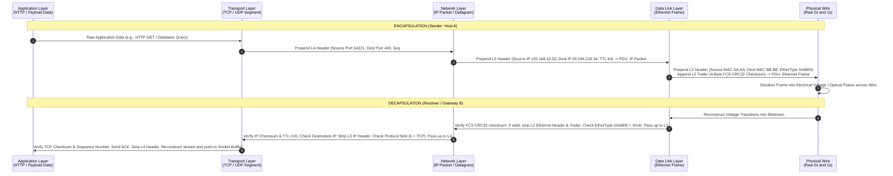
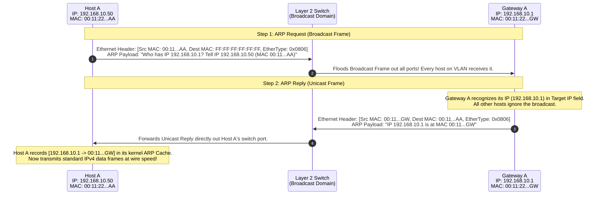
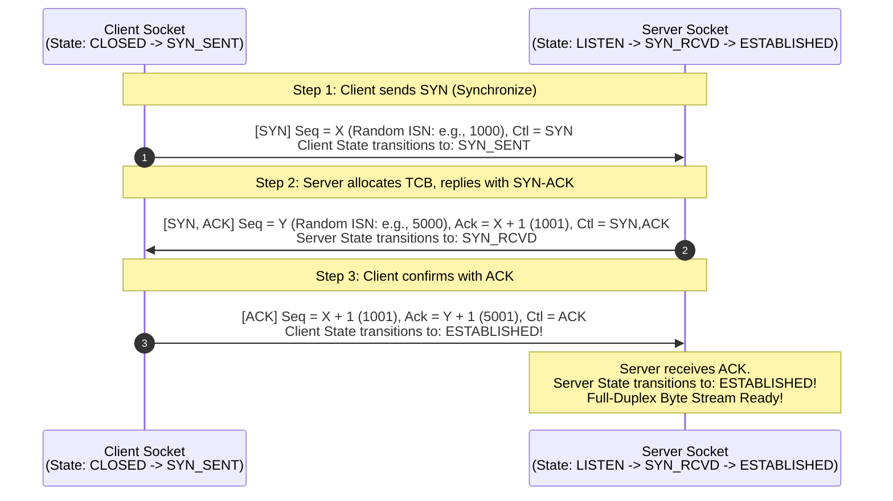
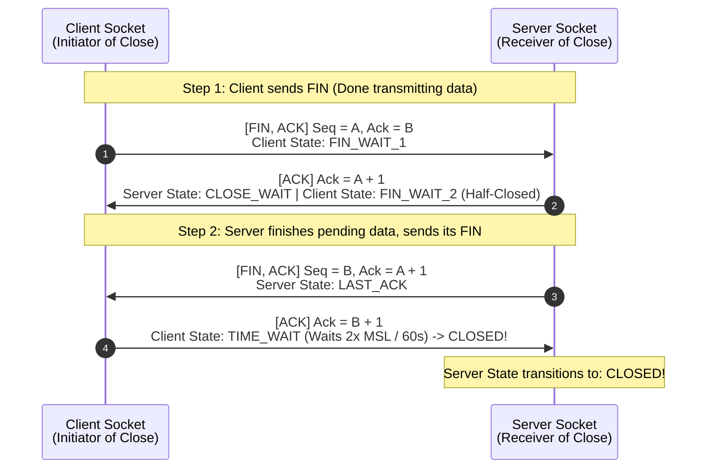
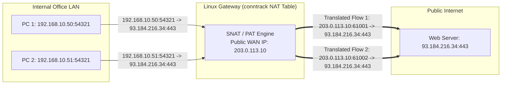
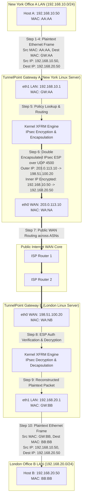

# PART 2 — TCP/IP Fundamentals

## 1. OSI Model vs. TCP/IP Model
To design and troubleshoot enterprise infrastructure, you must understand how networking protocols are layered. There are two primary reference models: the 7-layer **Open Systems Interconnection (OSI) Reference Model** (ISO/IEC 7498-1) and the 4-layer **TCP/IP Protocol Suite** (RFC 1122).

While the OSI model is a theoretical, academic framework used for conceptual troubleshooting and educational categorization, the **TCP/IP model is the actual engineering reality** implemented inside the Linux kernel, Unix operating systems, and every hardware device on the global Internet.



### Detailed Layer Comparison Table

| OSI Layer | TCP/IP Layer | Primary Responsibilities & Protocols | Data Protocol Data Unit (PDU) | Hardware / Software Addressing & Enforcement |
| :--- | :--- | :--- | :--- | :--- |
| **7. Application** | **4. Application** | User interfaces, high-level application data exchange, API endpoints. Protocols: HTTP/HTTPS, DNS, DHCP, SSH, FTP, SMTP, NTP. | **Data / Message** | User-space applications, REST APIs, JSON/XML payloads. |
| **6. Presentation** | **4. Application** | Data serialization, encoding, compression, and application-layer cryptographic formatting. Protocols: SSL/TLS, ASCII, UTF-8, MPEG, JPEG. | **Data / Message** | User-space libraries (OpenSSL, zlib, glibc). |
| **5. Session** | **4. Application** | Establishing, managing, and terminating persistent dialogs between applications. Protocols: NetBIOS, RPC, Sockets, SIP. | **Data / Message** | POSIX Socket API (`open`, `bind`, `listen`, `accept`). |
| **4. Transport** | **3. Transport** | End-to-end process-to-process communication, reliability, flow control (sliding window), congestion control, multiplexing. Protocols: **TCP, UDP**, SCTP. | **Segment** (TCP)<br>**Datagram** (UDP) | **16-bit Port Numbers** (`0 - 65535`). Enforced by Linux kernel TCP/UDP stack and stateful firewalls. |
| **3. Network** | **2. Internet** | Logical host-to-host addressing, packet routing across disparate Autonomous Systems, fragmentation, encapsulation. Protocols: **IPv4, IPv6, ICMP, IPsec (AH/ESP)**. | **Packet / Datagram** | **32-bit IPv4 Addresses** / **128-bit IPv6 Addresses**. Enforced by Routers, L3 Switches, Linux `iproute2`, and VPN Gateways. |
| **2. Data Link** | **1. Link / Network Interface** | Framing data for local physical transmission, MAC address resolution, error detection (CRC), local VLAN tagging. Protocols: **Ethernet (IEEE 802.3), ARP, VLAN (802.1Q), STP**. | **Frame** | **48-bit MAC Addresses** (`AA:BB:CC:DD:EE:FF`). Enforced by L2 Switches, Bridges, and NIC drivers. |
| **1. Physical** | **1. Link / Network Interface** | Raw serialization of bits into voltage transitions, light pulses, or RF waves across physical media. Standards: 1000BASE-T, 10GBASE-SR fiber, SFP+ transceivers. | **Bit / Symbol** | Physical copper/fiber cables, RJ45 jacks, optical transceivers, PHY chips. |

---

## 2. Encapsulation & Decapsulation
In networking, **Encapsulation** is the deterministic process of wrapping data with protocol headers and trailers as it moves down the protocol stack from the user application to the physical transmission medium. **Decapsulation** is the exact reverse process executed by the receiving host or gateway as data moves up the stack.



### How Encapsulation Powers TunnelPoint VPNs
When a normal packet traverses a network, it undergoes one layer of encapsulation. However, in our **TunnelPoint Site-to-Site VPN Platform**, we perform **Double Encapsulation (Tunneling)**:
1. **Inner Packet (Private LAN)**: The original packet created by Host A (`192.168.10.50` $\rightarrow$ `192.168.20.50`) with TCP payload.
2. **Cryptographic Wrapping (IPsec ESP)**: When Gateway A intercepts this packet, the Linux kernel XFRM engine encrypts the entire inner IP packet and wraps it in an **ESP Header** and **ESP Trailer/Auth Tag**.
3. **Outer Packet (Public Internet)**: Gateway A prepends a **new Outer IP Header** (`203.0.113.10` $\rightarrow$ `198.51.100.20`) and an optional **UDP Port 4500 Header** (for NAT Traversal). This double-encapsulated packet is then wrapped in an Ethernet frame and transmitted across the public WAN!

---

## 3. Ethernet & MAC Addresses (Layer 2)
**Ethernet (IEEE 802.3)** is the universal Layer 2 protocol governing wired local area networks. An Ethernet frame is structured with exact byte boundaries:

```
+----------------+---------------+------------------+---------------+--------------------+------------------+-------------------+
| Preamble       | SFD           | Destination MAC  | Source MAC    | EtherType / Length | Payload Data     | FCS (CRC-32)      |
| (7 Bytes)      | (1 Byte)      | (6 Bytes)        | (6 Bytes)     | (2 Bytes)          | (46 - 1500 Bytes)| (4 Bytes)         |
| 10101010...    | 10101011      | AA:BB:CC:DD:EE:FF| 11:22:33:44:55| 0x0800 (IPv4)      | IP Packet / ARP  | Checksum Trailer  |
+----------------+---------------+------------------+---------------+--------------------+------------------+-------------------+
```
* **Preamble (7 Bytes)**: An alternating pattern of 1s and 0s (`10101010...`) used by physical receiver hardware (PHY chips) to synchronize clock timers at wire speed.
* **Start Frame Delimiter / SFD (1 Byte)**: The sequence `10101011` indicating that the very next bit is the start of the actual Destination MAC address.
* **Destination MAC (6 Bytes / 48 Bits)**: The physical hardware address of the receiver interface on the local broadcast domain.
* **Source MAC (6 Bytes / 48 Bits)**: The physical hardware address of the sender interface.
* **EtherType (2 Bytes)**: A hexadecimal identifier specifying which Layer 3 protocol is encapsulated inside the payload:
  * `0x0800`: Internet Protocol Version 4 (IPv4)
  * `0x86DD`: Internet Protocol Version 6 (IPv6)
  * `0x0806`: Address Resolution Protocol (ARP)
  * `0x8100`: IEEE 802.1Q VLAN Tagged Frame
* **Payload (46 to 1500 Bytes)**: The encapsulated Layer 3 packet. *Note: If the Layer 3 packet is smaller than 46 bytes, Ethernet hardware automatically appends padding zeros to meet the minimum frame size of 64 bytes (excluding preamble/SFD).*
* **Frame Check Sequence / FCS (4 Bytes)**: A 32-bit Cyclic Redundancy Check (CRC-32) calculated over the MAC addresses, EtherType, and Payload. If an electrical noise spike alters even a single bit in transit, the receiver's calculated CRC will not match the FCS trailer, and **the Ethernet switch or NIC will drop the frame immediately without notifying the sender!**

### MAC Address Anatomy
A Media Access Control (MAC) address is a 48-bit (6-byte) hexadecimal identifier (e.g., `00:1A:2B:3C:4D:5E`).
* **Organizationally Unique Identifier (OUI - First 24 Bits / 3 Bytes)**: Assigned by the IEEE Registration Authority to hardware manufacturers (e.g., `00:1A:2B` identifies Cisco Systems, `00:50:56` identifies VMware Virtual NICs).
* **Network Interface Controller Specific (Last 24 Bits / 3 Bytes)**: Assigned sequentially by the manufacturer to ensure global uniqueness.
* **Unicast vs. Multicast vs. Broadcast**:
  * **Unicast**: The least significant bit (LSB) of the very first byte (the I/G bit) is set to `0` (e.g., `00:1A:2B:3C:4D:5E`). Targeted at one specific NIC.
  * **Multicast**: The I/G bit is set to `1` (e.g., `01:00:5E:00:00:01` for IPv4 multicast). Targeted at a subscribed group of NICs.
  * **Broadcast**: All 48 bits are set to `1` (`FF:FF:FF:FF:FF:FF`). Targeted at every single NIC on the local broadcast domain.

---

## 4. ARP (Address Resolution Protocol - RFC 826)
While software applications and routers use logical **Layer 3 IP Addresses** (`192.168.10.50`) to identify hosts across global networks, local physical hardware (Ethernet switches and NICs) can *only* transmit frames using physical **Layer 2 MAC Addresses** (`AA:BB:CC:DD:EE:FF`). 

**ARP is the critical bridge that translates a known Layer 3 IP address into an unknown Layer 2 MAC address on a local subnet.**

### The ARP 4-Step Exchange Workflow
Imagine Host A (`192.168.10.50`, MAC `00:11:22:33:44:AA`) wants to send an IP packet to its local TunnelPoint Gateway A (`192.168.10.1`), but Gateway A's MAC address is not in Host A's memory.



* **ARP Cache & Timers**: To avoid broadcasting an ARP request before every single packet, operating systems store resolved mappings in an **ARP Cache Table** in kernel memory for a limited time (in Linux, managed by `sysctl net.ipv4.neigh.default.gc_stale_time`, typically 60 to 120 seconds).
* **Gratuitous ARP (GARP)**: A special ARP packet where a host broadcasts an ARP Request or Reply for its *own* IP address (e.g., Target IP = Source IP). Why is this vital for TunnelPoint?
  * **High-Availability Failover (VRRP / Keepalived)**: When Primary Gateway A crashes, Secondary Backup Gateway B takes over the virtual IP address (`192.168.10.1`). Gateway B immediately broadcasts a **Gratuitous ARP** frame (`"IP 192.168.10.1 is now at MAC 00:11:22:33:44:BB"`). All LAN switches and host ARP caches instantly update their tables, redirecting all traffic to Backup Gateway B in sub-seconds!
  * **IP Conflict Detection**: When a Linux host boots up or receives a DHCP lease, it sends a GARP for its assigned IP. If another host replies, an IP address conflict exists!
* **ARP Spoofing / Poisoning Attack**: Because ARP is an unauthenticated protocol invented in 1982, any malicious actor on the local VLAN can broadcast forged ARP replies (`"I am Default Gateway 192.168.10.1, my MAC is [Attacker MAC]"`). All hosts on the subnet update their ARP caches and send their outbound Internet traffic to the attacker, executing a catastrophic **Man-in-the-Middle (MitM)** attack! This is mitigated in enterprise networks using switch-level **Dynamic ARP Inspection (DAI)**.

---

## 5. IPv4 vs. IPv6 & ICMP Deep Dive

### 1. IPv4 Header Anatomy (RFC 791 - 20 to 60 Bytes)
The **Internet Protocol Version 4 (IPv4)** header is the workhorse of global routing. You must know every bit of this 20-byte minimum header:

```
 0                   1                   2                   3
 0 1 2 3 4 5 6 7 8 9 0 1 2 3 4 5 6 7 8 9 0 1 2 3 4 5 6 7 8 9 0 1
+-+-+-+-+-+-+-+-+-+-+-+-+-+-+-+-+-+-+-+-+-+-+-+-+-+-+-+-+-+-+-+-+
|Version|  IHL  |Type of Service|          Total Length         |
+-+-+-+-+-+-+-+-+-+-+-+-+-+-+-+-+-+-+-+-+-+-+-+-+-+-+-+-+-+-+-+-+
|         Identification        |Flags|      Fragment Offset    |
+-+-+-+-+-+-+-+-+-+-+-+-+-+-+-+-+-+-+-+-+-+-+-+-+-+-+-+-+-+-+-+-+
|  Time to Live |    Protocol   |         Header Checksum       |
+-+-+-+-+-+-+-+-+-+-+-+-+-+-+-+-+-+-+-+-+-+-+-+-+-+-+-+-+-+-+-+-+
|                       Source IP Address                       |
+-+-+-+-+-+-+-+-+-+-+-+-+-+-+-+-+-+-+-+-+-+-+-+-+-+-+-+-+-+-+-+-+
|                    Destination IP Address                     |
+-+-+-+-+-+-+-+-+-+-+-+-+-+-+-+-+-+-+-+-+-+-+-+-+-+-+-+-+-+-+-+-+
|                    Options (if IHL > 5)                       |
+-+-+-+-+-+-+-+-+-+-+-+-+-+-+-+-+-+-+-+-+-+-+-+-+-+-+-+-+-+-+-+-+
```

* **Version (4 bits)**: Always `0100` (4) for IPv4.
* **Internet Header Length / IHL (4 bits)**: Specifies the length of the IP header in 32-bit (4-byte) words. Minimum valid value is `5` ($5 \times 4 = 20$ bytes). Maximum is `15` ($15 \times 4 = 60$ bytes).
* **Type of Service / DSCP / ECN (8 bits)**: Used for Quality of Service (QoS). Differentiated Services Code Point (DSCP - 6 bits) prioritizes real-time VoIP/VPN traffic over routers. Explicit Congestion Notification (ECN - 2 bits) allows routers to signal congestion without dropping packets.
* **Total Length (16 bits)**: The total size of the IP packet (Header + L4 Segment + Payload) in bytes. Maximum theoretical packet size is $2^{16} - 1 = 65,535$ bytes.
* **Identification (16 bits)**: A unique packet ID generated by the sender. If a packet is fragmented across a router, all fragments share this exact ID so the receiver knows how to reassemble them.
* **Flags (3 bits)**:
  * Bit 0: Reserved (always 0).
  * Bit 1: **Don't Fragment (DF Bit)**. If set to `1`, routers are forbidden from fragmenting this packet. If it exceeds interface MTU, the router drops it and sends an ICMP error!
  * Bit 2: **More Fragments (MF Bit)**. Set to `1` on all fragments except the very last fragment of a packet.
* **Fragment Offset (13 bits)**: Specifies the exact byte position (in units of 8 bytes) where this fragment belongs in the original reassembled packet.
* **Time to Live / TTL (8 bits)**: A loop-prevention counter initialized by the sender (typically 64 in Linux, 128 in Windows, 255 in Cisco). Decremented by 1 at every Layer 3 router hop. When TTL = 0, the packet is discarded.
* **Protocol (8 bits)**: Identifies the Layer 4 or VPN protocol encapsulated inside the IP payload:
  * `1` = ICMP
  * `6` = TCP
  * `17` = UDP
  * `50` = **IPsec Encapsulating Security Payload (ESP)** *(Crucial for TunnelPoint!)*
  * `51` = **IPsec Authentication Header (AH)**
* **Header Checksum (16 bits)**: A mathematical checksum calculated *only* over the IPv4 header words. Because TTL decrements at every hop, every router on Earth must recalculate and update this checksum in hardware!
* **Source & Destination IP Addresses (32 bits / 4 bytes each)**: The logical end-to-end network addresses.

### 2. IPv6 Header Anatomy (RFC 8200 - 40 Bytes Fixed)
IPv4 addresses ($2^{32} \approx 4.3$ billion) were officially exhausted by IANA in 2011. **IPv6** expands address space to 128 bits ($2^{128} \approx 3.4 \times 10^{38}$ addresses) and drastically streamlines routing efficiency:

```
 0                   1                   2                   3
 0 1 2 3 4 5 6 7 8 9 0 1 2 3 4 5 6 7 8 9 0 1 2 3 4 5 6 7 8 9 0 1
+-+-+-+-+-+-+-+-+-+-+-+-+-+-+-+-+-+-+-+-+-+-+-+-+-+-+-+-+-+-+-+-+
|Version| Traffic Class |           Flow Label                  |
+-+-+-+-+-+-+-+-+-+-+-+-+-+-+-+-+-+-+-+-+-+-+-+-+-+-+-+-+-+-+-+-+
|         Payload Length        |  Next Header  |   Hop Limit   |
+-+-+-+-+-+-+-+-+-+-+-+-+-+-+-+-+-+-+-+-+-+-+-+-+-+-+-+-+-+-+-+-+
|                                                               |
+                                                               +
|                                                               |
+                         Source Address                        +
|                           (128 Bits)                          |
+                                                               +
|                                                               |
+-+-+-+-+-+-+-+-+-+-+-+-+-+-+-+-+-+-+-+-+-+-+-+-+-+-+-+-+-+-+-+-+
|                                                               |
+                                                               +
|                                                               |
+                      Destination Address                      +
|                           (128 Bits)                          |
+                                                               +
|                                                               |
+-+-+-+-+-+-+-+-+-+-+-+-+-+-+-+-+-+-+-+-+-+-+-+-+-+-+-+-+-+-+-+-+
```
* **Why IPv6 is Faster for Routers**:
  1. **Fixed 40-Byte Header**: No variable `IHL` or `Options` fields! Hardware ASICs can parse IPv6 headers blindly at wire speed without checking lengths.
  2. **NO HEADER CHECKSUM!**: In IPv6, the header checksum was completely abolished. Why? Because Layer 2 Ethernet already has a 32-bit CRC, and Layer 4 TCP/UDP has its own checksum. Removing the L3 checksum means intermediate routers **no longer need to recalculate checksums when decrementing the Hop Limit**, cutting CPU overhead massively!
  3. **NO ROUTER FRAGMENTATION**: In IPv6, intermediate routers are strictly forbidden from fragmenting packets. If an IPv6 packet exceeds MTU, the router drops it immediately and sends an ICMPv6 "Packet Too Big" error. All fragmentation must be handled by the endpoints!
* **Next Header (8 bits)**: Replaces the IPv4 "Protocol" field. Points to the Layer 4 protocol (6=TCP, 17=UDP, 50=ESP) or an **IPv6 Extension Header** (e.g., Routing header, Fragmentation header).
* **Hop Limit (8 bits)**: Replaces IPv4 TTL. Functions identically (decremented by 1 per router hop).

### 3. ICMP (Internet Control Message Protocol - RFC 792 & RFC 4443)
ICMP is not a Transport layer protocol; it is an integral **Layer 3 control and messaging protocol** encapsulated directly inside IP packets (Protocol field `1` for IPv4, `58` for IPv6). ICMP does not carry user data; it reports routing errors, network diagnostics, and operational state.

* **ICMP Type 8 (Echo Request) & Type 0 (Echo Reply)**: The exact mechanism powered by the `ping` command.
* **ICMP Type 11 Code 0 (Time Exceeded / TTL Expired in Transit)**: Generated by a router when a packet's TTL hits 0. This is the exact mechanism exploited by `traceroute`! (Traceroute sends packets with TTL=1, TTL=2, TTL=3... forcing each successive router along the path to reply with an ICMP Time Exceeded message, revealing its IP address!).
* **ICMP Type 3 Code 4 (Destination Unreachable — Fragmentation Needed and DF Set)**: **CRITICAL FOR VPNS!** When an IPsec VPN gateway sends a 1500-byte packet with the IPv4 `DF (Don't Fragment)` bit set into a WAN interface with an MTU of 1400, the router drops the packet and transmits this exact ICMP message back to the sender, containing the router's Maximum MTU. This mechanism is called **Path MTU Discovery (PMTUD)**. *If a firewalled ISP blocks ICMP Type 3 Code 4, PMTUD fails silently, creating a catastrophic MTU Black Hole!*
* **ICMPv6 Neighbor Discovery Protocol (NDP)**: In IPv6, ARP was completely abolished! Instead, IPv6 hosts use ICMPv6 Type 135 (Neighbor Solicitation) and Type 136 (Neighbor Advertisement) sent over multicast Ethernet frames (`33:33:xx:xx:xx:xx`) to resolve MAC addresses and auto-configure IPs (SLAAC).

---

## 6. TCP vs. UDP & Ports (Layer 4)
Why do we need Layer 4? Because Layer 3 IP addresses only route packets from **Host A to Host B**. Once the packet arrives at Host B, the Linux kernel must know *which specific software application or daemon* (e.g., Apache web server, SSH daemon, StrongSwan IKE daemon) should receive the payload! 

This is accomplished using **16-bit Port Numbers** ($0 \text{ to } 65,535$).
* **Well-Known Ports (`0 - 1023`)**: Reserved for system daemons and root privileges (e.g., Port 22 SSH, Port 53 DNS, Port 80 HTTP, Port 443 HTTPS, **Port 500 UDP for StrongSwan IKEv2**).
* **Registered Ports (`1024 - 49151`)**: Assigned by IANA for specific user-space services (e.g., Port 3306 MySQL, **Port 4500 UDP for IPsec NAT Traversal**).
* **Ephemeral / Dynamic Ports (`49152 - 65535`)**: Temporary ports assigned dynamically by the Linux kernel (controlled by `sysctl net.ipv4.ip_local_port_range`) when a client initiates an outbound connection to a server.

### 1. UDP (User Datagram Protocol - RFC 768)
UDP is an ultra-lightweight, connectionless, stateless Transport protocol. It adds minimal overhead over bare IP.

```
 0                   1                   2                   3
 0 1 2 3 4 5 6 7 8 9 0 1 2 3 4 5 6 7 8 9 0 1 2 3 4 5 6 7 8 9 0 1
+-+-+-+-+-+-+-+-+-+-+-+-+-+-+-+-+-+-+-+-+-+-+-+-+-+-+-+-+-+-+-+-+
|          Source Port          |       Destination Port        |
+-+-+-+-+-+-+-+-+-+-+-+-+-+-+-+-+-+-+-+-+-+-+-+-+-+-+-+-+-+-+-+-+
|            Length             |           Checksum            |
+-+-+-+-+-+-+-+-+-+-+-+-+-+-+-+-+-+-+-+-+-+-+-+-+-+-+-+-+-+-+-+-+
|                       Payload Data...                         |
+-+-+-+-+-+-+-+-+-+-+-+-+-+-+-+-+-+-+-+-+-+-+-+-+-+-+-+-+-+-+-+-+
```
* **Header Size**: Exactly **8 bytes**!
* **Characteristics**:
  * **No Handshake / Stateless**: The sender simply transmits datagrams immediately without checking if the receiver is ready or listening.
  * **Unreliable & Unordered**: UDP provides zero delivery guarantees, zero sequence numbers, and zero acknowledgments. If a router drops a UDP datagram, UDP will never retransmit it. If datagrams arrive out of order, UDP passes them to the application out of order.
  * **No Flow or Congestion Control**: UDP transmits at whatever speed the application pumps data, even if it floods the network or overwhelms the receiver's CPU buffer.
* **Why TunnelPoint VPNs Rely on UDP**:
  * **IKEv2 Key Exchange uses UDP Port 500**: Because IKE must negotiate cryptographic keys before a secure connection exists, it cannot rely on a heavy TCP stream; it uses lightweight UDP packets with its own application-layer timers and retransmissions.
  * **IPsec NAT Traversal uses UDP Port 4500**: As we will see in Part 8, when IPsec packets must pass through a NAT router, we encapsulate the encrypted ESP packets inside **UDP Port 4500** headers! Why? Because NAT firewalls cannot track stateless ESP (Protocol 50) packets without port numbers; UDP gives them Source/Destination ports to track in `conntrack`!
  * **Why Never Tunnel TCP over TCP**: If you build a VPN that tunnels TCP over a TCP connection (like old SSL VPNs or OpenVPN over TCP), when packet loss occurs on the WAN, **both the inner TCP timer and the outer TCP timer will trigger retransmissions simultaneously!** This creates a feedback loop of exponential backoffs and duplicate acknowledgments called **TCP Meltdown**, causing VPN throughput to collapse to zero. That is why enterprise VPNs like TunnelPoint always encapsulate traffic over UDP!

### 2. TCP (Transmission Control Protocol - RFC 793)
TCP is a connection-oriented, reliable, ordered, full-duplex byte-stream protocol engineered to guarantee data integrity across imperfect, congested networks.

```
 0                   1                   2                   3
 0 1 2 3 4 5 6 7 8 9 0 1 2 3 4 5 6 7 8 9 0 1 2 3 4 5 6 7 8 9 0 1
+-+-+-+-+-+-+-+-+-+-+-+-+-+-+-+-+-+-+-+-+-+-+-+-+-+-+-+-+-+-+-+-+
|          Source Port          |       Destination Port        |
+-+-+-+-+-+-+-+-+-+-+-+-+-+-+-+-+-+-+-+-+-+-+-+-+-+-+-+-+-+-+-+-+
|                        Sequence Number                        |
+-+-+-+-+-+-+-+-+-+-+-+-+-+-+-+-+-+-+-+-+-+-+-+-+-+-+-+-+-+-+-+-+
|                    Acknowledgment Number                      |
+-+-+-+-+-+-+-+-+-+-+-+-+-+-+-+-+-+-+-+-+-+-+-+-+-+-+-+-+-+-+-+-+
|  Data |           |U|A|P|R|S|F|                               |
| Offset| Reserved  |R|C|S|S|Y|I|           Window Size         |
|       |           |G|K|H|T|N|N|                               |
+-+-+-+-+-+-+-+-+-+-+-+-+-+-+-+-+-+-+-+-+-+-+-+-+-+-+-+-+-+-+-+-+
|           Checksum            |         Urgent Pointer        |
+-+-+-+-+-+-+-+-+-+-+-+-+-+-+-+-+-+-+-+-+-+-+-+-+-+-+-+-+-+-+-+-+
|                    Options (if Data Offset > 5)               |
+-+-+-+-+-+-+-+-+-+-+-+-+-+-+-+-+-+-+-+-+-+-+-+-+-+-+-+-+-+-+-+-+
```
* **Sequence Number (32 bits)**: Tracks the exact byte offset of the stream. If Sequence Number is `1000` and the payload is 500 bytes, the last byte is `1499`.
* **Acknowledgment Number (32 bits)**: Cumulative acknowledgment. If a receiver sends `ACK=1500`, it is telling the sender: *"I have successfully received all bytes up to 1499; I am now expecting byte 1500!"*
* **Control Flags (Crucial 6 Bits)**:
  * **SYN (Synchronize)**: Initiates a connection and synchronizes initial sequence numbers.
  * **ACK (Acknowledgment)**: Confirms receipt of packets and validates the Acknowledgment Number field.
  * **FIN (Finish)**: Gracefully initiates connection termination (no more data from sender).
  * **RST (Reset)**: Abruptly terminates a connection due to an error, protocol violation, or connection to a closed port.
  * **PSH (Push)**: Forces the kernel socket buffer to push data immediately to the user-space application without waiting for buffer filling.
  * **URG (Urgent)**: Indicates urgent data pointed to by the Urgent Pointer field.
* **Window Size (16 bits - Flow Control)**: Implements the **Sliding Window** algorithm. It tells the sender: *"My kernel socket buffer currently has X bytes of free space left."* If the application stops reading data, the window shrinks to `0` (**Zero Window**), forcing the sender to pause transmission so it doesn't overflow the receiver's RAM!
* **Congestion Control Algorithms**: While Flow Control prevents overwhelming the *receiver*, Congestion Control prevents overwhelming intermediate *routers*. Linux implements algorithms like **CUBIC** and **BBR** (Bottleneck Bandwidth and RTT), dynamically scaling congestion windows using **Slow Start** (exponential scaling), **Congestion Avoidance** (linear scaling), and **Fast Retransmit / Fast Recovery** (triggered by receiving 3 duplicate ACKs before a timeout occurs).

### 3. TCP 3-Way Handshake & Socket States
Before a single byte of application data can be transmitted, TCP must establish a synchronized session across both operating system kernels:



### 4. TCP 4-Way Teardown & `TIME_WAIT` State
Closing a full-duplex TCP stream requires a 4-step exchange because each direction must be closed independently:



> **Why the `TIME_WAIT` State Matters in Production**: Notice that the client enters a state called `TIME_WAIT` for **2 x Maximum Segment Lifetime (MSL)** (defaults to 60 seconds in Linux `sysctl net.ipv4.tcp_fin_timeout`). Why? 
> Because if the final ACK (Step 4) is dropped by a router on the Internet, the server will time out and retransmit its FIN! If the client had immediately closed its socket and destroyed the port, the retransmitted FIN would hit a closed port, causing the client OS to fire back a TCP `RST`, causing an error log on the server! `TIME_WAIT` keeps the socket reserved in kernel memory just long enough to cleanly catch any delayed or retransmitted FIN packets!

---

## 7. DNS & DHCP Fundamentals

### 1. DNS (Domain Name System - UDP/TCP Port 53)
DNS is a global, hierarchical, distributed database that translates human-readable fully qualified domain names (FQDNs like `gateway.tunnelpoint.io`) into machine-routable IP addresses (`203.0.113.10`).
* **Why UDP Port 53?**: Standard DNS queries and responses are small (<512 bytes) and require maximum speed without handshake latency. However, if a DNS response exceeds 512 bytes (such as DNSSEC cryptographic signatures or massive zone transfers), DNS dynamically falls back to **TCP Port 53**!
* **The Recursive Resolution Hierarchy**:
  1. **Client OS Cache & `/etc/hosts`**: Checked first.
  2. **Recursive Resolver (e.g., ISP DNS, `8.8.8.8`, `1.1.1.1`)**: Receives the client's query and performs the iterative search on its behalf.
  3. **Root Name Servers (`.`)**: 13 global root server clusters (labeled A through M) directed by IANA. The resolver asks: *"Who handles `.com`?"*
  4. **TLD Name Servers (`.com`, `.io`, `.org`)**: Directed by organizations like Verisign. The resolver asks: *"Who handles `tunnelpoint.io`?"*
  5. **Authoritative Name Server**: The final server hosting the actual DNS zone file. Returns the IP address!
* **Key DNS Record Types**:
  * `A Record`: Maps hostname to a 32-bit **IPv4 address**.
  * `AAAA Record`: Maps hostname to a 128-bit **IPv6 address**.
  * `CNAME Record`: Canonical Name (an alias pointing one hostname to another hostname).
  * `TXT Record`: Arbitrary text data (used heavily for SPF/DKIM email security and Let's Encrypt / PKI domain ownership verification!).
  * `PTR Record`: Pointer record used for Reverse DNS lookups (mapping an IP address back to a hostname).

### 2. DHCP (Dynamic Host Configuration Protocol - UDP Ports 67/68)
When a laptop or branch server plugs into a network, how does it get an IP address automatically? Through DHCP! Because the client has zero IP address when it boots, **DHCP relies entirely on Layer 2 and Layer 3 Broadcasts (`255.255.255.255` / `FF:FF:FF:FF:FF:FF`)!**

The **DORA** 4-Step Handshake:
1. **D — Discover (Client Broadcast)**: Source IP `0.0.0.0:68` $\rightarrow$ Dest IP `255.255.255.255:67`, MAC `FF:FF:FF:FF:FF:FF`. *"Is there a DHCP server on this LAN?"*
2. **O — Offer (Server Broadcast/Unicast)**: The DHCP server reserves an IP from its pool and replies: *"I can offer you `192.168.10.100`, subnet mask `255.255.255.0`, default gateway `192.168.10.1`, DNS `8.8.8.8`, lease time 86,400 seconds."*
3. **R — Request (Client Broadcast)**: The client broadcasts: *"I accept the offer for `192.168.10.100` from DHCP Server X!"* (Broadcasting informs any other DHCP servers on the network that their offers were rejected so they can free their reserved IPs).
4. **A — Acknowledge (Server Broadcast/Unicast)**: The server finalizes the lease: *"Confirmed! IP `192.168.10.100` is officially leased to your MAC address."*

---

## 8. NAT, PAT & Subnetting Math (CIDR)

### 1. RFC 1918 Private Addressing & Why NAT Exists
To prevent the premature exhaustion of IPv4 addresses, IANA reserved three massive IP ranges exclusively for private, internal local area networks (RFC 1918):
* **10.0.0.0 — 10.255.255.255** (`10.0.0.0/8` — 16,777,216 IPs)
* **172.16.0.0 — 172.31.255.255** (`172.16.0.0/12` — 1,048,576 IPs)
* **192.168.0.0 — 192.168.255.255** (`192.168.0.0/16` — 65,536 IPs)

> [!CAUTION]
> **RFC 1918 addresses are non-routable on the public Internet!** If a public WAN router receives a packet destined for `192.168.10.50`, it drops it instantly as a bogon. Therefore, whenever private LAN clients need to communicate with the Internet, an edge device (like our Linux Gateway) must perform **Network Address Translation (NAT)**.

### 2. SNAT vs. DNAT vs. MASQUERADE vs. PAT
In Linux Netfilter (`iptables`/`nftables`), NAT occurs in the `nat` table across three distinct mechanisms:



* **SNAT (Source NAT)**: Modifies the **Source IP** address of outbound packets leaving a private network (e.g., changing `192.168.10.50` to static public WAN IP `203.0.113.10`). Used when your router has a static public IP.
* **MASQUERADE**: A specialized form of SNAT in Linux designed for dynamic WAN interfaces (like DHCP or PPPoE modems where the public IP changes dynamically). If the WAN interface goes down, MASQUERADE automatically flushes all connection tracking entries so sessions don't get stuck!
* **DNAT (Destination NAT / Port Forwarding)**: Modifies the **Destination IP** address of inbound packets entering from the Internet (e.g., mapping external public requests hitting `203.0.113.10:443` directly to an internal private web server at `192.168.10.100:443`).
* **PAT (Port Address Translation / NAT Overload)**: How do 500 office employees simultaneously browse the web using only ONE single public IP address (`203.0.113.10`)? Through PAT! 
  * When PC 1 (`192.168.10.50:54321`) and PC 2 (`192.168.10.51:54321`) both send traffic to the same web server, the Linux NAT gateway rewrites both the **Source IP AND the Layer 4 Source Port!**
  * PC 1's packet becomes `203.0.113.10:61001` $\rightarrow$ Web Server.
  * PC 2's packet becomes `203.0.113.10:61002` $\rightarrow$ Web Server.
  * When the web server replies to port `61001`, the Linux kernel `nf_conntrack` table performs a reverse lookup, rewrites the destination back to `192.168.10.50:54321`, and forwards it to PC 1!

> [!IMPORTANT]
> **The Golden Rule of VPN Routing & NAT**: When configuring our TunnelPoint Site-to-Site VPN, **WE MUST EXEMPT VPN TRAFFIC FROM NAT/MASQUERADE!** If Gateway A accidentally performs SNAT on traffic destined for Office B (`192.168.20.0/24`), changing the source from `192.168.10.50` to public WAN IP `203.0.113.10`, the IPsec cryptographic policy (SPD) will no longer recognize the packet as private LAN traffic, and **the packet will be sent over the Internet in unencrypted plaintext!** In Part 16, we will write strict iptables rules to bypass NAT for IPsec!

### 3. CIDR & Subnetting Math (Zero-Summary Breakdown)
**CIDR (Classless Inter-Domain Routing - RFC 4632)** replaced the rigid, wasteful Class A/B/C system with variable-length subnet masking (VLSM). 

An IPv4 address consists of 32 bits divided into a **Network Prefix** (identifying the subnet) and a **Host Identifier** (identifying the specific interface on that subnet). The CIDR notation `/N` specifies exactly how many bits from the left belong to the Network Prefix!

#### Master Subnetting Math Formula
For any CIDR prefix `/N`:
* **Number of Network Bits** = $N$
* **Number of Host Bits** = $32 - N$
* **Total IP Addresses in Subnet** = $2^{(32 - N)}$
* **Valid Usable Host IPs** = $2^{(32 - N)} - 2$ *(We MUST subtract 2: the very first IP is the **Network ID**, and the very last IP is the **Broadcast ID**!)*

#### Step-by-Step Subnetting Example: `192.168.10.0/26`
Let's analyze what happens when we subnet an office LAN using `/26`:
1. **Host Bits**: $32 - 26 = 6$ host bits.
2. **Total IPs per Subnet**: $2^6 = 64$ addresses.
3. **Usable Hosts per Subnet**: $64 - 2 = 62$ usable host IPs.
4. **Subnet Mask in Binary**: We set the first 26 bits to `1` and the remaining 6 bits to `0`:
   `11111111 . 11111111 . 11111111 . 11000000`
5. **Subnet Mask in Decimal**: `255.255.255.192` (since binary `11000000` = $128 + 64 = 192$).
6. **Subnet Boundaries across the `/24` block**:
   * **Subnet 1 (`192.168.10.0/26`)**: Network ID: `.0` | Usable Hosts: `.1` to `.62` | Broadcast ID: `.63`
   * **Subnet 2 (`192.168.10.64/26`)**: Network ID: `.64` | Usable Hosts: `.65` to `.126` | Broadcast ID: `.127`
   * **Subnet 3 (`192.168.10.128/26`)**: Network ID: `.128` | Usable Hosts: `.129` to `.190` | Broadcast ID: `.191`
   * **Subnet 4 (`192.168.10.192/26`)**: Network ID: `.192` | Usable Hosts: `.193` to `.254` | Broadcast ID: `.255`

#### Default Gateway Operation
When a host at `192.168.10.50/24` wants to send an IP packet to `192.168.10.88`, how does it know whether to ARP directly on the LAN or send it to the router?
The host OS performs a **Bitwise Logical AND Operation** between the Destination IP and its own Subnet Mask:
$$\text{Host IP AND Mask: } 192.168.10.50 \text{ AND } 255.255.255.0 = \text{Network ID } 192.168.10.0$$
$$\text{Dest IP AND Mask: } 192.168.10.88 \text{ AND } 255.255.255.0 = \text{Network ID } 192.168.10.0$$
Because both Network IDs match exactly (`192.168.10.0`), the host knows the destination is on the **local subnet**; it sends an ARP request directly for `.88`!

If the host wants to reach Office B at `192.168.20.50`, the bitwise AND returns `192.168.20.0`. Because this does *not* match its local network ID, the host knows the destination is **off-subnet**! It immediately encapsulates the packet into an Ethernet frame addressed to the MAC address of its configured **Default Gateway** (`192.168.10.1`)!

---

## 9. MTU, Fragmentation & Checksums

### 1. MTU & IP Fragmentation Deep Dive
The **Maximum Transmission Unit (MTU)** is the largest Layer 3 packet size (in bytes) that an interface can transmit without fragmentation. In standard Ethernet, $\text{MTU} = 1500$ bytes.

What happens if a router receives a 1500-byte IPv4 packet (with 20-byte IP header + 1480-byte data payload) that must be forwarded out an interface with an MTU of 1000 bytes?
If the IP `DF (Don't Fragment)` flag is `0`, the router executes **IP Fragmentation**:

```
Original Packet: [20B IP Header | 1480 Bytes Payload Data] (Total Size = 1500 Bytes, ID = 5555)
                                      |
                                      V Router slices into 2 Fragments (MTU = 1000)
                                      |
Fragment 1: [20B IP Header | 976 Bytes Data ] -> Total Size = 996B | ID = 5555 | MF = 1 | Offset = 0
Fragment 2: [20B IP Header | 504 Bytes Data ] -> Total Size = 524B | ID = 5555 | MF = 0 | Offset = 122 (976/8)
```
* Notice why Fragment 1 has 976 bytes of data instead of 980! Because the **Fragment Offset field is measured in units of 8 bytes**, the data payload of every fragment (except the last) **must be evenly divisible by 8!** ($976 \div 8 = 122$).
* **Why Fragmentation is Destructive to Firewalls & VPNs**:
  In Fragment 2, notice that the original Layer 4 TCP/UDP header (which contains the Source and Destination Port numbers!) was located in the first 20 bytes of the original payload—which is now contained *only* inside Fragment 1! **Fragment 2 has ZERO Layer 4 header and ZERO port numbers!**
  When Fragment 2 arrives at a stateless firewall or an ECMP load balancer inspecting L4 ports, the device cannot see any port numbers, and **drops the fragment immediately as anomalous!** The entire 1500-byte packet is lost! That is why we must avoid fragmentation at all costs in TunnelPoint using MSS clamping!

### 2. Checksum Calculation Mechanics
How does an IPv4 router calculate the 16-bit Header Checksum?
1. The 16-bit Checksum field itself is temporarily set to `0000 0000 0000 0000`.
2. The entire 20-byte IP header is divided into ten 16-bit (2-byte) words.
3. All ten 16-bit words are added together using **One's Complement Arithmetic** (if the addition generates a carry bit out of the 16th bit, that carry bit is wrapped around and added back to the lowest bit).
4. The final 16-bit sum is inverted (bitwise NOT / One's complement). That result is written into the Checksum field!
5. When the receiving router adds all ten 16-bit words (including the checksum!), the result in one's complement will be all 1s (`1111 1111 1111 1111` / `0xFFFF`). If even one bit was corrupted in transit, the sum will not equal `0xFFFF`, and the router drops the packet!

---

## 10. The Complete Packet Lifecycle (End-to-End Master Workflow)
Let's synthesize everything from Part 1 and Part 2 into one unified, production-grade engineering walkthrough!

**Scenario**: An employee on Host A (`192.168.10.50/24`, MAC `AA:AA`) in New York Office A opens a terminal and runs `curl http://192.168.20.50:80/api` to fetch data from an internal web server Host B (`192.168.20.50/24`, MAC `BB:BB`) located in London Office B across our **TunnelPoint Site-to-Site IPsec VPN Platform**.



### The Step-by-Step Packet Flow Breakdown
1. **Application & Transport Layer (Host A)**:
   * The `curl` process creates an HTTP GET request.
   * The Linux socket API passes the payload to TCP. TCP creates a SYN segment: Source Port = `54321` (ephemeral), Destination Port = `80`, Sequence Number = `1000`, SYN flag set.
2. **Network Layer Routing Decision (Host A)**:
   * Host A's IP stack checks the Destination IP (`192.168.20.50`) against its Subnet Mask (`255.255.255.0`).
   * Bitwise AND reveals Network ID `192.168.20.0`. Since this is off-subnet, Host A consults its routing table and selects Default Gateway A (`192.168.10.1`).
3. **Data Link Layer ARP Resolution (Host A)**:
   * Host A checks its ARP cache for IP `192.168.10.1`. If missing, it broadcasts an ARP Request (`FF:FF:FF:FF:FF:FF`). Gateway A replies with MAC `GW:AA`.
   * Host A encapsulates the IP packet into an Ethernet frame: **Source MAC = `AA:AA`**, **Destination MAC = `GW:AA`**, **EtherType = `0x0800`**. Transmits out LAN interface!
4. **Ingress at Gateway A (New York LAN Interface `eth1`)**:
   * Switch delivers frame to Gateway A's `eth1` NIC.
   * Gateway A's NIC verifies Ethernet FCS CRC32. Strips Layer 2 header.
   * Gateway A's kernel checks Destination IP (`192.168.20.50`). Since Gateway A has IP forwarding enabled (`sysctl net.ipv4.ip_forward=1`), it prepares to route the packet.
5. **IPsec Policy Lookup & Encapsulation (Gateway A XFRM Engine)**:
   * Before sending to the FIB routing table, the packet passes through the Netfilter FORWARD hooks and checks the **XFRM Security Policy Database (SPD)**.
   * A policy matches: *"Traffic from `192.168.10.0/24` to `192.168.20.0/24` MUST be encrypted via IPsec tunnel to peer `198.51.100.20`!"*
   * The kernel XFRM engine takes the *entire* original IP packet (`192.168.10.50` $\rightarrow$ `192.168.20.50`), encrypts it using **AES-256-GCM**, appends an ESP Auth Tag, and prepends:
     * **ESP Header (SPI + Sequence Number)**
     * **UDP Header (Source Port 4500, Dest Port 4500 — NAT Traversal)**
     * **New Outer IPv4 Header**: Source IP = `203.0.113.10` (Gateway A WAN), Destination IP = `198.51.100.20` (Gateway B WAN), Protocol = `17` (UDP), TTL = `64`.
6. **WAN Egress & Public Internet Routing**:
   * Gateway A checks its FIB for destination `198.51.100.20`. Next hop is ISP Router 1. Gateway A ARPs for ISP Router 1's MAC, builds a new Ethernet frame, and transmits out `eth0`!
   * The packet traverses Tier 1 ISP backbone routers across the Atlantic Ocean. At every hop, routers decrement outer TTL by 1, update header checksum, and strip/rewrite Layer 2 MAC addresses. **The private IPs and HTTP data inside remain completely invisible and encrypted!**
7. **Ingress & Decapsulation at Gateway B (London WAN Interface `eth0`)**:
   * Packet arrives at Gateway B's public interface `eth0` (`198.51.100.20`).
   * Gateway B strips Ethernet header. Sees Outer IP Destination is itself, Protocol is UDP 4500.
   * Passes UDP packet to XFRM engine. XFRM uses the Security Parameter Index (SPI) in the ESP header to look up the **Security Association (SA)** in kernel memory.
   * XFRM validates the AES-GCM authentication tag. If an attacker modified even 1 bit in transit across the ocean, authentication fails and the packet is silently dropped!
   * Since auth succeeds, XFRM decrypts the payload, strips the Outer IP, UDP 4500, and ESP headers, and **recovers the pristine, original private packet (`192.168.10.50` $\rightarrow$ `192.168.20.50`)!**
8. **Final LAN Routing & Delivery (London Office B LAN)**:
   * Gateway B checks its FIB for Destination IP `192.168.20.50`. Route table says: *"Reachable directly out LAN interface `eth1`!"*
   * Gateway B ARPs for Host B's MAC address (`BB:BB`).
   * Gateway B builds a final plaintext Ethernet frame: **Source MAC = `GW:BB`** (Gateway B LAN interface), **Destination MAC = `BB:BB`** (Host B), EtherType = `0x0800`.
   * Transmits frame out `eth1` across London office switch.
9. **Receipt at Host B**:
   * Host B NIC verifies CRC32. Strips Ethernet header.
   * IP stack checks IP header checksum, confirms Destination IP is itself (`192.168.20.50`). Strips IP header.
   * TCP stack inspects Destination Port `80`. Finds Apache web server listening on port 80!
   * TCP allocates socket buffer, transitions server socket state to `SYN_RCVD`, and generates the returning **SYN-ACK packet** (`192.168.20.50` $\rightarrow$ `192.168.10.50`), which will travel back through the exact same IPsec tunnel encapsulation workflow in reverse!

---

## 11. Phase 2 Practical Exercises
Run these commands in your Linux environment or terminal to inspect TCP/IP behavior:

### Exercise 1: Inspecting Active TCP Socket States and Ephemeral Ports
Use `ss` (Socket Statistics — the modern replacement for `netstat`) to observe real-time socket states:
```bash
# 1. View all listening TCP and UDP sockets with numeric ports and process names
sudo ss -tulpn

# 2. View all established TCP connections and their state transitions (ESTABLISHED, TIME_WAIT)
ss -tno state established

# 3. Check your Linux system's configured ephemeral port range
sysctl net.ipv4.ip_local_port_range
```
**Goal**: Identify which local port your SSH or browser session is using, and confirm it falls within the ephemeral port range (`49152-65535`).

### Exercise 2: Observing Path MTU Discovery and Fragmentation
Use `ping` with the "Don't Fragment" flag set to experimentally discover the exact MTU of your network connection:
```bash
# 1. Ping Google DNS with a 1500-byte payload WITHOUT fragmentation allowed (Linux: -M do, -s sets payload size; add 28 bytes for IP+ICMP headers!)
# For 1500 MTU: 1500 - 28 = 1472 max payload size
ping -M do -s 1472 -c 2 8.8.8.8

# 2. Now try sending a packet 1 byte larger than standard MTU (1473 payload = 1501 total packet size). Observe the immediate ICMP error!
ping -M do -s 1473 -c 2 8.8.8.8
```
**Goal**: See the OS return `Message too long` or `Frag needed and DF set`, proving that routers and kernels enforce MTU strictly at Layer 3!

### Exercise 3: Performing Subnetting Calculations via Command Line
Use `ipcalc` (or python/awk) to quickly calculate subnet boundaries:
```bash
# If ipcalc is installed (or install via sudo apt install ipcalc / dnf install ipcalc):
ipcalc 192.168.10.50/26
```
**Goal**: Verify that the Network ID is `192.168.10.0`, Broadcast is `192.168.10.63`, and Usable Host Range is `.1` to `.62`.

---

## 12. Phase 2 Quiz Questions
Test your mastery of Part 2 without referencing the text above:

1. **TCP Handshake Vulnerability**: In a SYN Flood DoS attack, an attacker floods a server with millions of spoofed TCP SYN packets but never sends the final ACK. Why does this crash the server, which specific socket state fills up in kernel memory, and what modern Linux kernel mechanism (`sysctl`) mitigates this without dropping legitimate connections?
2. **Subnetting Math Challenge**: You are an Infrastructure Engineer engineering a new AWS VPC. You are assigned the CIDR block `172.16.64.0/18`. How many total IPv4 addresses are in this block? If you carve this block into four equal-sized smaller subnets, what is the CIDR prefix notation (`/N`) of the new subnets, and what is the exact Network ID and Broadcast ID of the *third* subnet?
3. **UDP vs. TCP in VPNs**: Why would tunneling an OpenVPN session over TCP Port 443 cause catastrophic performance degradation ("TCP Meltdown") when packet loss occurs on the physical WAN link, whereas tunneling StrongSwan over UDP Port 500/4500 maintains high throughput?
4. **Fragmentation & MTU**: A router with an ingress interface MTU of 1500 receives an IPv4 packet with Total Length = 1400 bytes, Identification = `0x8899`, and the `DF` flag set to `0`. It must forward this packet out an egress WAN interface with an MTU of 600 bytes. How many fragments will the router generate? What will be the exact `More Fragments (MF)` flag and `Fragment Offset` decimal value of the *second* fragment?
5. **DHCP & Broadcast Domains**: When a laptop boots up on an enterprise VLAN, it sends a DHCP Discover packet with Destination IP `255.255.255.255`. If the corporate DHCP server is located on a completely different VLAN and subnet across a Layer 3 Router, why will the laptop fail to get an IP address by default? What exact router service/feature must the network engineer configure on the router's VLAN interface to forward those broadcasts to the remote DHCP server?

---

## 13. Senior Engineer Interview Questions & Answers

### Question 1: "Explain how Path MTU Discovery (PMTUD) works, why it frequently fails in modern cloud networks, and how we mitigate it in Site-to-Site VPN architectures."
* **Answer**: Path MTU Discovery (RFC 1191) is an automated mechanism where an endpoint sets the IPv4 `DF (Don't Fragment)` bit to `1` on all outbound packets. As the packet traverses the network, if it encounters an intermediate router whose egress interface MTU is smaller than the packet size, the router drops the packet and sends an **ICMP Type 3 Code 4 (Destination Unreachable — Fragmentation Needed and DF Set)** message back to the sender containing the router's MTU size. The sender's kernel receives this ICMP error, caches the path MTU, and dynamically shrinks its packet size to fit the link without fragmentation.
  **Why it fails**: In modern cloud and enterprise networks, overly aggressive security administrators or ISP firewalls frequently block all ICMP traffic (including Type 3 Code 4) under the mistaken belief that "all ICMP is a security risk." When this happens, the sender never receives the ICMP notification! The sender continuously retransmits full-size 1500-byte packets, which are silently dropped by the bottleneck router—a catastrophic condition known as an **PMTUD Black Hole** (causing SSH freezes, HTTPS timeouts, and VPN stalls).
  **How we mitigate in VPNs**: Because IPsec encapsulation adds 50–80 bytes of overhead, VPN tunnels are prime victims of MTU black holes. We mitigate this by implementing **TCP MSS Clamping** on our Linux VPN Gateways using iptables (`iptables -t mangle -A FORWARD -p tcp --tcp-flags SYN,RST SYN -j TCPMSS --clamp-mss-to-pmtu`). This intercepts the TCP SYN handshake between LAN clients and dynamically rewrites the Maximum Segment Size option to a safe lower threshold (e.g., 1360 bytes), guaranteeing that when the IPsec ESP header is added, the final encapsulated packet never exceeds the physical WAN MTU of 1500!

### Question 2: "What is the difference between SNAT, DNAT, and PAT? How does Linux `nf_conntrack` handle bidirectional NAT flows without requiring inbound firewall rules?"
* **Answer**: **SNAT (Source NAT)** modifies the Source IP of outbound traffic leaving a network, mapping private internal addresses to a public WAN IP. **DNAT (Destination NAT)** modifies the Destination IP of inbound traffic, redirecting public external requests (like port 443) to an internal private server. **PAT (Port Address Translation / NAT Overload)** is a subset of SNAT that multiplexes thousands of private IP:Port pairs onto a single public IP address by dynamically rewriting the Layer 4 Source Port (e.g., mapping `192.168.10.50:54321` to `203.0.113.10:61001`).
  When an internal client initiates an outbound connection, Linux Netfilter's connection tracking engine (`nf_conntrack`) intercepts the packet, applies the PAT translation, and records a state entry in kernel memory linking the internal tuple `[192.168.10.50:54321]` to the translated public tuple `[203.0.113.10:61001]` with state `NEW` $\rightarrow$ `ESTABLISHED`. When the remote web server sends return traffic destined for `203.0.113.10:61001`, the stateful firewall inspects the `conntrack` table, matches the established session, automatically reverses the destination IP and port back to `192.168.10.50:54321`, and permits the packet through the firewall without needing any static inbound firewall rules!

### Question 3 (STAR Method Response): "Describe a time you troubleshot an elusive intermittent connectivity issue involving TCP socket states or DNS resolution in a high-concurrency production environment."
* **Situation**: In my previous role as an SRE, our microservices payment gateway in Kubernetes began throwing intermittent `502 Bad Gateway` and `EADDRNOTAVAIL (Cannot assign requested address)` errors during peak Black Friday traffic spikes, causing 3% of customer checkout transactions to fail.
* **Task**: I needed to identify why application pods were failing to establish outbound TCP connections to our external payment provider API without degrading live customer traffic.
* **Action**:
  1. I logged into the failing worker nodes and executed `ss -s` and `ss -tno state time-wait`. I discovered that over 60,000 sockets were sitting stuck in the **`TIME_WAIT`** state!
  2. By analyzing our application code and kernel network tuning, I identified two compounding root causes: First, our payment service HTTP client was not utilizing **HTTP Connection Pooling (Keep-Alive)**; it was opening and closing a brand new TCP connection for every single transaction! Second, our Linux host ephemeral port range (`sysctl net.ipv4.ip_local_port_range`) was set to the conservative default of `32768 - 60999` (only ~28,000 available ports).
  3. Because closed TCP sockets remain in `TIME_WAIT` for 60 seconds (to catch delayed FIN/ACK packets), opening 500 new connections per second exhausted all 28,000 ephemeral ports within 56 seconds! Once port exhaustion occurred, the kernel threw `EADDRNOTAVAIL`!
  4. To immediately remediate the outage, I applied three sysctl kernel tuning optimizations across our cluster: I expanded the ephemeral port range to the maximum allowable (`sysctl -w net.ipv4.ip_local_port_range="1024 65535"`), enabled TCP window scaling and fast recycling where safe, and deployed a code hotfix enabling HTTP connection pooling with a 30-second keep-alive timeout in the client library.
* **Result**: Socket exhaustion dropped from 60,000 `TIME_WAIT` sockets down to under 500 steady-state connections. Checkout transaction error rates dropped immediately to 0.00%, and the architecture successfully scaled to handle over 10,000 requests per second during peak trading.

---

## 14. Common Mistakes & Pitfalls

1. **Forgetting that Subnetting Math Requires Subtracting 2**:
   * *Mistake*: Assuming a `/28` subnet ($32 - 28 = 4$ host bits $\rightarrow 2^4 = 16$) gives you 16 usable IP addresses for servers or laptops.
   * *Correction*: You must **always subtract 2**! The first IP (`.0` in a standard subnet) is reserved as the **Network Identifier**, and the last IP (`.15`) is reserved as the **Broadcast Address**! A `/28` gives you exactly $16 - 2 = 14$ usable host IPs!
2. **Confusing TCP Flow Control with Congestion Control**:
   * *Mistake*: Assuming that when TCP slows down transmission, it is solely because the receiving server's CPU or RAM is overloaded.
   * *Correction*: TCP has two distinct throttling mechanisms: **Flow Control (Receive Window)** prevents overflowing the *receiver's* local socket buffer, whereas **Congestion Control (Slow Start / CUBIC / BBR)** prevents overflowing intermediate *routers and WAN links* across the network!
3. **Overlooking DNS TTLs During Infrastructure Failovers**:
   * *Mistake*: Changing the A Record of a VPN Gateway or Web Server during an outage and expecting all global clients to immediately reconnect to the new IP address.
   * *Correction*: DNS records carry a **Time-To-Live (TTL)** value (often set to 3600 seconds / 1 hour or 86400 seconds / 24 hours by default). Intermediate recursive resolvers and client OS caches will blindly continue sending traffic to the *old, dead IP address* until the TTL expires! Before executing planned migrations, always lower DNS TTLs to 300 seconds (5 minutes) at least 24 hours in advance!
4. **Ignoring MTU Overhead when Designing Tunnel Environments**:
   * *Mistake*: Setting LAN host interfaces to 1500 MTU and VPN WAN interfaces to 1500 MTU without implementing MSS clamping or jumbo frames.
   * *Correction*: Any encapsulation protocol (IPsec, GRE, VXLAN, WireGuard) adds overhead headers! If you do not lower the TCP MSS or increase the underlying physical underlay MTU (e.g., using 9000-byte Jumbo Frames on AWS VPC / Data Center links), silent packet drops will plague large file transfers and database queries.

---

## 15. Real-World Company Usage

### 1. Cloudflare (Anycast DNS & BGP Routing)
Cloudflare operates one of the world's largest authoritative DNS and DDoS mitigation networks, handling over 50 million HTTP/DNS requests per second. How do they serve the global public DNS IP address `1.1.1.1` from hundreds of data centers worldwide without IP conflicts?
Through **BGP Anycast Routing**! Instead of `1.1.1.1` pointing to a single physical server in one location (Unicast), every single one of Cloudflare's 300+ data centers globally advertises the exact same `/32` IP prefix (`1.1.1.1/32`) via Exterior BGP to Tier 1 ISPs. When a user in Tokyo queries `1.1.1.1`, the global BGP routing tables automatically direct the UDP Port 53 packet to the **topologically shortest AS path**—delivering the packet to Cloudflare's Tokyo data center in under 2 milliseconds! If the Tokyo datacenter loses power, BGP withdraws the prefix advertisement, and global routers instantly reroute customer packets to the next closest datacenter in Osaka or Seoul!

### 2. Netflix (TCP BBR & Kernel Socket Buffer Optimization)
Netflix accounts for over 15% of global Internet downstream traffic during peak evening hours, streaming 4K video from high-density FreeBSD and Linux Open Connect Appliances (OCAs) installed directly inside ISP data centers.
To saturate 100 Gbps fiber links without packet loss or bufferbloat across congested retail ISP networks, Netflix engineers replaced legacy TCP congestion algorithms (like CUBIC) with **TCP BBR (Bottleneck Bandwidth and RTT)** developed by Google. Unlike CUBIC, which blindly increases transmission speed until packet loss occurs (triggering tail-drop in ISP routers), BBR builds an explicit mathematical model of the network channel's actual bottleneck bandwidth and round-trip propagation time. By transmitting data at the exact rate the physical pipe can absorb without building up queuing delay in router buffers, Netflix achieves maximum throughput with minimal jitter and zero bufferbloat!
