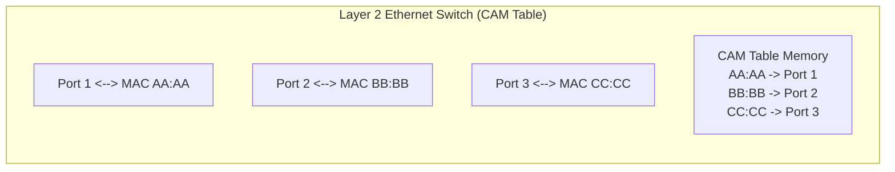
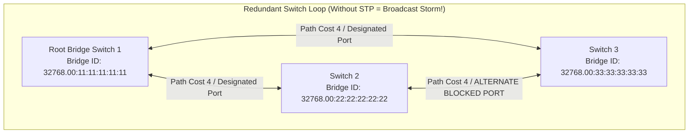
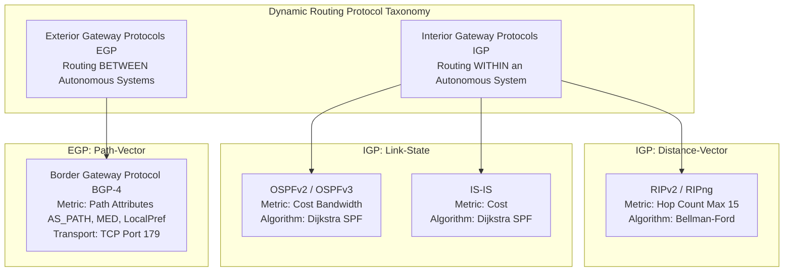
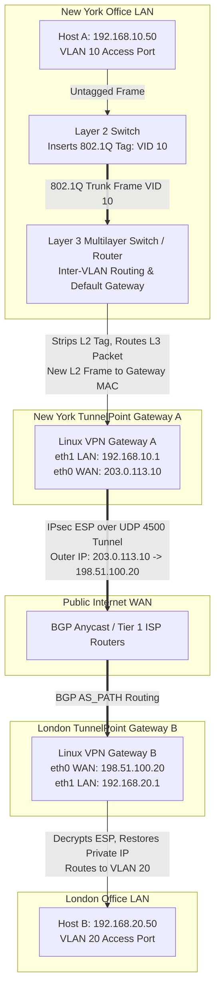

# PART 3 — Routing & Switching

## 1. Layer 2 vs. Layer 3 Switching & Forwarding Architectures
To engineer enterprise WANs and Site-to-Site VPN platforms like **TunnelPoint**, you must master the mechanics of how network frames and packets move across physical hardware. 

While small home networks rely on simple all-in-one WiFi routers, enterprise infrastructures separate data-link forwarding (**Layer 2 Switching**) from network-layer routing (**Layer 3 Routing**) to achieve wire-speed performance across thousands of endpoints.

### Layer 2 Switching Mechanics (CAM Table Learning & ASICs)
A **Layer 2 Switch** operates strictly on 48-bit Ethernet MAC addresses. It connects hardware interfaces within the *same* broadcast domain or subnet.



* **Content-Addressable Memory (CAM)**: Unlike standard RAM where the CPU provides a memory address to retrieve data, CAM hardware takes a **data word (the 48-bit MAC address) as input** and returns the exact memory address (the switch port number) in a single clock cycle ($O(1)$ complexity). This allows ASICs to make forwarding decisions in under 1 microsecond at wire speeds exceeding 400 Gbps.
* **The Layer 2 Forwarding Algorithm**:
  1. **Source MAC Learning**: When Frame F arrives on Port 1 from MAC `AA:AA`, the ASIC checks the CAM table. If `AA:AA` is not recorded, it writes: `[MAC AA:AA -> Port 1, Timestamp: 0s]`. (CAM entries typically expire after 300 seconds of inactivity).
  2. **Destination MAC Lookup**: The ASIC checks the Destination MAC in the CAM table:
     * **Known Unicast**: If destination `BB:BB` is mapped to Port 2, the frame is forwarded *only* out Port 2.
     * **Unknown Unicast**: If destination `DD:DD` is not yet in the CAM table, the switch **floods** the frame out all ports in the VLAN except Port 1.
     * **Broadcast / Multicast**: If destination is `FF:FF:FF:FF:FF:FF` or `01:00:5E:xx:xx:xx`, the switch **floods** the frame out all ports in the VLAN except Port 1.
     * **Local Filtering**: If destination `AA:AA` is mapped to Port 1 (the same port the frame arrived on), the switch **drops (filters)** the frame.

### Layer 3 Switching & Routing Mechanics (TCAM & FIB)
While Layer 2 switches forward frames within a subnet, **Layer 3 Routers and Multilayer Switches** forward IP packets *between* disparate subnets and broadcast domains.

* **Ternary Content-Addressable Memory (TCAM)**: While standard CAM matches exact binary strings (0s and 1s), TCAM evaluates three states: `0`, `1`, and `X` (Don't Care / Wildcard). This allows TCAM ASICs to perform **wire-speed IP subnet matching** (e.g., matching `192.168.10.X`) in a single clock cycle without CPU intervention!
* **Why Layer 3 Switches Replaced "Router-on-a-Stick"**: In legacy networks, routing traffic between VLAN 10 and VLAN 20 required sending all frames out a trunk link to an external router CPU (Router-on-a-Stick), creating a massive bandwidth bottleneck. Modern Layer 3 switches incorporate TCAM routing tables directly into the switch ASICs, routing inter-VLAN traffic at 100+ Gbps wire speed.

---

## 2. VLANs (IEEE 802.1Q) & Trunking Deep Dive
A **Virtual Local Area Network (VLAN)** logically partitions a single physical switch into multiple isolated broadcast domains. Without VLANs, a broadcast sent by a marketing computer would interrupt the NICs of every finance server and database in the building.

### Access Ports vs. Trunk Ports
* **Access Port**: An interface connected to an end-user device (laptop, printer, server). An access port belongs to exactly **one VLAN** (e.g., VLAN 10). When a PC sends a standard Ethernet frame into an access port, the switch internally tags it as VLAN 10. When the switch sends a frame out an access port to a PC, **it strips the VLAN tag completely**, delivering a standard untagged Ethernet frame.
* **Trunk Port**: An interface connected between two switches, or between a switch and a **TunnelPoint Linux Gateway / Router**. A trunk port carries traffic for **multiple VLANs simultaneously** across a single physical cable!

### IEEE 802.1Q Frame Tagging Structure
How does a receiving switch know whether an incoming frame on a trunk link belongs to VLAN 10 or VLAN 20? Through **IEEE 802.1Q Tagging**! The sending switch inserts a **4-byte (32-bit) 802.1Q Tag** directly into the Ethernet header between the Source MAC and the EtherType field:

```
+----------------+---------------+------------------+---------------+---------------------------------+--------------------+------------------+-------------------+
| Preamble       | SFD           | Destination MAC  | Source MAC    | 802.1Q Tag (4 Bytes / 32 Bits)  | EtherType / Length | Payload Data     | FCS (CRC-32)      |
| (7 Bytes)      | (1 Byte)      | (6 Bytes)        | (6 Bytes)     | [TPID: 0x8100 | TCI: PCP/DEI/VID]| 0x0800 (IPv4)      | IP Packet / ARP  | Checksum Trailer  |
+----------------+---------------+------------------+---------------+---------------------------------+--------------------+------------------+-------------------+
```

#### Anatomy of the 4-Byte 802.1Q Tag
1. **Tag Protocol Identifier (TPID - 16 Bits / 2 Bytes)**: Always set to the hexadecimal value **`0x8100`**. When a NIC or switch ASIC sees `0x8100` after the Source MAC, it instantly knows this is an 802.1Q tagged frame!
2. **Tag Control Information (TCI - 16 Bits / 2 Bytes)**:
   * **Priority Code Point (PCP - 3 Bits)**: Defines IEEE 802.1p Quality of Service (QoS) class of service ($0 \text{ to } 7$). Used to prioritize real-time Voice over IP (VoIP) or **TunnelPoint IPsec VPN packets** over standard data bulk transfers across switch trunks!
   * **Drop Eligible Indicator (DEI - 1 Bit)**: If set to `1`, this frame can be dropped first by switches during severe traffic congestion.
   * **VLAN Identifier (VID - 12 Bits)**: Identifies the specific VLAN number! Because the VID is 12 bits wide, the mathematical maximum number of VLANs on an Ethernet network is $2^{12} = 4,096$ (VLAN `0` and `4095` are reserved, leaving usable VLANs **`1 to 4094`**).

> [!WARNING]
> **Native VLAN & VLAN Hopping Attack (Double Tagging)**:
> On an 802.1Q trunk link, the **Native VLAN** (default is VLAN 1) is the only VLAN whose frames are transmitted across the trunk **without an 802.1Q tag** (untagged).
> **The Attack**: If an attacker plugs a PC into an access port assigned to the Native VLAN (VLAN 1), they can craft a malicious **Double-Tagged Ethernet Frame** containing two 802.1Q tags: an outer tag for VLAN 1 and an inner tag for VLAN 100 (e.g., Secure Finance VLAN).
> When Switch 1 receives the frame, it sees the outer tag is VLAN 1 (the Native VLAN). When forwarding across the trunk to Switch 2, Switch 1 **strips the outer VLAN 1 tag** because native VLAN frames must cross untagged! When the frame arrives at Switch 2, Switch 2 reads the *remaining inner tag (VLAN 100)* and forwards the attacker's packet directly into the isolated Finance VLAN!
> **Enterprise Remediations**: Never use VLAN 1 for anything! Always change the Native VLAN on trunk ports to an unused, black-holed VLAN ID (e.g., VLAN 999), and tag all operational VLANs!

---

## 3. Spanning Tree Protocol (STP - IEEE 802.1D / RSTP 802.1w)
In enterprise network design, we must install redundant physical fiber cables between switches so that if one cable is cut, the network survives. 

However, **Layer 2 Ethernet headers do NOT have a Time-To-Live (TTL) field!** If a physical loop exists between switches, broadcast frames (`FF:FF:FF:FF:FF:FF`) will circulate infinitely, multiplying at every hop until they consume 100% of bandwidth and crash the switch CPUs within seconds—a **Broadcast Storm**.



### The STP Loop-Prevention Algorithm
**Spanning Tree Protocol (STP)** executes a mathematical graph algorithm developed by Radia Perlman that elects a Root Bridge and logically blocks redundant physical interfaces to construct a loop-free tree topology:

1. **Root Bridge Election**: Switches exchange multicast Bridge Protocol Data Units (BPDUs) every 2 seconds. The switch with the **lowest Bridge ID (Bridge Priority + MAC Address)** wins and becomes the Root Bridge. By default, all switches have Priority `32768`. Therefore, the switch with the lowest hexadecimal MAC address becomes Root! *(In production, engineers manually set the Core Switch priority to `4096` to guarantee it becomes Root).*
2. **Root Port (RP) Selection**: Every non-root switch calculates the shortest cumulative path cost to the Root Bridge. The interface with the lowest cost becomes the Root Port. (Standard costs: 10 Gbps = 2, 1 Gbps = 4, 100 Mbps = 19).
3. **Designated Port (DP) Selection**: On every network segment/link, the switch port advertising the lowest cumulative cost to Root becomes the Designated Port (forwarding traffic).
4. **Blocking / Alternate Port**: Any switch interface that is neither a Root Port nor a Designated Port is placed into a **Blocked State**. It listens to BPDUs but drops all user data frames, physically breaking the loop!

### STP vs. Rapid Spanning Tree (RSTP 802.1w)
* **Legacy STP (802.1D) Convergence Delay**: When a cable breaks, legacy STP takes **30 to 50 seconds** to transition a blocked port through Listening (15s) and Learning (15s) states into Forwarding! In a modern datacenter or during an active **TunnelPoint VPN session**, a 50-second blackout causes TCP connections to drop and IKE tunnels to fail!
* **Rapid Spanning Tree Protocol (RSTP - 802.1w)**: Replaces timers with an active **Proposal/Agreement Handshake** between switch ASICs. When a primary link fails, RSTP transitions an Alternate Backup Port into Forwarding state in **less than 50 milliseconds!**
* **PortFast / Edge Port**: Configured on switch access ports connected to end-user laptops or Linux servers. It instructs the switch to bypass STP Listening/Learning states and jump immediately into Forwarding state the microsecond the cable is plugged in! *(Always pair PortFast with **BPDU Guard**—if a user plugs a rogue switch into a PortFast port, BPDU Guard instantly disables the port to prevent loops!)*

---

## 4. Routing Tables & Longest-Prefix Matching (LPM)
When an IP packet arrives at a router or **TunnelPoint Linux Gateway**, the kernel data plane consults its **Forwarding Information Base (FIB) / Routing Table** to determine the egress interface and next-hop gateway.

### Anatomy of an Enterprise Routing Table
In Linux (`ip route show` or `netstat -rn`), a routing table consists of six core fields:
```
Destination        Gateway            Genmask         Flags   Metric   Ref    Use   Iface
0.0.0.0            203.0.113.1        0.0.0.0         UG      100      0        0   eth0  (Default Gateway / WAN)
192.168.10.0       0.0.0.0            255.255.255.0   U       0        0        0   eth1  (Local Office LAN)
192.168.20.0       198.51.100.20      255.255.255.0   UG      50       0        0   eth0  (Remote Office via VPN Gateway)
```
* **Destination & Genmask**: The target IP subnet prefix and subnet mask. `0.0.0.0/0` represents the **Default Route (Gateway of Last Resort)**—matching any IP address on Earth that does not match a more specific route!
* **Gateway (Next-Hop)**: The IP address of the next router along the path. If listed as `0.0.0.0` or `*`, the subnet is **Directly Connected** to the router's local interface!
* **Flags**: `U` = Route is UP. `G` = Requires a Gateway (next-hop router). `H` = Host route (a `/32` single IP route).
* **Metric**: A numerical cost assigned to the route. When multiple routes exist to the exact *same* prefix, the router selects the route with the lowest metric!

### Longest-Prefix Matching (LPM) — The Absolute Rule of Routing
How does a router choose where to send a packet when multiple overlapping subnet prefixes exist in its table?
**THE ROUTER ALWAYS SELECTS THE ROUTE WITH THE LONGEST SUBNET MASK PREFIX (THE MOST SPECIFIC MATCH)!**

#### Interactive LPM Example
Imagine our TunnelPoint Gateway A has the following four entries in its routing table:
1. `0.0.0.0/0 via 203.0.113.1 dev eth0` (Default Internet Route)
2. `10.0.0.0/8 via 192.168.10.254 dev eth1` (Corporate Intranet Core)
3. `10.20.0.0/16 via 198.51.100.20 dev ipsec0` (TunnelPoint VPN Tunnel to London)
4. `10.20.50.100/32 via 172.16.0.5 dev eth2` (Dedicated Fiber to High-Security Database)

Where will the gateway route the following incoming packets?
* **Packet 1: Dest IP `8.8.8.8`**: Does not match `/8`, `/16`, or `/32`. Matches only `/0` (length 0). Forwarded out `eth0` to Internet!
* **Packet 2: Dest IP `10.5.5.5`**: Matches `/0` (length 0) and `10.0.0.0/8` (length 8). Longest prefix is `/8`! Forwarded out `eth1` to Intranet Core!
* **Packet 3: Dest IP `10.20.100.50`**: Matches `/0`, `/8`, and `10.20.0.0/16` (length 16). Longest prefix is `/16`! Forwarded into `ipsec0` VPN Tunnel!
* **Packet 4: Dest IP `10.20.50.100`**: Matches all four routes! Longest prefix is `10.20.50.100/32` (length 32 — exact host match!). Forwarded out `eth2` to High-Security Database!

> [!IMPORTANT]
> **Longest-Prefix Matching ALWAYS overrides Administrative Distance and Metric!** Even if the default route `/0` has a metric of `1` and the `/16` VPN route has a metric of `5000`, the router will **always** choose the `/16` route because 16 bits is more specific than 0 bits!

### Administrative Distance (AD) / Route Preference
What happens if a router learns the exact *same* subnet prefix (`192.168.20.0/24`) from three different routing sources simultaneously (e.g., Static Route, OSPF, and BGP)?
The router uses **Administrative Distance (AD)**—a believability/preference rating assigned to each routing protocol. **The lower the AD, the more trustworthy the route!**

| Routing Source / Protocol | Standard Linux / Cisco Administrative Distance (AD) |
| :--- | :--- |
| **Connected Interface** | **0** (Absolute highest trustworthiness) |
| **Static Route** | **1** (Administrator configured) |
| **eBGP (Exterior BGP)** | **20** |
| **OSPF (Open Shortest Path First)** | **110** |
| **RIP (Routing Information Protocol)** | **120** |
| **iBGP (Interior BGP)** | **200** |
| **Unknown / Unreachable** | **255** (Route is discarded) |

---

## 5. Static Routing vs. Dynamic Routing

### Static Routing
A **Static Route** is manually typed into the router configuration by a network administrator:
```bash
# Adding a static route on Linux: Route traffic for London Office (192.168.20.0/24) via VPN Gateway B WAN IP
sudo ip route add 192.168.20.0/24 via 198.51.100.20 dev eth0
```
* **Advantages**: Zero CPU overhead, zero bandwidth consumed by routing protocols, absolute security (no routing advertisements can be spoofed by attackers).
* **Disadvantages**: Zero fault tolerance or adaptability! If a WAN fiber cable breaks or an ISP goes down, a static route remains in the table, black-holing traffic indefinitely until an engineer manually logs in and deletes it!
* **When to Use**: Stub networks (networks with only one exit point), Default Gateways, and simple Site-to-Site VPN tunnels with fixed endpoints.

### Dynamic Routing
**Dynamic Routing Protocols** (OSPF, BGP, RIP) allow routers to automatically exchange topology messages, calculate loop-free paths, and instantly reconverge traffic onto backup links when failures occur!

---

## 6. Dynamic Routing Protocol Deep Dive: RIP, OSPF & BGP



### 1. RIP (Routing Information Protocol - RIPv2 / RIPng)
* **Algorithm**: Distance-Vector protocol using the **Bellman-Ford algorithm**. Routers broadcast their entire routing table to neighbors every 30 seconds over UDP port 520.
* **Metric**: Pure **Hop Count** (number of routers along the path).
* **Why RIP is Obsolete in Enterprise Networks**:
  1. **15 Hop Limit**: Any destination 16 hops away is marked as unreachable (`Infinity`). It cannot scale beyond small networks!
  2. **Bandwidth Blindness**: A 1-hop path across a slow 1.5 Mbps T1 serial link has a metric of `1`. A 2-hop path across two 100 Gbps fiber links has a metric of `2`. **RIP will blindly route traffic over the slow 1.5 Mbps link!**
  3. **Slow Convergence & Count-to-Infinity**: When a link fails, RIP takes up to 180 seconds (Dead Timer) to converge, frequently generating routing loops!

### 2. OSPF (Open Shortest Path First - RFC 2328 OSPFv2 / OSPFv3)
OSPF is the industry-standard **Link-State IGP** used inside enterprise LANs, datacenters, and campus networks.
* **Algorithm**: **Edsger Dijkstra's Shortest Path First (SPF)** algorithm.
* **Link-State Operation**: Unlike RIP, OSPF routers do *not* broadcast their entire routing tables! Instead, they exchange small **Link-State Advertisements (LSAs)** describing the operational state, IP prefix, and speed of their directly connected interfaces. Every router in an area compiles these LSAs into an identical **Link-State Database (LSDB)**—a complete topological map of the entire network! Each router then runs Dijkstra's SPF math against its local LSDB to construct the shortest-path routing tree!
* **Hierarchical Area Design**:
  * To prevent the LSDB from becoming too large and consuming massive CPU/RAM on routers, OSPF divides networks into **Areas**.
  * **Area 0 (Backbone Area)**: The core of the OSPF network. All other areas (**Area 1, Area 2, etc.**) **MUST physically or logically connect directly to Area 0!** Area Border Routers (ABRs) summarize routes between areas, isolating topology instability (if a switch flapping occurs in Area 1, routers in Area 2 do not need to recalculate their Dijkstra SPF trees!).
* **OSPF Metric (Cost Math)**:
  $$\text{OSPF Cost} = \frac{\text{Reference Bandwidth } (100 \text{ Mbps by default})}{\text{Interface Bandwidth in Mbps}}$$
  * 100 Mbps Fast Ethernet: $\frac{100}{100} = \text{Cost } 1$.
  * 10 Gbps Fiber: $\frac{100}{10,000} = 0.01 \rightarrow \text{Cost } 1$ *(By default, OSPF cannot differentiate between 100 Mbps, 1 Gbps, and 10 Gbps because costs cannot be decimals! In production, engineers must change `auto-cost reference-bandwidth 100000` to fix this!)*

### 3. BGP (Border Gateway Protocol - RFC 4271)
While OSPF routes traffic *within* an enterprise network (IGP), **BGP is the Path-Vector EGP that routes traffic across the global Internet and Cloud WANs!**

* **Transport**: BGP does not use raw IP or UDP broadcasts; it establishes reliable, unicast **TCP Port 179** connections between routing peers!
* **iBGP vs. eBGP**:
  * **eBGP (Exterior BGP)**: Peering between routers in **different Autonomous Systems** (e.g., TunnelPoint Gateway peering with AWS Transit Gateway or AT&T ISP). Administrative Distance = `20`.
  * **iBGP (Interior BGP)**: Peering between routers inside the **same Autonomous System**. Administrative Distance = `200`. Used by ISPs and large corporations to distribute Internet routes across their internal backbone.
* **BGP Path Attributes (How BGP Makes Routing Decisions)**:
  BGP does not use a simple numerical metric or bandwidth cost. It evaluates a strict sequence of **Path Attributes**:
  1. **Highest Weight**: Cisco-proprietary local router attribute.
  2. **Highest LOCAL_PREF (Local Preference)**: An attribute shared across the entire AS. Used by network engineers to dictate: *"All outbound traffic to the Internet MUST exit via Fiber ISP 1 instead of Backup Coax ISP 2!"*
  3. **Locally Originated Routes**: Routes generated by the router itself (`network` or `aggregate` commands).
  4. **Shortest AS_PATH**: The primary loop-prevention and distance metric of the Internet! If Route A traverses ASNs `[AS3356, AS15169]` (2 AS hops) and Route B traverses `[AS2914, AS1299, AS65001, AS15169]` (4 AS hops), BGP selects Route A! If a router sees its *own* ASN inside an incoming AS_PATH advertisement, it drops the route immediately to prevent routing loops!
  5. **Lowest MED (Multi-Exit Discriminator)**: An attribute sent to external eBGP peers telling them: *"If you have multiple physical links into our AS, please send inbound traffic across Link 1 instead of Link 2!"*
  6. **eBGP over iBGP**: Prefer routes learned from external peers over internal peers.

---

## 7. Gateway Operation & Policy-Based Routing (PBR)
In standard IP routing, a router makes its forwarding decision **solely based on the Destination IP address**.

However, in advanced enterprise infrastructures and **TunnelPoint Linux VPN Gateways**, we frequently require **Policy-Based Routing (PBR / Linux Advanced Routing via `iproute2`)** to route packets based on:
* **Source IP Address** (e.g., Executive VLAN `192.168.10.10/32` routes over high-speed Fiber WAN, while Guest VLAN `192.168.10.200/24` routes over cheap DSL WAN).
* **Layer 4 Protocol / Port** (e.g., All HTTP port 80 traffic routes to an external web proxy, while database port 5432 traffic routes into our IPsec VPN tunnel!).
* **Ingress Interface or DSCP QoS marking**.

### Linux Advanced Routing Mechanics (`ip rule` & Multiple Route Tables)
The Linux kernel supports up to **255 independent routing tables** defined in `/etc/iproute2/rt_tables` (Table 254 is the default table viewed by `ip route show`). 

To implement Policy-Based Routing, we use the **Routing Policy Database (RPDB)** configured via the `ip rule` command:

```bash
# 1. Create a custom routing table named 'vpn_table' with ID 100 in /etc/iproute2/rt_tables
echo "100 vpn_table" | sudo tee -a /etc/iproute2/rt_tables

# 2. Add a static default route inside our custom 'vpn_table' pointing into our TunnelPoint IPsec Virtual Tunnel Interface (vti0)
sudo ip route add default via 198.51.100.20 dev vti0 table vpn_table

# 3. Create an RPDB Policy Rule: Instruct the Linux kernel that any traffic originating from our Secure Finance Subnet (192.168.10.128/26) MUST lookup 'vpn_table' instead of the default routing table!
sudo ip rule add from 192.168.10.128/26 table vpn_table priority 10

# 4. View active Linux routing rules (evaluated sequentially from lowest priority number to highest!)
ip rule show
```

> **Why PBR is Essential for Enterprise VPN Gateways**: When we deploy TunnelPoint in cloud environments (like AWS or Azure), we use **Virtual Tunnel Interfaces (VTI / Route-Based VPNs)**. By combining Linux PBR rules with VTI interfaces, we can dynamically route specific subnets across encrypted IPsec tunnels while allowing general internet traffic to exit natively out the default WAN gateway!

---

## 8. How Packets Travel: The Multi-Hop & Multi-VLAN Walkthrough
Let's trace a packet across a complete enterprise switching, routing, and VPN topology!

**Scenario**: Host A in New York Engineering VLAN 10 (`192.168.10.50/24`) pings Host B in London Finance VLAN 20 (`192.168.20.50/24`) across our **TunnelPoint Site-to-Site VPN Gateway**.



### Step-by-Step Hardware Forwarding Analysis
1. **Access Port Ingress (L2 Switch)**: Host A transmits an untagged Ethernet frame destined for Default Gateway MAC. The L2 switch receives it on Port 1, notes `[MAC AA:AA -> Port 1]` in its CAM table, and tags the frame internally as **VLAN 10**.
2. **Trunk Port Egress (L2 Switch $\rightarrow$ L3 Switch)**: The L2 switch forwards the frame out its trunk port toward the L3 Switch. It inserts a **4-byte IEEE 802.1Q Tag (`VID = 10`, TPID = `0x8100`)** into the Ethernet header!
3. **Layer 3 Switch Inter-VLAN Routing**: The L3 Switch receives the tagged frame on its trunk port.
   * ASICs inspect the destination MAC address, recognizing it is the L3 Switch's own Virtual Switch Interface (SVI / VLAN 10 Gateway MAC).
   * The L3 Switch **strips off the entire Layer 2 Ethernet header and 802.1Q tag!**
   * ASICs consult the TCAM Forwarding Information Base (FIB) for Destination IP `192.168.20.50`. Longest-prefix match points to Default Gateway A (`192.168.10.1`).
   * The L3 Switch decrements TTL from 64 to 63, updates IP header checksum, ARPs for Gateway A's MAC address, and builds a **brand new untagged Ethernet frame** addressed to Gateway A's LAN NIC!
4. **IPsec Encapsulation & BGP WAN Transit (Gateway A)**:
   * Gateway A receives the frame, strips L2 header, and matches kernel XFRM security policies (SPD).
   * Encrypts packet in **AES-256-GCM ESP**, prepends outer WAN IP header (`203.0.113.10` $\rightarrow$ `198.51.100.20`), and transmits out `eth0`.
   * Public WAN routers evaluate the outer destination IP using **BGP AS_PATH attributes**, forwarding the encrypted ESP packet across Atlantic Ocean ISP backbones without viewing the inner VLAN or private IP data!
5. **Decapsulation & Delivery (Gateway B $\rightarrow$ London Host B)**:
   * Gateway B receives WAN packet, validates ESP authentication tag, decrypts payload, and recovers pristine private packet (`192.168.10.50` $\rightarrow$ `192.168.20.50`).
   * Gateway B checks FIB, routes out LAN interface `eth1` onto London office switch, which delivers the frame directly to Host B on VLAN 20!

---

## 9. Phase 3 Practical Exercises
Execute these commands on your Linux system or lab terminal to observe routing and switching mechanics:

### Exercise 1: Inspecting Routing Tables and Longest-Prefix Matching
Use `ip route` to examine your Linux kernel routing table and test exact route selection:
```bash
# 1. View your complete IPv4 routing table with metrics and interface names
ip route show

# 2. Ask the Linux kernel FIB exactly which route and interface it will choose for a specific destination IP!
ip route get 8.8.8.8
ip route get 192.168.10.50

# 3. View active Policy-Based Routing (PBR) rules in the kernel
ip rule show
```
**Goal**: Observe how `ip route get` simulates the exact ASIC/kernel Longest-Prefix Match lookup without transmitting a packet!

### Exercise 2: Simulating VLAN Interfaces and 802.1Q Tagging in Linux
You can create virtual 802.1Q VLAN sub-interfaces directly on Linux without needing a physical switch:
```bash
# 1. Create an 802.1Q VLAN 10 interface named eth0.10 attached to physical interface eth0
sudo ip link add link eth0 name eth0.10 type vlan id 10

# 2. Assign a private IP address to the new VLAN 10 interface and bring it UP
sudo ip addr add 192.168.10.1/24 dev eth0.10
sudo ip link set dev eth0.10 up

# 3. Verify the new VLAN interface and its 802.1Q encapsulation state
ip -d link show eth0.10
```
**Goal**: See how Linux handles VLAN encapsulation in software. When packets exit `eth0.10`, the kernel automatically inserts the 4-byte `0x8100` tag with `VID=10`! *(To clean up after testing: `sudo ip link delete eth0.10`)*.

---

## 10. Phase 3 Quiz Questions
Test your mastery of Part 3 without referencing the text above:

1. **Longest-Prefix Matching vs. Metric**: A router's routing table contains two entries: Route A is `10.20.0.0/16 via 192.168.1.1` with an OSPF Metric of `500` and Administrative Distance of `110`. Route B is `10.0.0.0/8 via 192.168.1.254` with a Static Metric of `10` and Administrative Distance of `1`. When an IP packet arrives destined for `10.20.55.99`, which exact next-hop gateway will the router select and why?
2. **VLAN Hopping Defense**: Explain how an attacker executes a "Double Tagging" VLAN hopping attack across an 802.1Q trunk link. What exact configuration weakness on the trunk port makes this attack possible, and what two mandatory architectural rules must a Senior Network Engineer enforce to prevent it?
3. **STP vs. RSTP Convergence**: Why does legacy Spanning Tree Protocol (802.1D) take up to 50 seconds to restore network connectivity after a primary fiber link failure, whereas Rapid Spanning Tree Protocol (802.1w) reconverges in under 50 milliseconds? What specific switch access port feature must be enabled for end-user laptops and servers?
4. **OSPF vs. BGP Use Cases**: Why do enterprise networks use OSPF as their Interior Gateway Protocol (IGP) within their campus data centers, but switch strictly to Border Gateway Protocol (BGP) when peering with AWS Transit Gateway or external ISPs across WAN links? What specific scaling limitation of OSPF makes it impossible to use on the global Internet?
5. **Policy-Based Routing (PBR)**: In standard Linux routing, if you configure two default gateways (`0.0.0.0/0 via ISP1` and `0.0.0.0/0 via ISP2`) in the same default routing table with identical metrics, what problem occurs? How do you use Linux `iprule` and `/etc/iproute2/rt_tables` to guarantee that all traffic originating from a specific database server (`192.168.10.99/32`) *always* routes over ISP 2?

---

## 11. Senior Engineer Interview Questions & Answers

### Question 1: "Explain how Longest-Prefix Matching (LPM) works in hardware routers using TCAM. Why is LPM computationally more complex than Layer 2 MAC address CAM table lookups?"
* **Answer**: A Layer 2 switch uses standard Content-Addressable Memory (CAM) to perform exact binary searches. Because a MAC address (`AA:BB:CC:DD:EE:FF`) is fixed at 48 bits, the ASIC feeds the exact 48-bit string into CAM, which returns the egress port in $O(1)$ clock cycle.
  In contrast, Layer 3 routing requires matching variable-length subnet prefixes (`/8`, `/16`, `/24`, `/32`). If a router used exact-match RAM/CAM, it would have to perform 32 sequential searches (checking `/32`, then `/31`, then `/30`... down to `/0`) for every single packet! To achieve wire speed, routers use **Ternary Content-Addressable Memory (TCAM)**, which evaluates three states per bit: `0`, `1`, and `X` (Don't Care / Wildcard). By programming subnet masks as wildcard strings (e.g., `192.168.10.X` for a `/24`), TCAM compares the incoming IP destination against all 900,000+ Internet routes simultaneously in a single clock cycle, returning the memory address of the longest matching prefix!

### Question 2: "What is BGP AS_PATH prepending, and how do network engineers use it to influence inbound traffic from the Internet across redundant multi-homed ISP connections?"
* **Answer**: When an enterprise has two internet connections (e.g., a 10 Gbps Primary Fiber link via ISP 1 and a 1 Gbps Backup Coax link via ISP 2), influencing *outbound* traffic is easy: we simply set a higher BGP **LOCAL_PREF** attribute on routes learned from ISP 1.
  However, influencing *inbound* traffic coming from the Internet is challenging because external autonomous systems make their own routing decisions! To force global Internet routers to send inbound traffic across our Primary 10 Gbps link instead of the Backup link, we use **AS_PATH Prepending**. When advertising our public IP prefix (`203.0.113.0/24`) to Backup ISP 2, we artificially lengthen the AS_PATH by repeating our own Autonomous System Number multiple times (e.g., advertising `[AS65100, AS65100, AS65100, AS65100]`). When advertising to Primary ISP 1, we advertise a normal single AS_PATH `[AS65100]`. Because BGP's primary path selection algorithm prefers the **shortest AS_PATH**, global routers worldwide will see the 1-hop path via ISP 1 as superior to the artificially inflated 4-hop path via ISP 2, directing 100% of inbound traffic over our primary fiber!

### Question 3 (STAR Method Response): "Describe a time you diagnosed and resolved a network outage caused by a routing loop or Spanning Tree failure."
* **Situation**: During a datacenter core switch firmware upgrade at my previous enterprise, our entire campus network experienced a sudden, catastrophic outage. CPU utilization on all 40+ access switches spiked to 100%, network latency jumped to over 5,000ms, and internal SSH/SSH-VPN connections dropped completely.
* **Task**: As the lead Infrastructure Engineer, I had to immediately identify and terminate the root cause of the broadcast storm without physical console access to all 40 switches.
* **Action**:
  1. I managed to connect to our out-of-band management console on Core Switch 1 and ran `show interfaces counters errors` and `show spanning-tree detail`. I observed that interface `GigabitEthernet1/0/24` was receiving over 800,000 broadcast packets per second!
  2. I discovered that during the firmware reboot of Core Switch 1, a junior engineer had mistakenly plugged a redundant fiber link between two distribution switches that had **RSTP (802.1w) disabled** due to a legacy VLAN misconfiguration! Without STP BPDUs flowing on that link, both switches transitioned their ports to Forwarding state simultaneously, creating an infinite Layer 2 loop!
  3. Because Ethernet frames lack a TTL field, broadcasts were circulating endlessly, multiplying at every switch.
  4. To instantly break the loop without shutting down distribution switches, I issued an administrative shutdown command on interface `GigE1/0/24` from the core switch CLI.
* **Result**: Within 2 seconds of shutting down the looped port, broadcast traffic dropped from 800,000 pps down to normal background levels (12 pps), switch CPUs dropped to 8%, and campus connectivity was fully restored. To permanently prevent reoccurrence, I audited all 40 switches, enforced global Rapid Spanning Tree (RSTP 802.1w), and enabled **BPDU Guard** and **Loop Guard** across all access and trunk interfaces.

---

## 12. Common Mistakes & Pitfalls

1. **Confusing OSPF Cost with Administrative Distance**:
   * *Mistake*: Assuming an OSPF route with Cost `10` will be chosen over an eBGP route with Metric `5` because 10 is higher/lower.
   * *Correction*: **Administrative Distance (AD)** determines which *routing protocol* wins when different protocols advertise the exact same subnet (eBGP AD=20 beats OSPF AD=110!). **Metric/Cost** is only evaluated *within the exact same protocol* (e.g., choosing between two OSPF paths)!
2. **Forgetting to Change OSPF Auto-Cost Reference Bandwidth**:
   * *Mistake*: Leaving OSPF at its default reference bandwidth ($10^8$ bps / 100 Mbps) on modern 10 Gbps / 40 Gbps datacenter networks.
   * *Correction*: Because OSPF cost formula is $\frac{\text{Ref BW}}{\text{Interface BW}}$ and costs must be integers ($\ge 1$), a 100 Mbps link, a 1 Gbps link, and a 10 Gbps link **all calculate to Cost 1 by default!** OSPF will load-balance traffic across a slow 100 Mbps link and a 10 Gbps fiber link equally! Always configure `auto-cost reference-bandwidth 100000` (100 Gbps) across all routers!
3. **Misconfiguring Trunk Native VLANs**:
   * *Mistake*: Setting Switch 1's trunk native VLAN to VLAN 1, while accidentally setting Switch 2's connected trunk native VLAN to VLAN 10.
   * *Correction*: This creates a **Native VLAN Mismatch / VLAN Leak!** Untagged frames exiting Switch 1 on VLAN 1 will enter Switch 2 and be dumped directly into VLAN 10, merging two isolated broadcast domains and causing severe DHCP/IP routing conflicts! Native VLANs must match identically on both ends of a trunk link!
4. **Overlooking Asymmetric Routing in Stateful Firewalls and VPNs**:
   * *Mistake*: Designing a multi-path network where outbound packets from Host A to Host B travel via Router 1 (which has a stateful firewall), but return packets from Host B to Host A route back via Router 2!
   * *Correction*: This is called **Asymmetric Routing**. When return packets arrive at Router 2, Router 2's stateful firewall (`conntrack`) has no record of the initial TCP SYN handshake! It marks the return packets as invalid/spoofed and **drops them immediately!** In Site-to-Site VPN design, you must ensure routing is strictly symmetric across gateways!

---

## 13. Real-World Company Usage

### 1. Amazon Web Services (AWS Transit Gateway & BGP VPNs)
When enterprise customers connect hundreds of on-premises branch offices and AWS Virtual Private Clouds (VPCs), managing static routes or full-mesh point-to-point VPN tunnels becomes a maintenance nightmare ($N(N-1)/2$ tunnels!).
AWS solves this using **AWS Transit Gateway (TGW)**—a centralized, cloud-native Layer 3 routing hub. Customers establish dynamic **IPsec Site-to-Site VPN tunnels** from their on-premises Linux/Cisco gateways directly into the AWS TGW using **Exterior BGP (eBGP over IPsec VTI)**.
When a new subnet is added to an on-premises datacenter in Chicago, the local router advertises the new prefix over the IPsec tunnel via BGP. The AWS Transit Gateway receives the BGP update, updates its internal TCAM route tables, and automatically propagates the route to all 50+ connected AWS VPCs globally in sub-seconds without human intervention!

### 2. Equinix & Global IXPs (BGP Route Servers & Peering Fabrics)
At global **Internet Exchange Points (IXPs)** operated by Equinix or DE-CIX, hundreds of Tier 1 ISPs, content providers (Netflix, Google), and enterprise networks plug their core routers into a massive, multi-terabit Ethernet Layer 2 switching fabric.
If 500 ISPs at an IXP wanted to peer with each other directly, they would have to configure $500 \times 499 / 2 = 124,750$ individual BGP peering sessions! To eliminate this complexity, IXPs deploy **BGP Route Servers**. Every ISP establishes just **one single eBGP peering session** with the IXP Route Server. The Route Server acts as a reliable routing broker: it receives routing table advertisements from all 500 networks, applies strict prefix-list filtering and RPKI cryptographic route validation, and distributes a clean, unified global routing table back to every connected participant!
