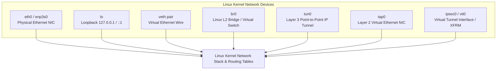
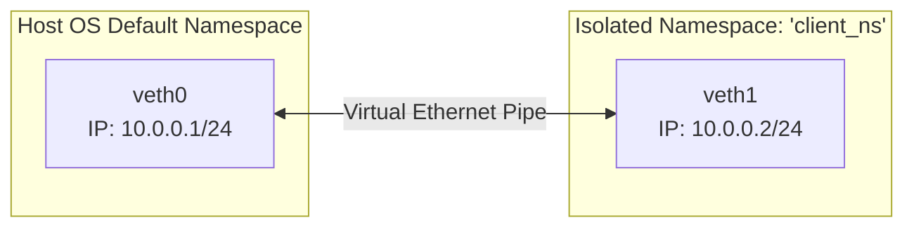
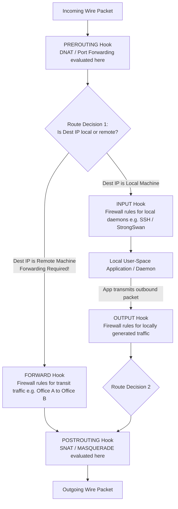

# PART 4 — Linux Networking

## 1. Linux Network Interfaces & Device Taxonomy
In the Linux operating system, network communication is mediated through logical network devices managed by the kernel network stack. Unlike Unix files, network interfaces do not exist as device nodes in `/dev`; they are dynamic kernel objects accessible via the socket API and `iproute2` utilities.



### Device Type Deep Dive
1. **Physical Ethernet (`eth0`, `enp3s0`, `eno1`)**: Represents a hardware Network Interface Card (NIC). Operates at Layer 1/2.
2. **Loopback (`lo`)**: A pure software virtual interface assigned `127.0.0.1/8` and `::1/128`. Packets sent to `lo` are looped back immediately inside kernel memory without ever touching hardware. Essential for local IPC and daemon binding.
3. **Virtual Ethernet Pairs (`veth`)**: Created in linked pairs (e.g., `veth0` $\leftrightarrow$ `veth1`). They act as a virtual patch cable: any packet transmitted into `veth0` instantly emerges from `veth1`. Why are they critical? **They are the foundational building block of Docker containers and Kubernetes pods!** One end sits inside the container's isolated network namespace, and the other end plugs into the host's bridge!
4. **Linux Bridge (`br0`)**: A virtual Layer 2 Ethernet switch implemented entirely in kernel software. It maintains a MAC address CAM table, performs MAC learning, and switches frames between connected interfaces (`veth`, physical NICs, or VMs).
5. **TUN vs. TAP Devices (Virtual Network Drivers)**:
   * **TUN (Network Tunnel / Layer 3)**: A software-only interface that operates at **Layer 3 (IP Packets)**. When a user-space application (like OpenVPN or WireGuard) opens `/dev/net/tun`, the kernel passes raw IPv4/IPv6 packets directly to the application without Ethernet headers!
   * **TAP (Network Tap / Layer 2)**: A software-only interface that operates at **Layer 2 (Ethernet Frames)**. When opened, the kernel passes complete Ethernet frames (including MAC addresses) to user space. Used heavily by hypervisors (QEMU/KVM, Proxmox) to give virtual machines virtual Ethernet NICs!
6. **Virtual Tunnel Interfaces (`vti0`, `ipsec0` - XFRM)**: Specialized Layer 3 interfaces tied directly to the Linux kernel **XFRM (Transform) IPsec Engine**. Any packet routed into `vti0` is automatically encrypted by kernel XFRM and encapsulated into an IPsec ESP/UDP packet!

---

## 2. IP Forwarding & Kernel Sysctl Tuning
By default, **a standard Linux system is NOT a router!** If a packet arrives on `eth1` with a Destination IP belonging to another machine on `eth0`, the Linux kernel drops it immediately.

To convert a Linux server into a **TunnelPoint VPN Gateway**, we must explicitly enable kernel IP forwarding and tune security parameters in `/proc/sys/net/` via `/etc/sysctl.conf`:

```ini
# /etc/sysctl.conf - Enterprise Hardened Linux VPN Gateway Parameters

# 1. Enable IPv4 and IPv6 Packet Forwarding across all interfaces
net.ipv4.ip_forward = 1
net.ipv6.conf.all.forwarding = 1

# 2. Disable ICMP Redirect Acceptance and Transmission
# Why? ICMP Redirects tell hosts to use a different router. In a secure VPN gateway, malicious redirects can bypass encryption policies!
net.ipv4.conf.all.send_redirects = 0
net.ipv4.conf.default.send_redirects = 0
net.ipv4.conf.all.accept_redirects = 0
net.ipv4.conf.default.accept_redirects = 0

# 3. Enable Strict Reverse Path Filtering (RP-Filter / RFC 3704)
# Why? Prevents IP Spoofing! If a packet arrives on WAN eth0 claiming to have Source IP 192.168.10.50 (our internal LAN!), RP-Filter checks the routing table. Seeing that 192.168.10.50 is reachable via eth1, the kernel knows the packet on eth0 is spoofed and drops it instantly!
net.ipv4.conf.all.rp_filter = 1
net.ipv4.conf.default.rp_filter = 1

# 4. Ignore ICMP Echo Broadcasts (Smurf DoS Attack Defense)
net.ipv4.icmp_echo_ignore_broadcasts = 1

# 5. Disable Source Routing (Prevent attackers from specifying custom routing hops)
net.ipv4.conf.all.accept_source_route = 0

# 6. TCP Memory & Buffer Tuning for High-Throughput VPN Routing
net.core.rmem_max = 16777216
net.core.wmem_max = 16777216
net.ipv4.tcp_rmem = 4096 87380 16777216
net.ipv4.tcp_wmem = 4096 65536 16777216
```
To apply these changes dynamically without rebooting: `sudo sysctl -p`.

---

## 3. The `iproute2` Command Suite (Line-by-Line Mastery)
The legacy `net-tools` package (`ifconfig`, `route`, `arp`, `netstat`) was deprecated in Linux over 15 years ago. Enterprise engineers use **`iproute2`** (`ip`, `ss`, `tc`, `bridge`).

### Line-by-Line Breakdown of Core `ip` Commands
```bash
# 1. ip link: Inspect and control Layer 2 Data Link interfaces
sudo ip link show                   # List all interfaces, MAC addresses, MTU, and flags (UP, BROADCAST, PROMISC)
sudo ip link set dev eth0 up        # Bring interface eth0 administratively UP
sudo ip link set dev eth0 mtu 1400  # Set interface MTU to 1400 bytes (vital for avoiding VPN fragmentation!)

# 2. ip addr (ip -4 / ip -6): Inspect and control Layer 3 IP addresses
sudo ip -4 addr show dev eth1       # Show only IPv4 addresses assigned to eth1
sudo ip addr add 192.168.10.1/24 dev eth1  # Assign static IPv4 address and CIDR mask to LAN interface
sudo ip addr del 192.168.10.1/24 dev eth1  # Remove IP address from interface

# 3. ip route: Manipulate kernel Forwarding Information Base (FIB)
sudo ip route show                  # Display current IPv4 routing table
sudo ip route add 192.168.20.0/24 via 198.51.100.20 dev eth0  # Static route to London office via VPN gateway
sudo ip route add default via 203.0.113.1 dev eth0            # Set Default Gateway (0.0.0.0/0)
sudo ip route get 8.8.8.8           # Simulate exact ASIC/kernel route lookup for an IP

# 4. ip neighbor (ip neigh): Manipulate Layer 2 ARP and IPv6 NDP tables
sudo ip neighbor show               # View ARP cache (IP to MAC mappings)
sudo ip neighbor flush dev eth1     # Flush ARP cache on LAN interface (force re-ARPing)

# 5. ip rule: Manipulate Routing Policy Database (RPDB / Policy-Based Routing)
sudo ip rule show                   # Display active routing rules and priorities
sudo ip rule add from 192.168.10.0/24 table 100 priority 10   # Direct LAN subnet to custom route table 100

# 6. ip netns: Manipulate Network Namespaces (Containerization isolation)
sudo ip netns add office_a          # Create an isolated network namespace named 'office_a'
sudo ip netns exec office_a ip link list  # Execute 'ip link list' INSIDE the isolated namespace!
```

---

## 4. Network Namespaces (`netns`) & Virtual Ethernet (`veth`)
How do Docker containers run on a Linux server with independent IP addresses, routing tables, and firewall rules without interfering with the host OS? Through **Linux Network Namespaces (`netns`)**!

A network namespace is an isolated copy of the entire Linux kernel networking stack: it has its own loopback interface, its own set of NICs, its own routing table (`FIB`), its own ARP cache, and its own Netfilter/iptables ruleset!

### Complete Lab: Building an Isolated Virtual Network with `veth` and `netns`
Let's build a simulated 2-node network directly inside your Linux kernel:



```bash
# Step 1: Create an isolated network namespace named 'client_ns'
sudo ip netns add client_ns

# Step 2: Create a connected Virtual Ethernet cable pair (veth0 <---> veth1)
sudo ip link add veth0 type veth peer name veth1

# Step 3: Move veth1 into the isolated 'client_ns' namespace! (veth0 stays in default host namespace)
sudo ip link set veth1 netns client_ns

# Step 4: Configure IP address and bring UP veth0 in the default host namespace
sudo ip addr add 10.0.0.1/24 dev veth0
sudo ip link set dev veth0 up

# Step 5: Configure IP address and bring UP veth1 inside the isolated 'client_ns' namespace!
sudo ip netns exec client_ns ip addr add 10.0.0.2/24 dev veth1
sudo ip netns exec client_ns ip link set dev veth1 up
sudo ip netns exec client_ns ip link set dev lo up

# Step 6: Verify connectivity across the virtual namespace boundary!
ping -c 3 10.0.0.2
sudo ip netns exec client_ns ping -c 3 10.0.0.1
```
*(To clean up: `sudo ip netns delete client_ns` automatically destroys the namespace and veth pair!)*

---

## 5. Linux Netfilter & iptables / nftables Architecture
**Netfilter** is the packet filtering and modification framework embedded inside the Linux kernel. It provides five distinct hooks inside the networking stack where kernel modules (like `iptables`, `nftables`, or `conntrack`) can intercept, modify, drop, or NAT packets passing through the system:



### The 5 Netfilter Hooks
1. **`PREROUTING`**: Intercepts packets immediately after they arrive on a network interface, *before* any routing decisions are made. **Destination NAT (DNAT / Port Forwarding)** occurs here!
2. **`INPUT`**: Intercepts packets whose destination IP matches the local Linux machine itself (e.g., SSH attempts to port 22 or IKEv2 packets hitting port 500).
3. **`FORWARD`**: **THE CORE OF OUR VPN GATEWAY!** Intercepts packets arriving on one interface that must be routed out another interface (e.g., traffic passing from LAN `eth1` across the gateway to WAN `eth0` or IPsec tunnel `ipsec0`).
4. **`OUTPUT`**: Intercepts packets originated by local applications running on the Linux machine itself before they are routed.
5. **`POSTROUTING`**: Intercepts packets at the very last microsecond before they leave an egress interface onto the wire. **Source NAT (SNAT and MASQUERADE)** occurs here!

### `iptables` vs. Modern `nftables`
* **`iptables` (Legacy)**: Uses separate tables (`filter`, `nat`, `mangle`, `raw`) evaluated sequentially. Rules are processed linearly ($O(N)$), meaning if you have 10,000 firewall rules, a packet must be checked against every rule sequentially until a match occurs, causing CPU bottlenecks under DDoS attacks!
* **`nftables` (Modern Linux Standard)**: Replaces iptables with a unified pseudo-virtual machine inside the kernel. It uses **in-kernel maps, sets, and hash tables ($O(1)$ complexity)**. You can check an incoming IP against a blocklist of 100,000 IP addresses in a single clock cycle!

---

## 6. The Linux XFRM (Transform) Framework
How does Linux implement IPsec encryption without needing external proprietary software? Through the **XFRM (Transform) Framework** integrated directly into the Linux kernel data plane!

XFRM consists of two core kernel databases managed via the `ip xfrm` command suite:

```mermaid
graph LR
    subgraph "Linux Kernel XFRM Engine"
        SPD[Security Policy Database / SPD<br>'ip xfrm policy'<br>Rule: 192.168.10.0/24 -> 192.168.20.0/24<br>Action: ENCRYPT via IPsec tunnel to 198.51.100.20]
        SAD[Security Association Database / SAD<br>'ip xfrm state'<br>SA: SPI 0xC4A201B9 | Key: AES-256-GCM<br>Peer: 198.51.100.20]
    end

    PKT[Plaintext IP Packet<br>192.168.10.50 -> 192.168.20.50] -->|1. Checked against SPD| SPD
    SPD -->|2. Policy matches! Lookup SPI in SAD| SAD
    SAD ==>|3. Kernel encrypts & encapsulates| ESP[Encrypted IPsec ESP Packet out WAN]
```

1. **Security Policy Database (SPD / `ip xfrm policy`)**: The control-plane ruleset that tells the kernel *what traffic must be encrypted, what traffic must be dropped, and what traffic can pass in plaintext!*
   ```bash
   # View active kernel IPsec security policies
   sudo ip xfrm policy show
   ```
2. **Security Association Database (SAD / `ip xfrm state`)**: The data-plane cryptographic engine! It stores the active **Security Associations (SAs)** negotiated by our daemon (StrongSwan). Each SA contains the **SPI (Security Parameter Index)**, the encryption algorithm (e.g., `rfc4106(gcm(aes))`), the 256-bit secret session key, and anti-replay window sequence numbers!
   ```bash
   # View active cryptographic Security Associations and encryption keys in kernel memory!
   sudo ip xfrm state show
   ```

> **How StrongSwan & XFRM Interact**: **StrongSwan is NOT an encryption engine!** StrongSwan is a user-space IKEv2 key exchange daemon (`charon`). When Gateway A and Gateway B negotiate an IPsec tunnel, StrongSwan communicates over UDP 500/4500 to perform Diffie-Hellman key exchange and certificate authentication. Once the keys are derived, StrongSwan uses **Netlink system calls** to inject the secret keys and SPD rules directly into the Linux kernel's **XFRM SAD and SPD databases**! From that exact microsecond onwards, StrongSwan steps out of the way; 100% of the actual packet encryption and routing is executed at wire speed by the Linux kernel XFRM engine!

---

## 7. Phase 4 Practical Exercises & Quiz Checkpoint 🏁

### Practical Exercises
1. **Sysctl Inspection**: Run `sysctl net.ipv4.ip_forward` and `sysctl net.ipv4.conf.all.rp_filter` to check your machine's forwarding and spoofing defense states.
2. **XFRM Inspection**: Run `sudo ip xfrm state show` and `sudo ip xfrm policy show`. (If no VPN is running yet, the tables will be empty!).
3. **Netfilter Inspection**: Run `sudo iptables -L -n -v` and `sudo iptables -t nat -L -n -v` to see packet and byte counters across all Netfilter chains!

### Quiz Questions
1. **Reverse Path Filtering**: Why is enabling `net.ipv4.conf.all.rp_filter=1` (Strict Reverse Path Filtering / RFC 3704) mandatory on an enterprise VPN Gateway's public WAN interface? Describe the exact IP spoofing attack it prevents!
2. **Netfilter Hooks**: When an internal employee on LAN `eth1` (`192.168.10.50`) sends a file transfer across our Linux VPN Gateway to a remote server in London (`192.168.20.50`), which of the 5 Netfilter hooks (`PREROUTING`, `INPUT`, `FORWARD`, `OUTPUT`, `POSTROUTING`) does that packet traverse inside the gateway? Why does it NOT trigger the `INPUT` or `OUTPUT` hooks?
3. **TUN vs. TAP**: Why does OpenVPN or WireGuard use a **TUN (`tun0`)** virtual interface for Layer 3 IP routing, whereas a QEMU/KVM virtual machine hypervisor uses a **TAP (`tap0`)** virtual interface? What exact header is present in TAP that is completely absent in TUN?
4. **XFRM Mechanics**: What is the fundamental division of labor between the user-space **StrongSwan daemon (`charon`)** and the Linux kernel **XFRM framework**? If the StrongSwan daemon process crashes or is restarted after a tunnel is already established, why does active data-plane VPN traffic continue flowing without interruption?
5. **iptables vs. nftables**: In a high-throughput enterprise gateway processing 10 Gbps of traffic against a blocklist of 50,000 malicious IP addresses, why will legacy `iptables` cause severe CPU throttling and packet loss, whereas modern `nftables` processes the blocklist with zero latency degradation? What algorithmic difference ($O(N)$ vs $O(1)$) accounts for this?
