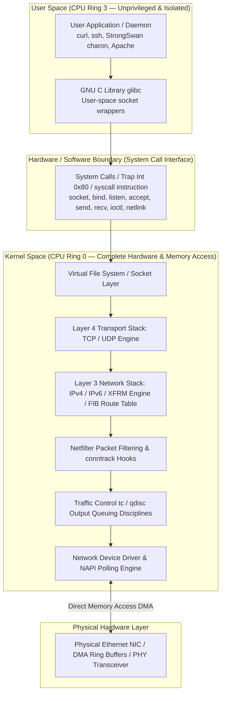
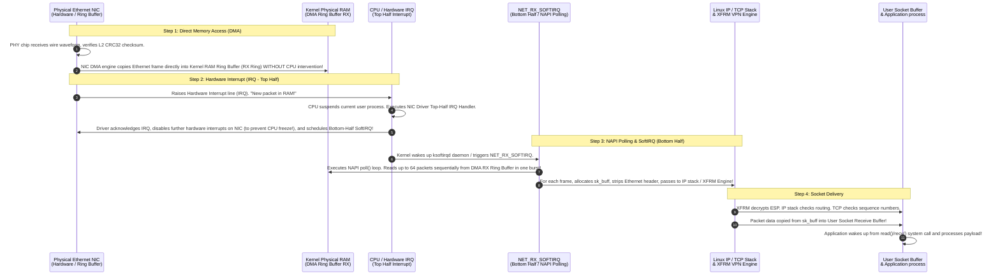
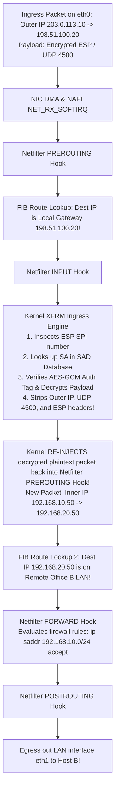

# PART 5 — Kernel, User Space & System Space

## 1. Kernel Space vs. User Space (Ring 0 vs. Ring 3)
To understand how packets move from a user application (like a web browser or database client) onto a physical network wire, you must master the architectural boundary between **User Space** and **Kernel Space** enforced by modern CPU hardware.



### Why Privilege Separation Exists
* **User Space (CPU Privilege Ring 3)**: The restricted execution environment where standard applications, scripts, and user daemons (including our StrongSwan IKE daemon `charon`) execute. In Ring 3, applications have **zero direct access to physical hardware** (NICs, hard drives, RAM page tables). An application cannot directly read or write to an Ethernet card's memory registers. If a user application crashes, generates a segmentation fault, or attempts an illegal memory access, the kernel terminates the process (`SIGSEGV`), leaving the rest of the system running smoothly.
* **Kernel Space (CPU Privilege Ring 0)**: The absolute privileged execution environment reserved exclusively for the Linux kernel core, memory managers, file systems, network stack, and hardware device drivers. In Ring 0, code has unrestricted access to all CPU registers, physical RAM, and hardware interrupt lines. **If code in Kernel Space crashes (a Kernel Panic or Null Pointer Dereference in a driver), the entire operating system freezes and crashes instantly!**

---

## 2. System Calls & The POSIX Socket API
Because user-space applications cannot touch network hardware, how does an application transmit data over the Internet? By trapping into kernel space using **System Calls (`syscalls`)**!

When an application invokes a socket function, the CPU executes a specialized hardware instruction (`syscall` on x86_64, or legacy software interrupt `int 0x80`), switching the CPU privilege level from Ring 3 to Ring 0, saving user-space CPU registers onto the kernel stack, and executing the corresponding kernel function!

### Line-by-Line Breakdown of the POSIX Socket API
To build networking platforms, you must understand what happens inside the kernel during each socket system call:

```c
// 1. socket(): Create a network communication endpoint in kernel space
int sockfd = socket(AF_INET, SOCK_STREAM, IPPROTO_TCP);
```
* **Kernel Mechanics**: The application requests a new socket. The kernel allocates a `struct socket` and a corresponding **`struct sock` (sk)** in kernel memory, initializes the TCP/IP protocol state timers, and returns a integer **File Descriptor (`sockfd`)** to user space (e.g., FD `3`). In Linux, *everything is a file*—this socket descriptor is inserted into the process's Virtual File System (VFS) file descriptor table!

```c
// 2. bind(): Associate the socket with a local IP address and Port
struct sockaddr_in serv_addr = {.sin_family = AF_INET, .sin_port = htons(500), .sin_addr.s_addr = INADDR_ANY};
bind(sockfd, (struct sockaddr *)&serv_addr, sizeof(serv_addr));
```
* **Kernel Mechanics**: This is how our **StrongSwan daemon** binds to **UDP Port 500**! The kernel checks if the requested port (`500`) is already in use by another process, verifies if the port is a privileged Well-Known port ($< 1024$) requiring `root` or `CAP_NET_BIND_SERVICE` capability, and records the local IP:Port binding in the kernel's protocol hash tables.

```c
// 3. listen() & accept(): Prepare server socket to accept inbound client connections (TCP only)
listen(sockfd, 1024);
int client_fd = accept(sockfd, (struct sockaddr *)&client_addr, &addr_len);
```
* **Kernel Mechanics**: `listen()` creates two queues in kernel RAM: the **SYN Queue** (storing half-open connections undergoing the 3-way handshake) and the **Accept Queue** (storing fully established connections waiting for the application to read them). When the application calls `accept()`, if the Accept Queue is empty, the user-space process is put to sleep (blocked) by the kernel scheduler until a client completes the 3-way handshake!

```c
// 4. send() / write(): Transmit application payload across the network
ssize_t bytes_sent = send(client_fd, buffer, sizeof(buffer), 0);
```
* **Kernel Mechanics (The Outbound Path)**: When `send()` is invoked, the kernel copies the payload data from User Space RAM into Kernel Space RAM, wrapping it inside a foundational kernel data structure called **`struct sk_buff` (Socket Buffer)**! The `sk_buff` is pushed down the TCP stack (adding TCP header and sequence numbers), down the IP stack (adding IP header and checking routing tables), down through Netfilter/XFRM hooks, and into the network device driver output queue!

---

## 3. The Anatomy of `struct sk_buff` (Socket Buffer)
The **`struct sk_buff` (skb)** defined in `<linux/skbuff.h>` is the single most important data structure in the Linux networking stack. It represents a packet in memory as it travels between the application, the protocol stack, and the physical NIC driver.

Why is `sk_buff` engineered with four internal memory pointers (`head`, `data`, `tail`, `end`)? **To achieve Zero-Copy Packet Encapsulation!**

```
+----------------------------------------------------------------------------------------------------+
| struct sk_buff Memory Buffer Allocation (Allocated once per packet by kernel)                      |
+----------------------------------------------------------------------------------------------------+
|  [Headroom / Reserved Space]  |  Ethernet Header  |  IP Header  |  TCP Header  |  Payload Data  |  [Tailroom]  |
+----------------------------------------------------------------------------------------------------+
^                               ^                                                ^              ^
|                               |                                                |              |
skb->head                       skb->data                                        skb->tail      skb->end
```

### Zero-Copy Header Manipulation Mechanics
In naive networking implementations, whenever a packet moves from Layer 4 (TCP) down to Layer 3 (IP), the OS would allocate a brand new memory buffer, copy the TCP payload into it, and prepend the IP header—wasting massive CPU cycles and RAM bandwidth on memory copies!

The Linux kernel avoids memory copies completely using **`sk_buff` pointer manipulation**:
1. **Allocation**: When an application transmits 1000 bytes of data, the kernel allocates a single large `sk_buff` buffer with pre-allocated empty space at the beginning (**Headroom**) and end (**Tailroom**). Initially, `skb->data` points to the start of the payload data.
2. **Pushing Headers Down the Stack (`skb_push`)**:
   * As the packet enters Layer 4 (TCP), the kernel calls `skb_push(skb, 20)`. This simply decrements the `skb->data` pointer backward by 20 bytes into the empty Headroom and writes the 20-byte TCP header! **Zero payload data was moved or copied in RAM!**
   * As it enters Layer 3 (IP), the kernel calls `skb_push(skb, 20)` again, moving `skb->data` backward by 20 bytes and writing the IPv4 header!
   * In our **TunnelPoint VPN Gateway**, when the XFRM engine encrypts the packet, it calls `skb_push` to prepend the outer IP, UDP 4500, and ESP headers directly into the Headroom, and calls `skb_put` to append the ESP Auth Tag into the Tailroom!
3. **Stripping Headers Up the Stack (`skb_pull`)**:
   * On the receiving machine, as the packet moves up from Ethernet $\rightarrow$ IP $\rightarrow$ TCP, the kernel calls `skb_pull(skb, len)`, which simply increments the `skb->data` pointer forward across the headers! The headers are stripped instantly without modifying or copying a single byte of memory!

---

## 4. Interrupts, NAPI & Packet Processing (The Ingress Path)
What happens at the exact nanosecond a photon pulse or voltage waveform arrives at a physical Ethernet NIC (`eth0`) on a Linux server? How does the kernel process millions of packets per second without freezing?



### 1. Direct Memory Access (DMA) & Ring Buffers
If the CPU had to manually read every byte of data off the network card over the PCIe bus, a 10 Gbps network link would consume 100% of CPU processing power just moving data!
Modern NICs use **Direct Memory Access (DMA)**. When the Linux system boots, the NIC driver allocates circular memory buffers in physical kernel RAM called **DMA Ring Buffers (RX Ring for receive, TX Ring for transmit)**. When an Ethernet frame arrives on the wire, the NIC hardware DMA engine writes the packet directly into kernel RAM without waking up or interrupting the CPU!

### 2. Hardware Interrupts (IRQ) vs. SoftIRQs
Once the NIC DMA engine finishes writing the frame into RAM, it must notify the kernel.
* **The Interrupt Storm Problem**: Historically, the NIC fired a **Hardware Interrupt (IRQ)** for every single incoming packet. At 10 Gbps (approx. 14.8 million minimum-size packets per second), firing 14.8 million hardware interrupts per second causes **Livelock**—the CPU spends 100% of its time entering and exiting interrupt handlers, completely freezing the operating system and dropping all packets!
* **Top Half vs. Bottom Half Architecture**: To prevent livelock, Linux divides interrupt processing into two halves:
  * **Top Half (Hardware IRQ Handler)**: Executes immediately when the IRQ fires. It does minimal work: it acknowledges the interrupt to the NIC hardware, **instantly disables further hardware interrupts from that NIC**, schedules a software interrupt (SoftIRQ) for background processing, and exits in under 1 microsecond!
  * **Bottom Half (`NET_RX_SOFTIRQ` / `ksoftirqd`)**: Executes asynchronously at lower priority. This is where the actual heavy lifting of networking (allocating `sk_buff`, checking routing tables, decrypting IPsec ESP tunnels, running iptables rules) takes place across multiple CPU cores!

### 3. NAPI (New API) Interrupt Coalescing
**NAPI** is the modern Linux kernel networking mechanism that eliminates interrupt storms by dynamically switching between **Interrupt Mode** and **Polling Mode**:
* **Low Traffic (Interrupt Mode)**: When network traffic is light, NAPI operates via hardware interrupts. Each arriving packet fires an IRQ, ensuring sub-millisecond latency.
* **High Traffic / Attack Mode (Polling Mode)**: When a burst of traffic or a DDoS attack hits the NIC, the first packet fires an IRQ. The top-half handler disables NIC hardware interrupts and triggers NAPI Polling (`NET_RX_SOFTIRQ`). The kernel then enters a high-speed `poll()` loop, scooping up 64 packets at a time directly from the DMA ring buffer in RAM without firing a single hardware interrupt! Once the ring buffer is drained empty, NAPI re-enables hardware interrupts and goes back to sleep!

---

## 5. XFRM Kernel Architecture & Netfilter Hooks
Where exactly does our **TunnelPoint Site-to-Site VPN** sit inside this complex kernel machinery?

When an encrypted IPsec ESP packet (`Protocol 50` or `UDP Port 4500`) arrives on public WAN interface `eth0`, how does the kernel decrypt it and deliver the plaintext packet to LAN `eth1`?



> [!IMPORTANT]
> **The XFRM Re-Injection Loop (Critical Engineering Concept!)**:
> Notice step 5 above! When the kernel XFRM engine decrypts an incoming IPsec packet, **it strips the outer public IP header and re-injects the decrypted inner private packet back into the very beginning of the networking stack (PREROUTING Hook)!**
> Why? Because the kernel must evaluate the decrypted private packet (`192.168.10.50` $\rightarrow$ `192.168.20.50`) against your routing tables and firewall forwarding rules as if it had just arrived freshly from a wire! This is why your `iptables FORWARD` chain must explicitly permit traffic flowing between private subnets (`192.168.10.0/24` $\leftrightarrow$ `192.168.20.0/24`), even though those subnets are separated by an ocean!

---

## 6. Phase 5 Practical Exercises & Quiz Checkpoint 🏁

### Practical Exercises
1. **Inspecting SoftIRQs**: Run `cat /proc/softirqs | grep -E "NET_RX|NET_TX"`. Observe the massive number of receive and transmit software interrupts handled across each of your CPU cores!
2. **Inspecting Socket Buffers & Memory**: Run `cat /proc/net/sockstat` to observe real-time kernel memory allocation across TCP, UDP, and RAW sockets.
3. **Inspecting NIC Ring Buffers**: Run `sudo ethtool -g eth0` (replace `eth0` with your interface) to view the maximum hardware DMA ring buffer parameters (RX/TX ring size) supported by your Ethernet NIC driver!

### Quiz Questions
1. **Ring 0 vs. Ring 3**: Why is it physically impossible for a user-space application (like a python script or web server running in Ring 3) to directly read or write to physical Ethernet NIC hardware memory registers? What exact mechanism (`syscall` / trap) must the application invoke to request network transmission from the OS?
2. **The Livelock Problem**: In legacy Linux kernels without NAPI, why would a network server receiving 10 million packets per second across a 10 Gbps interface experience complete system freeze (Livelock) and 100% packet loss, even if the CPU had plenty of idle processing power?
3. **NAPI Polling Mechanics**: How does NAPI (New API) interrupt coalescing eliminate interrupt storms under heavy traffic load or DDoS attacks? Explain the exact transition between Top-Half Hardware IRQs and Bottom-Half `NET_RX_SOFTIRQ` polling loops!
4. **Zero-Copy `sk_buff` Manipulation**: When an application transmits 1400 bytes of payload data down the Linux network stack, explain how the kernel appends the 20-byte TCP header and 20-byte IPv4 header using `sk_buff` pointers (`head`, `data`, `tail`, `end`) without performing a single memory copy of the payload data in RAM!
5. **XFRM Packet Re-Injection**: When an encrypted IPsec ESP packet arrives on WAN interface `eth0` of our TunnelPoint Gateway, after the kernel XFRM engine validates the authentication tag and decrypts the payload, why does it **re-inject** the plaintext packet back into the `PREROUTING` Netfilter hook instead of sending it directly to the output interface? How does this impact our `iptables FORWARD` firewall rules?
