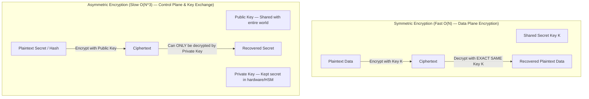
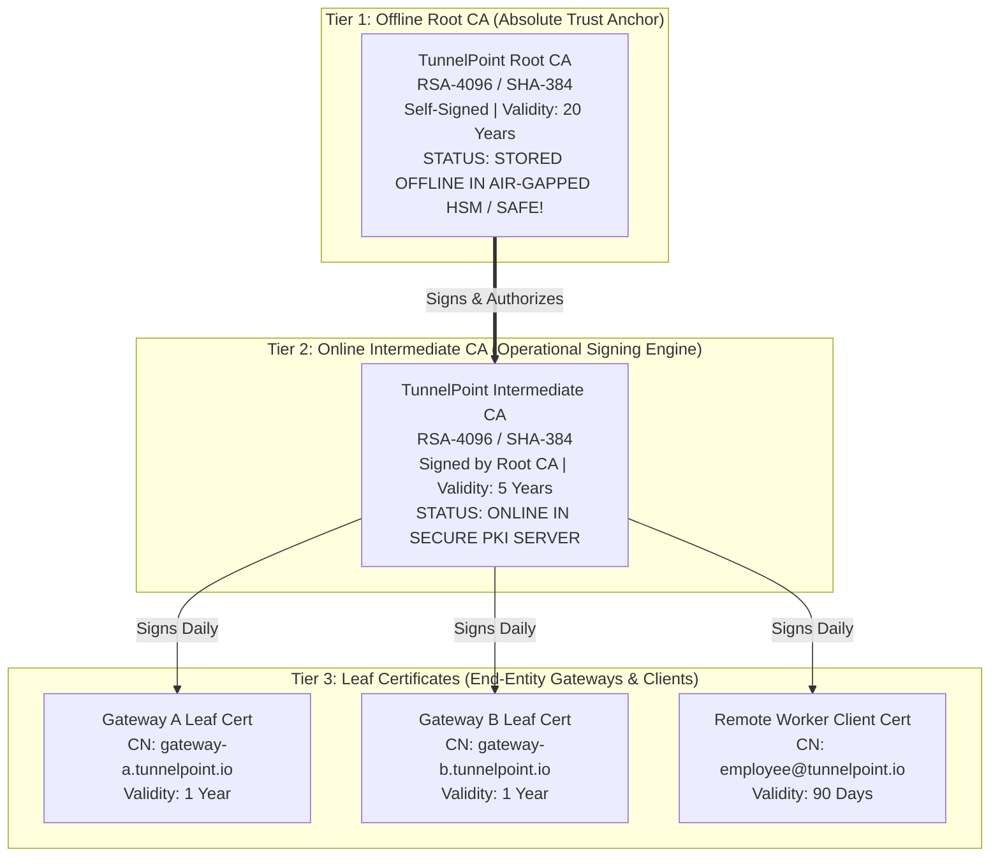
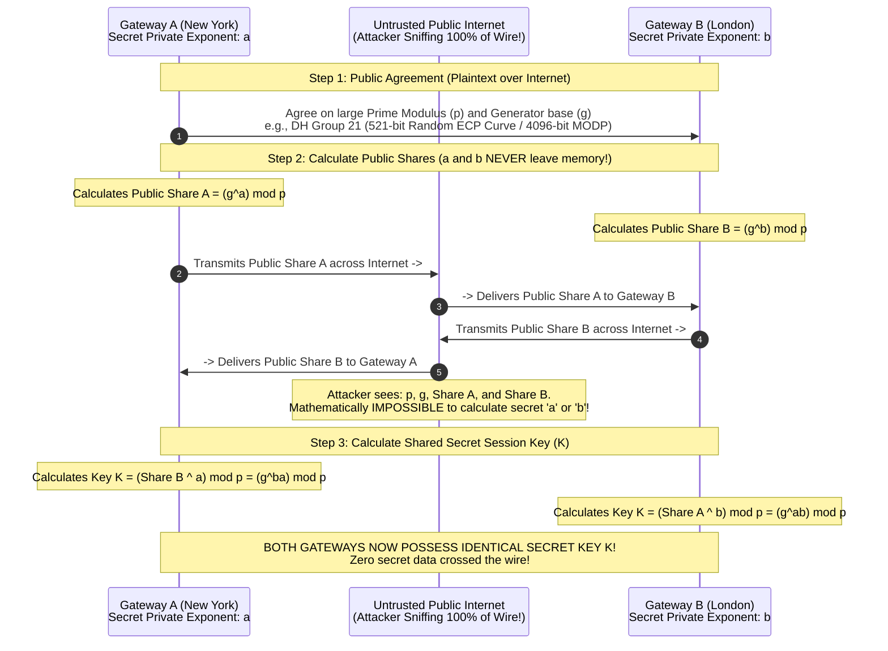

# PART 6 — Cryptography Fundamentals

## 1. Why Cryptography Exists: The CIA Triad & Non-Repudiation
When engineering enterprise infrastructure like **TunnelPoint**, transmitting data across the public Internet exposes every byte to interception by ISPs, hostile nation-states, and malicious actors on intermediate routing hops. 

Modern cryptographic engineering exists to enforce four fundamental security guarantees:
1. **Confidentiality (Encryption)**: Ensuring that unauthorized third parties cannot read or decipher the payload data. Achieved via symmetric ciphers like **AES-256-GCM** and **ChaCha20**.
2. **Integrity (Hashing & Auth Tags)**: Ensuring that data has not been altered, corrupted, or tampered with in transit. If an attacker modifies even 1 bit of an IPsec packet across the ocean, the receiver must detect and drop it immediately! Achieved via **SHA-384**, **HMAC**, and **AEAD auth tags**.
3. **Authentication (Identity Verification)**: Proving beyond mathematical doubt that the computer sending the packet is genuinely who it claims to be, rather than an imposter executing a Man-in-the-Middle (MitM) attack. Achieved via **X.509 Digital Certificates**, **RSA/ECDSA signatures**, and **Pre-Shared Keys (PSK)**.
4. **Non-Repudiation**: Ensuring that the sender of a message or cryptographic handshake cannot later deny having sent it, because the signature could only have been generated using their unique secret private key.

---

## 2. Symmetric vs. Asymmetric Encryption



### 1. Symmetric Encryption (The Data Plane Engine)
In **Symmetric Cryptography**, the sender and receiver use the **exact same secret key** to encrypt and decrypt data.
* **Performance**: Extremely fast ($O(N)$ computational complexity). Modern CPUs feature dedicated hardware instruction sets (**Intel AES-NI**, ARM Cryptographic Extensions) capable of encrypting tens of gigabits per second at wire speed with sub-microsecond latency.
* **The Key Distribution Problem**: If symmetric encryption requires both parties to share the same secret key, how do Gateway A in New York and Gateway B in London securely share Key K across an insecure public Internet without an eavesdropper intercepting it? **They cannot do it using symmetric math alone!** They must use Asymmetric Diffie-Hellman key exchange first!

#### Enterprise Symmetric Ciphers Used in TunnelPoint
1. **AES-GCM (Advanced Encryption Standard in Galois/Counter Mode — RFC 4106)**:
   * The gold standard of enterprise VPN encryption (NSA Suite B / FIPS 140-3 compliant).
   * **Why GCM Mode is Superior to CBC Mode**: Legacy ciphers like AES-CBC (Cipher Block Chaining) only provided *encryption*; they required running a separate HMAC (like SHA-1) over the packet to guarantee integrity (Encrypt-then-MAC), requiring two passes over memory. **AES-GCM is an AEAD cipher (Authenticated Encryption with Associated Data)**! It uses Galois field mathematics to encrypt the payload AND generate a 16-byte cryptographic Authentication Tag simultaneously in a single high-speed memory pass!
   * In TunnelPoint, we enforce **`aes256gcm16`** (256-bit AES key with a 16-byte GCM authentication tag).
2. **ChaCha20-Poly1305 (RFC 7539)**:
   * A modern stream cipher paired with the Poly1305 authenticator designed by Daniel J. Bernstein (djb).
   * **Why it exists**: While AES-GCM is blisteringly fast on servers with hardware AES-NI instructions, on embedded routers, IoT devices, or mobile smartphones without AES acceleration, AES-GCM consumes massive CPU power and battery. ChaCha20-Poly1305 relies strictly on simple bitwise operations (ADD, XOR, ROTATE), delivering 3x faster performance on non-accelerated hardware! Used heavily in WireGuard and modern TLS 1.3 / IKEv2 mobile VPN clients.

### 2. Asymmetric Encryption (The Control Plane Engine)
In **Asymmetric Cryptography**, each entity generates a mathematically linked pair of keys: a **Public Key** (which is published openly to the entire world) and a **Private Key** (which is guarded fiercely in secure memory or Hardware Security Modules / HSMs).
* **Mathematical Properties**: Anything encrypted with the Public Key can **only** be decrypted by the corresponding Private Key. Conversely, anything signed (encrypted) with the Private Key can be verified by anyone holding the Public Key!
* **Performance**: Computationally massive ($O(N^3)$ complexity). Attempting to encrypt a 10 GB file or a 10 Gbps video stream using RSA or ECC would freeze a supercomputer! Therefore, **asymmetric encryption is NEVER used to encrypt bulk data!** It is used strictly during initial handshakes (like IKEv2 Phase 1 or TLS) to authenticate identities and securely negotiate a temporary Symmetric Session Key!

#### Enterprise Asymmetric Algorithms
1. **RSA (Rivest-Shamir-Adleman - RFC 8017)**:
   * Its security relies on the immense mathematical difficulty of **factoring the product of two massive prime numbers** ($N = p \times q$).
   * *Key Lengths*: Legacy 1024-bit RSA is completely broken. 2048-bit RSA is considered the absolute minimum today. In **TunnelPoint**, we enforce **RSA-3072 or RSA-4096** for long-term Root CA and Gateway certificates!
2. **ECC (Elliptic Curve Cryptography - ECDSA / Ed25519 - RFC 6090)**:
   * Its security relies on the **Elliptic Curve Discrete Logarithm Problem (ECDLP)** over algebraic curves ($y^2 = x^3 + ax + b$).
   * **Why ECC is Replacing RSA in Modern Enterprise Systems**: To achieve equivalent cryptographic strength against modern supercomputers, RSA requires massive, unwieldy key sizes (e.g., a 3072-bit RSA key requires transmitting 384 bytes of data per certificate signature!). In contrast, a **256-bit ECC key (ECDSA P-256 / Curve25519) provides the exact same security strength as a 3072-bit RSA key** while being 12 times smaller and computing signatures 10x faster! In TunnelPoint security hardening (Part 20), we recommend **ECDSA P-384 / P-521**!

---

## 3. Cryptographic Hash Functions & HMAC (SHA-256 / SHA-384)
A **Cryptographic Hash Function** is a deterministic mathematical algorithm that takes an input string of arbitrary length (from a 1-byte word to a 100 TB database) and condenses it into a fixed-length hexadecimal string called a **Message Digest / Hash** (e.g., a 256-bit / 32-byte hash).

### Essential Properties of a Cryptographic Hash
1. **Deterministic**: Hashing the exact same input file a billion times will always produce the exact same hash output.
2. **One-Way (Pre-Image Resistance)**: Given a hash output (e.g., `a591a6d...`), it is mathematically impossible to reverse-engineer or calculate the original input file.
3. **Avalanche Effect**: Changing even a single bit in a 100 TB file completely randomizes over 50% of the output hash bits!
4. **Collision Resistance**: It is computationally infeasible to find two completely different input files that produce the exact same output hash! *(Why **MD5 and SHA-1 are obsolete and banned**: cryptographers discovered mathematical methods to generate hash collisions, allowing attackers to forge digital certificates! We use **SHA-256 and SHA-384** exclusively).*

### HMAC (Hash-Based Message Authentication Code - RFC 2104)
A simple SHA-256 hash of a message proves that the message wasn't accidentally corrupted by a noisy wire, but **it does not protect against a malicious attacker!**
If an attacker intercepts a packet on the Internet, alters the financial transaction data inside, recalculates the new SHA-256 hash, and replaces the old hash with the new hash, the receiver will blindly accept the forged packet!

**HMAC solves this by mathematically combining a Secret Key with the Hash Function**:
$$\text{HMAC}(K, m) = H\Big((K \oplus \text{opad}) \parallel H\big((K \oplus \text{ipad}) \parallel m\big)\Big)$$
Because an attacker on the Internet does not possess the secret session key $K$, they cannot calculate a valid HMAC! If they modify 1 bit of the packet payload, the HMAC verification fails on the receiving gateway, and the packet is silently dropped!

---

## 4. X.509 Certificates & PKI (Public Key Infrastructure)
How does Gateway A in New York know that the public key presented by Gateway B during an IKEv2 VPN handshake genuinely belongs to London Office B, rather than a nation-state hacker intercepting traffic at an ISP in the middle? Through **Public Key Infrastructure (PKI) and X.509 Digital Certificates (RFC 5280)**!

An **X.509 Certificate** is an electronic identity document—equivalent to a digital passport—cryptographically signed by a trusted third-party **Certificate Authority (CA)**.

```
+----------------------------------------------------------------------------------------------------+
| X.509 v3 Digital Certificate Structure (e.g., gateway-a.tunnelpoint.io)                            |
+----------------------------------------------------------------------------------------------------+
| Version: v3 (0x2) | Serial Number: 7A:A8:92:B1:03...                                               |
| Signature Algorithm: SHA-384 with RSA Encryption (or ECDSA with SHA-384)                           |
| Issuer (Who signed this?): CN = TunnelPoint Intermediate CA, O = TunnelPoint Enterprise, C = US     |
| Validity Period: Not Before: Jan 1 00:00:00 2026 GMT | Not After: Jan 1 00:00:00 2028 GMT          |
| Subject (Who owns this?): CN = gateway-a.tunnelpoint.io, O = TunnelPoint NY Office, C = US         |
| Subject Public Key Info: Public Key Algorithm: RSA (4096 bit) | Modulus: 00:C2:A1...               |
| X.509v3 Extensions:                                                                                |
|    - Basic Constraints: CA:FALSE (This is a leaf gateway cert, NOT allowed to sign other certs!)   |
|    - Key Usage: Digital Signature, Key Encipherment, Key Agreement                                 |
|    - Extended Key Usage: Server Authentication, Client Authentication, IPsec End System            |
|    - Subject Alternative Name (SAN): DNS:gateway-a.tunnelpoint.io, IP Address:203.0.113.10          |
+----------------------------------------------------------------------------------------------------+
| Certificate Authority Signature: [Encrypted Hash of all fields above signed by CA Private Key]     |
+----------------------------------------------------------------------------------------------------+
```

### The 3-Tier Enterprise CA Hierarchy (What We Build in Part 14!)
In production enterprise environments, you **NEVER** sign server or VPN gateway certificates directly with your Root CA! Why? Because if a CA private key is compromised by hackers, every certificate ever signed by that key must be revoked immediately!



* **Root CA (Tier 1)**: The ultimate root of trust. It is self-signed. Once it generates and signs the Intermediate CA certificate, **the Root CA private key is moved offline onto an encrypted USB drive or air-gapped Hardware Security Module (HSM) and locked in a physical safe!** It is only brought online once every 5 years to sign a new Intermediate CA!
* **Intermediate CA (Tier 2)**: An operational server that sits online in a secure subnet. Its sole job is to sign daily leaf certificates for VPN gateways, web servers, and remote employees. If an Intermediate CA is compromised, administrators simply use the offline Root CA to revoke the Intermediate CA, instantly invalidating the compromised chain without destroying the Root Trust Anchor!
* **Leaf Certificates (Tier 3)**: Assigned to our TunnelPoint VPN Gateways (`gateway-a` and `gateway-b`). Notice the X.509 extension `Basic Constraints: CA:FALSE`—this strictly forbids a gateway from attempting to act as a CA and signing rogue certificates for attackers!

---

## 5. Diffie-Hellman (DH) & Elliptic Curve DH (ECDH)
If symmetric encryption requires both gateways to share a secret session key ($K$), and asymmetric encryption is too slow to encrypt data, how do Gateway A and Gateway B securely establish Key $K$ over the public Internet without transmitting $K$ across the wire?

Through **Diffie-Hellman Key Exchange (RFC 2631)**—one of the greatest mathematical breakthroughs in computing history!

### The Mathematics of Diffie-Hellman (Modular Exponentiation)
Diffie-Hellman relies on the mathematical difficulty of the **Discrete Logarithm Problem**: while computing powers modulo a prime number ($g^x \bmod p$) is trivial for a computer, calculating the inverse logarithm to find secret exponent $x$ given only the output is computationally impossible for large primes!



### Diffie-Hellman Groups in StrongSwan VPNs
In IPsec configuration files (`swanctl.conf`), you will specify **DH Groups**:
* **Group 2 (1024-bit MODP) & Group 5 (1536-bit MODP)**: **OBSOLETE AND INSECURE!** Can be cracked by nation-state supercomputers using Number Field Sieve pre-computations (Logjam attack).
* **Group 14 (2048-bit MODP) & Group 16 (4096-bit MODP)**: Standard secure prime-modulus DH groups.
* **Group 19 (256-bit ECP / Curve25519) & Group 21 (521-bit ECP)**: **Elliptic Curve Diffie-Hellman (ECDH)**! Instead of modular exponentiation over giant prime numbers, ECDH performs scalar multiplication over elliptic curves. It delivers blisteringly fast key exchanges with superior cryptographic strength! We enforce **Curve25519 / DH Group 31 or Group 20/21** in TunnelPoint!

---

## 6. Perfect Forward Secrecy (PFS) — The Ultimate Security Shield
Why is **Perfect Forward Secrecy (PFS)** the most critical cryptographic requirement in modern VPN engineering?

Imagine an enterprise VPN that does NOT use PFS:
1. Gateway A and Gateway B authenticate using their permanent RSA-4096 Private Keys.
2. They derive a session key directly from their static private keys without running a fresh Diffie-Hellman exchange.
3. **The Disaster**: A nation-state intelligence agency records 100% of the encrypted IPsec VPN traffic flowing across the Atlantic Ocean between New York and London from **2020 to 2025**, storing petabytes of encrypted ciphertext in massive data centers. In **2026**, the intelligence agency hacks our company, bribes an administrator, or exploits a server vulnerability and **steals our Gateway A permanent RSA-4096 Private Key!**
4. Because the session keys were derived directly from the static private key, the intelligence agency feeds the stolen private key into their supercomputers and **retroactively decrypts 5 years of historical corporate secrets, financial transactions, and executive emails!**

### How PFS Prevents Historical Decryption
When we enable **Perfect Forward Secrecy (PFS)** in our StrongSwan `swanctl.conf` (by appending a DH group to our Phase 2 ESP proposals, e.g., `esp_proposals = aes256gcm16-ecp384!`):
1. For **every single IPsec tunnel session** (and every time the tunnel rekeys after 1 hour), Gateway A and Gateway B generate **brand new, ephemeral (temporary) Diffie-Hellman private exponents ($a$ and $b$)** in RAM!
2. They perform an ECDH exchange over the wire to derive a unique session key $K_{session}$.
3. Once the 1-hour session concludes or the tunnel rekeys, **the OS kernel permanently overwrites and destroys the ephemeral private exponents ($a$ and $b$) and session key $K_{session}$ in RAM!**
4. Even if an attacker records 10 years of ciphertext and steals our long-term RSA Root CA and Gateway Private Keys in year 11, **they CANNOT decrypt a single historical packet!** Why? Because our long-term RSA keys were only used to *sign/authenticate* the DH exchange; they were never used to derive the encryption key! The ephemeral DH keys required to decrypt the ciphertext ceased to exist in the physical universe 10 years ago!

---

## 7. Phase 6 Practical Exercises & Quiz Checkpoint 🏁

### Practical Exercises
1. **Inspecting OpenSSL Cryptographic Algorithms**: Run `openssl list -digest-algorithms` and `openssl list -cipher-algorithms` on your Linux terminal to see all hardware and software ciphers supported by your system's OpenSSL library.
2. **Benchmarking Hardware AES-NI vs. ChaCha20**: Test your CPU's cryptographic processing speed:
   ```bash
   # Benchmark AES-256-GCM vs ChaCha20-Poly1305 processing speed in bytes per second
   openssl speed -evp aes-256-gcm
   openssl speed -evp chacha20-poly1305
   ```
3. **Simulating Certificate Hashing & Verification**:
   ```bash
   # Generate a test SHA-256 checksum of a file and verify its deterministic property
   echo "TunnelPoint Enterprise VPN" > test_secret.txt
   sha256sum test_secret.txt
   ```

### Quiz Questions
1. **AES-GCM vs. AES-CBC**: Why is **AES-256-GCM** mathematically superior to legacy **AES-256-CBC** for high-speed VPN gateways? What specific cryptographic property does GCM provide in a single memory pass that CBC lacks?
2. **ChaCha20 Use Cases**: In what specific hardware scenario would a Senior Infrastructure Architect choose **ChaCha20-Poly1305** over **AES-256-GCM** for an IPsec or WireGuard VPN tunnel? Explain why AES-GCM performs poorly on that specific hardware!
3. **The PKI Trust Chain**: Explain why enterprise organizations never sign server or VPN gateway leaf certificates directly with their **Root CA**. If an online **Intermediate CA** is compromised by attackers, explain the exact step-by-step remediation procedure an administrator executes to secure the network without destroying the root trust anchor!
4. **Diffie-Hellman Mathematics**: During a Diffie-Hellman key exchange over the public Internet, an eavesdropping hacker successfully captures the prime modulus ($p$), the generator ($g$), Gateway A's public share ($A = g^a \bmod p$), and Gateway B's public share ($B = g^b \bmod p$). Why is it mathematically impossible for the hacker to compute the shared secret session key ($K = g^{ab} \bmod p$)? What famous mathematical problem prevents them from extracting secret exponent $a$?
5. **Perfect Forward Secrecy (PFS)**: Explain how enabling Perfect Forward Secrecy (PFS) in an IPsec VPN configuration protects an organization against retroactive decryption by nation-state adversaries who record years of encrypted WAN traffic and later steal the gateway's long-term RSA private key! What exact parameter must be included in the Phase 2 (`CHILD_SA`) proposal to enforce PFS?
