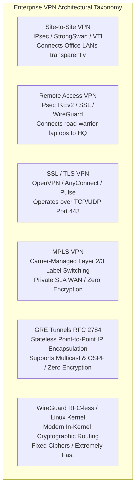

# PART 7 — VPN Technologies

## 1. Comprehensive VPN Taxonomy & Architectural Overview
A **Virtual Private Network (VPN)** is an enterprise networking technology that constructs a secure, encrypted logical overlay network across an untrusted, public underlay network (such as the Internet or carrier WAN).

To engineer infrastructure at a senior level, you must understand the operational trade-offs across the six major VPN architectures deployed in real-world production environments:

---

## 2. Deep-Dive Comparative Analysis of VPN Technologies

### 1. Site-to-Site VPN (The TunnelPoint Core)
* **Architecture**: Connects two or more fixed geographic locations (e.g., New York Headquarters LAN `192.168.10.0/24` and London Branch LAN `192.168.20.0/24`) over the public Internet using edge VPN Gateways (such as our Linux StrongSwan servers, Cisco ASAs, or AWS/Azure VPN Gateways).
* **Operation**: Completely **transparent to end users and hosts**. When a laptop on the New York LAN communicates with a database in London, it simply sends standard IP packets to its default gateway. The edge gateway intercepts the traffic, encrypts it in bulk, encapsulates it across the WAN, and decapsulates it at the remote office. End-user laptops do not run VPN client software!
* **Standard Protocol**: **IPsec (IKEv2 / ESP over UDP 500/4500)**.

### 2. Remote Access VPN (Client-to-Site)
* **Architecture**: Connects individual mobile employees, remote workers, or IoT devices (road-warriors) directly to an enterprise corporate network from arbitrary public WiFi networks or cellular modems.
* **Operation**: Requires dedicated VPN client software (e.g., Cisco AnyConnect, StrongSwan mobile client, Windows/macOS native IKEv2 client) installed on the user's endpoint. When initiated, the client authenticates against the gateway (using EAP-MSCHAPv2, X.509 user certificates, or SAML/MFA), establishes an encrypted tunnel, and receives a virtual private IP address assigned dynamically from an internal pool (via IKEv2 Configuration Payloads / `CFG_REQUEST`).
* **Standard Protocols**: **IKEv2 IPsec**, **WireGuard**, or **SSL/TLS (OpenVPN)**.

### 3. SSL / TLS VPNs (OpenVPN, Cisco AnyConnect, Pulse Secure)
* **Architecture**: Operates at Layer 4/7 using standard **OpenSSL / TLS protocols** (the exact same encryption powering HTTPS web browsing).
* **Why SSL VPNs Became Popular**: In restricted hotel, airport, or corporate firewalled networks, network administrators frequently block outbound UDP Port 500 (IKEv2) and Protocol 50 (ESP), preventing IPsec VPNs from connecting! However, almost no firewall on Earth blocks **outbound TCP Port 443 (HTTPS)**! SSL VPNs encapsulate private network traffic inside standard TLS sessions over TCP/UDP Port 443, effortlessly bypassing restrictive firewalls!
* **Disadvantages (The User-Space Bottleneck & TCP Meltdown)**:
  * **User-Space Performance Penalty**: Unlike IPsec and WireGuard (which run directly inside the Ring 0 Linux kernel data plane), OpenVPN and SSL VPN daemons run in **Ring 3 User Space**. Every single packet must be copied from kernel space to user space (via `/dev/net/tun`), encrypted by OpenSSL, and copied back into kernel space to be transmitted! At 10 Gbps speeds, this context switching causes massive CPU throttling!
  * **TCP Meltdown**: If an SSL VPN is forced to run over **TCP Port 443** (instead of UDP), encapsulating inner TCP application traffic inside an outer TCP tunnel creates catastrophic retransmission loops during WAN packet loss!

### 4. MPLS VPN (Multi-Protocol Label Switching — Carrier Managed WAN)
* **Architecture**: A proprietary private WAN service sold by global telecommunication carriers (e.g., AT&T, Verizon, NTT). Instead of routing traffic over the public Internet, customer edge routers connect directly into the carrier's private MPLS switching backbone.
* **Operation**: Routers do not perform IP routing lookups across the core! Instead, ingress edge routers prepend a **20-bit MPLS Label** (Shim Header) between the Layer 2 Ethernet header and Layer 3 IP header. Core switches forward frames at extreme wire speeds purely by swapping labels ($O(1)$ lookup)!
* **Advantages**: Guaranteed Service Level Agreements (SLAs), deterministic sub-millisecond latency, zero jitter, and built-in Quality of Service (QoS) prioritization.
* **Disadvantages (Why Enterprises are Abandoning MPLS for SD-WAN / IPsec)**:
  1. **Astronomical Cost**: A 100 Mbps MPLS dedicated circuit costs 10x to 50x more per month than a standard 1 Gbps business fiber Internet connection!
  2. **ZERO ENCRYPTION!**: MPLS provides logical path isolation (VRFs), but **data travels across the telecom carrier's backbone in unencrypted plaintext!** If a carrier switch is compromised or tapped by intelligence agencies, all corporate data is exposed! That is why security-conscious enterprises deploy **IPsec VPN encryption directly on top of MPLS circuits!**

### 5. GRE Tunnels (Generic Routing Encapsulation — RFC 2784)
* **Architecture**: Developed by Cisco, GRE is a lightweight, stateless Layer 3 tunneling protocol designed to encapsulate any network layer protocol (IPv4, IPv6, IPX, AppleTalk) inside a standard IPv4 packet (IP Protocol field `47`).
* **Why GRE is Critical for Dynamic Routing**: Standard legacy IPsec (Policy-Based VPNs) only encrypts unicast traffic matching strict IP subnet rules (`192.168.10.0/24` $\rightarrow$ `192.168.20.0/24`). **Legacy IPsec cannot transmit Layer 2/3 Multicast or Broadcast packets!** Because dynamic routing protocols like **OSPF and Multicast BGP rely entirely on multicast packets (`224.0.0.5`, `224.0.0.6`)**, you cannot run OSPF directly over a legacy IPsec tunnel!
* **The Solution (GRE over IPsec)**: Engineers create a logical point-to-point **GRE Tunnel** between routers. GRE effortlessly encapsulates multicast OSPF routing packets into unicast GRE packets! However, **GRE PROVIDES ZERO ENCRYPTION OR AUTHENTICATION!** Therefore, engineers configure an **IPsec tunnel to encrypt the GRE packets (GRE over IPsec)**—combining the rich multicast routing capabilities of GRE with the military-grade encryption of IPsec! *(Note: Modern Linux **Virtual Tunnel Interfaces / VTI** and StrongSwan XFRM interfaces have largely replaced GRE over IPsec by natively supporting route-based multicast IPsec!)*

### 6. WireGuard (The Modern In-Kernel Challenger)
* **Architecture**: Created by Jason A. Donenfeld and merged directly into the Linux kernel (v5.6+) in 2020. WireGuard was designed to replace OpenVPN and IPsec with an ultra-simple, modern, high-performance cryptographic architecture (~4,000 lines of code vs. >100,000 lines in StrongSwan/OpenVPN).
* **Cryptographic Design (Fixed Modern Suite)**: Unlike IPsec and TLS (which force endpoints to negotiate hundreds of complex cipher combinations during handshakes, creating downgrade attack vulnerabilities), **WireGuard enforces a single, immutable, state-of-the-art cryptographic suite**:
  * **ChaCha20-Poly1305** for authenticated payload encryption.
  * **Curve25519 (ECDH)** for asymmetric key exchange.
  * **BLAKE2s** for hashing and HMAC.
  * **HKDF** for key derivation.
* **Cryptokey Routing**: In WireGuard, public keys *are* network addresses! Each interface has a private key and a list of peer public keys mapped to allowed IP subnets (`AllowedIPs`). When a packet arrives destined for `192.168.20.50`, WireGuard instantly checks `AllowedIPs`, encrypts the packet with the corresponding peer's Curve25519 public key, and sends it over UDP!
* **Advantages**: Blisteringly fast (faster than OpenVPN and rivaling hardware-accelerated IPsec), zero-configuration roaming (seamlessly handles IP changes when switching from WiFi to 5G), and minimal attack surface.
* **Why WireGuard Has NOT Fully Replaced IPsec in Enterprise Data Centers**:
  1. **Lack of Dynamic Routing & PKI Integration**: WireGuard has no native concept of X.509 Certificate Authorities, CRLs, or LDAP/RADIUS/MFA integration. Managing static public keys across 5,000 enterprise branch routers without an automated PKI control plane is impossible!
  2. **No Dynamic Peer Discovery**: Both endpoints must statically know each other's public keys and IP mappings in advance.
  3. **Strict Compliance Hurdles**: Many banking, defense, and healthcare institutions mandate **NIST FIPS 140-3 / NSA Suite B** compliance (requiring AES-256-GCM and RSA/ECDSA X.509 certificates). Because WireGuard strictly refuses to support AES or X.509, it cannot be legally deployed in certain regulated government and financial infrastructures!

---

## 3. StrongSwan vs. LibreSwan (The Linux IPsec Titans)
In the open-source Linux ecosystem, two production-grade IKE/IPsec implementations dominate: **StrongSwan** and **LibreSwan**. Both operate as user-space IKE daemons that configure the Linux kernel XFRM engine.

| Feature / Capability | StrongSwan (Our TunnelPoint Selection!) | LibreSwan (Fork of legacy FreeSWRAN / Openswan) |
| :--- | :--- | :--- |
| **Primary Architecture** | Modern, modular, multi-threaded daemon (`charon`) written from scratch in clean C. Highly extensible via plugins. | Continuation of the legacy FreeSWRAN codebase (`pluto` daemon). Default IPsec provider in Red Hat / RHEL / Fedora. |
| **Configuration Syntax** | Modern, structured, readable **`swanctl.conf`** (VICI / Versatile IKE Configuration Interface) based on libvici. | Legacy **`ipsec.conf`** whitespace-sensitive format (though modern versions support updated syntax). |
| **Cloud & Native Integration** | **Exceptional.** Natively supports Linux XFRM / VTI route-based interfaces, Docker/Kubernetes containerization, and AWS/Azure/GCP BGP VPN peering. | Excellent in RHEL/CentOS enterprise environments, deeply integrated with NSS (Network Security Services) crypto library. |
| **Cryptographic Plugin Support** | Massive plugin ecosystem: OpenSSL, GCrypt, AF_ALG (Linux kernel hardware crypto), PKCS#11 (HSMs / Smartcards), TPM 2.0. | Relies primarily on Mozilla NSS cryptographic library for FIPS 140-2 compliance. |

---

## 4. Why TunnelPoint Uses StrongSwan IKEv2 / IPsec with Linux XFRM
For our **TunnelPoint Enterprise Secure Site-to-Site VPN Platform**, we explicitly select **StrongSwan IKEv2 / IPsec coupled with Linux Route-Based XFRM / VTI interfaces** as our foundational architecture. 

Here is our Senior Infrastructure Architect justification for this engineering decision:
1. **Absolute Wire-Speed Performance**: Because StrongSwan offloads 100% of data-plane encryption to the Linux kernel **XFRM engine in Ring 0**, our VPN achieves line-rate gigabit throughput using CPU hardware **AES-NI acceleration**, completely avoiding the user-space context-switching bottlenecks of OpenVPN!
2. **Enterprise X.509 PKI Hierarchy Integration**: Unlike WireGuard, StrongSwan natively supports multi-tier X.509 Certificate Authorities, Certificate Revocation Lists (CRLs), Online Certificate Status Protocol (OCSP), and SAN identity verification—allowing us to scale to thousands of gateways with zero manual public-key distribution!
3. **Route-Based VTI / XFRM Interfaces (Cloud & BGP Readiness)**: By utilizing modern Route-Based XFRM interfaces instead of legacy policy-based IPsec, TunnelPoint integrates seamlessly with **dynamic routing protocols (OSPF and BGP)** and cloud provider transit hubs (AWS Transit Gateway and Azure VPN Gateway)!
4. **Regulatory & Security Compliance**: StrongSwan fully implements **NSA Suite B, NIST FIPS 140-3, and RFC 8247** cryptographic hardening standards (enforcing AES-256-GCM, SHA-384, ECDSA P-384, and Perfect Forward Secrecy across all tunnels).

---

## 5. Phase 7 Practical Exercises & Quiz Checkpoint 🏁

### Practical Exercises
1. **Inspecting StrongSwan Capabilities**: If StrongSwan is installed on your Linux system, run `sudo swanctl --stats` and `sudo swanctl --list-supported` to view all loaded cryptographic plugins, IKE algorithms, and Diffie-Hellman groups supported by the `charon` daemon!
2. **Analyzing Kernel XFRM Interfaces**: Check if your Linux kernel supports virtual tunnel interfaces by running `sudo ip link add vti0 type vti local 127.0.0.1 remote 127.0.0.1 key 100`. Inspect the newly created tunnel device with `ip -d link show vti0`! *(To clean up: `sudo ip link del vti0`)*.

### Quiz Questions
1. **SSL VPNs vs. IPsec**: Why do enterprise network administrators frequently deploy SSL/TLS VPNs (like OpenVPN or Cisco AnyConnect over TCP Port 443) for remote-access road-warrior employees in hotels or airports, even though IPsec/IKEv2 (UDP Port 500/4500) delivers significantly higher throughput and lower latency?
2. **The "TCP Meltdown" Phenomenon**: What exact network failure occurs when you configure an SSL VPN or OpenVPN tunnel to encapsulate private TCP application traffic inside an outer **TCP Port 443** tunnel across a congested WAN link experiencing 2% packet loss? Why does encapsulating over UDP prevent this?
3. **GRE over IPsec**: Why is standard legacy IPsec (Policy-Based VPN) mathematically incapable of transmitting dynamic routing protocols like OSPF or Multicast BGP across a Site-to-Site tunnel? Describe how combining **Generic Routing Encapsulation (GRE)** with IPsec solves this limitation!
4. **WireGuard vs. StrongSwan IPsec**: While WireGuard is significantly simpler to configure and runs at incredible in-kernel speeds using ChaCha20-Poly1305, explain the two primary architectural limitations that prevent large global banks and defense institutions from replacing their StrongSwan IPsec VPN infrastructures with WireGuard!
5. **MPLS WAN Security**: An enterprise CFO suggests replacing all corporate IPsec VPN gateways with private carrier-managed MPLS circuits to eliminate encryption CPU overhead, assuming that because MPLS is a "private telecom network," it is inherently secure. As the Senior Cybersecurity Architect, how do you refute this assumption? What exact cryptographic vulnerability exists on an MPLS line?
