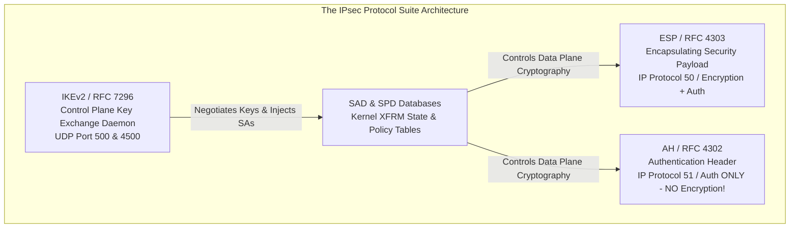
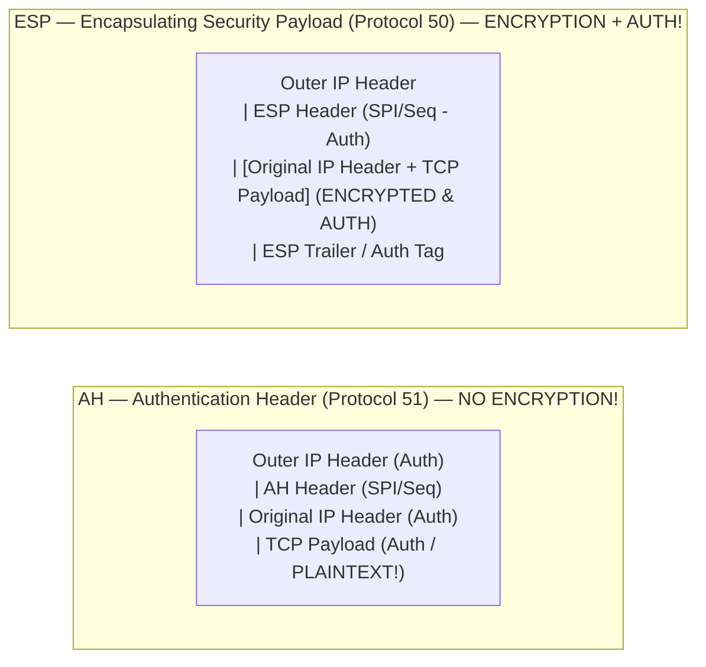
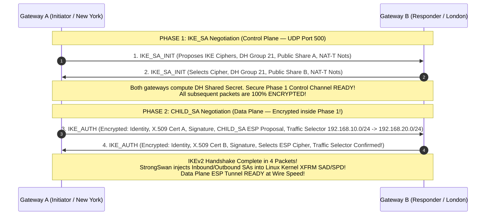
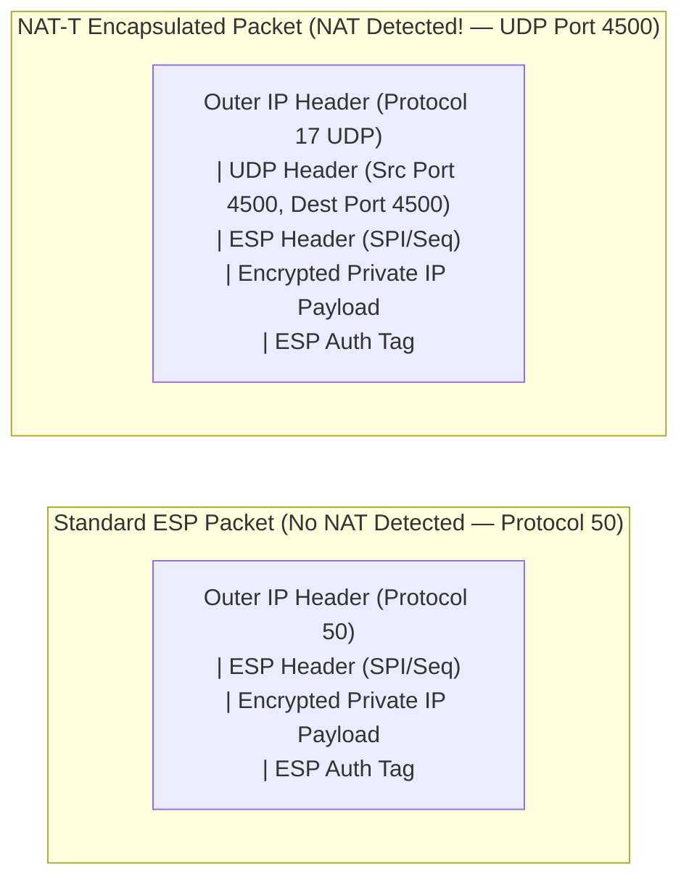

# PART 8 — IPsec Deep Dive

## 1. IPsec Architecture Overview (RFC 4301)
**Internet Protocol Security (IPsec)** is not a single protocol; it is an open, modular suite of cryptographic protocols and frameworks standardized by the IETF to provide data confidentiality, integrity, authentication, and anti-replay protection at **Layer 3 (the Network Layer)**.

Because IPsec operates at Layer 3, it encrypts everything above it in the OSI stack: Layer 4 TCP/UDP headers, port numbers, application payloads, and database queries are completely shielded from public WAN observation.



---

## 2. AH (Authentication Header) vs. ESP (Encapsulating Security Payload)
IPsec provides two distinct data-plane protocols for wrapping network packets: **AH (Protocol 51)** and **ESP (Protocol 50)**.



### 1. AH (Authentication Header — RFC 4302 / IP Protocol 51)
* **Function**: Provides data integrity, data origin authentication, and anti-replay protection for the entire packet.
* **Why AH is Obsolete in Modern VPNs**:
  1. **ZERO ENCRYPTION!**: AH does not encrypt the data payload! A packet wrapped in AH sends your internal HTTP requests and database passwords across the Internet in **clear plaintext**!
  2. **INCOMPATIBLE WITH NAT (Network Address Translation)**: AH calculates its cryptographic integrity hash across the **entire IP packet, including the immutable fields in the Outer IP Header (such as Source and Destination IP addresses!)**. When an AH packet passes through an ISP NAT router or firewall, the NAT device rewrites the public IP address. When the receiving VPN gateway calculates the AH hash, it sees that the IP address changed in transit, declares the packet corrupted/tampered with, and **drops it immediately!** AH can never cross a NAT router!

### 2. ESP (Encapsulating Security Payload — RFC 4303 / IP Protocol 50)
* **Function**: The undisputed workhorse of enterprise VPNs. ESP provides **Data Confidentiality (Encryption)**, Data Origin Authentication, Data Integrity, and Anti-Replay protection!
* **NAT Compatibility**: Unlike AH, ESP calculates its integrity authentication tag *only* over the ESP header and the encrypted payload! It **completely ignores the outer IP header!** Therefore, when a NAT router changes the outer public IP address in transit, the ESP authentication tag remains perfectly valid!
* **In TunnelPoint**: We strictly disable AH and enforce **100% ESP encapsulation** using **`aes256gcm16`**.

---

## 3. Transport Mode vs. Tunnel Mode
IPsec ESP and AH can be deployed in two operational modes depending on network topology:

```
+----------------------------------------------------------------------------------------------------+
| 1. TRANSPORT MODE (Host-to-Host Encryption on Same LAN / Subnet)                                   |
+----------------------------------------------------------------------------------------------------+
| Original IP Header (192.168.10.50 -> 192.168.10.88) | ESP Header | [TCP Payload] Encrypted | ESP Auth|
+----------------------------------------------------------------------------------------------------+

+----------------------------------------------------------------------------------------------------+
| 2. TUNNEL MODE (Site-to-Site VPN Gateways — What TunnelPoint Uses!)                                |
+----------------------------------------------------------------------------------------------------+
| NEW Outer WAN IP Header | ESP Header | [Original Private IP Header + TCP Payload] Encrypted | ESP Auth|
| (203.0.113.10 -> 198.51)|            | (192.168.10.50 -> 192.168.20.50)                     |         |
+----------------------------------------------------------------------------------------------------+
```

### 1. Transport Mode
* **Mechanism**: Encrypts only the Layer 4 payload (e.g., TCP/UDP segment). It **retains the original IP header** intact at the very front of the packet.
* **Use Case**: End-to-end encryption between two servers sitting on the *same local subnet or routable intranet* (e.g., securing database RPCs between two Linux servers inside the same AWS VPC).
* **Why Transport Mode Fails for Site-to-Site VPNs**: If Gateway A used Transport Mode to send a packet from New York (`192.168.10.50`) to London (`192.168.20.50`), the public Internet routers would see an RFC 1918 private destination IP address (`192.168.20.50`) at the front of the packet and drop it instantly as an unroutable bogon!

### 2. Tunnel Mode (The TunnelPoint Standard)
* **Mechanism**: The kernel XFRM engine takes the **entire original IP packet** (including the private source/destination IP headers and payload), encrypts it in bulk, wraps it in an ESP header/trailer, and **prepends a brand new Outer Public IPv4 Header** (`203.0.113.10` $\rightarrow$ `198.51.100.20`)!
* **Use Case**: **Mandatory for all Site-to-Site and Remote Access VPN Gateways!** The public WAN routers route the packet across the ocean purely by reading the outer public IP header, completely blind to the private network IP addresses hidden safely inside the encrypted ESP payload!

---

## 4. IKEv1 vs. IKEv2 (Internet Key Exchange — RFC 7296)
How do two VPN gateways negotiate cryptographic algorithms, authenticate each other's identities, and establish secret session keys before transmitting ESP data packets? Through the **Internet Key Exchange (IKE)** control-plane protocol operating over **UDP Port 500**!

### Why IKEv1 is Obsolete (Main Mode & Aggressive Mode)
Invented in 1998 (RFC 2409), IKEv1 was notoriously complex, slow, and plagued by architectural flaws:
* **Main Mode**: Required **6 sequential UDP packets (3 Round-Trip Times / 3-RTT)** just to establish Phase 1! In high-latency satellite or trans-oceanic links, tunnel setup took seconds!
* **Aggressive Mode**: Reduced setup to 3 packets (1.5-RTT), but **transmitted the identity hash of the gateway in unencrypted cleartext!** Eavesdroppers could capture the hash and run offline dictionary brute-force attacks to crack Pre-Shared Keys (PSKs)!
* **No Built-in NAT Traversal or Dead Peer Detection**: Required bolting on cumbersome proprietary vendor extensions.

### Why IKEv2 is the Enterprise Standard (RFC 7296)
Released in 2005 and updated in RFC 7296, **IKEv2** completely rewrote the protocol into a streamlined, highly secure 4-packet exchange:
1. **Speed (2-RTT Setup)**: Establishes the entire VPN tunnel (both Phase 1 and Phase 2!) in exactly **4 UDP packets (2 Round-Trip Times)**!
2. **Built-in NAT Traversal (NAT-T)** and **Dead Peer Detection (DPD)** natively integrated into the protocol standards.
3. **MOBIKE (RFC 4555 - IKEv2 Mobility and Multihoming)**: Allows a mobile client or multihomed gateway to seamlessly switch WAN IP addresses (e.g., roaming from corporate WiFi to 5G cellular) **without dropping the established IPsec ESP tunnel or forcing a re-authentication!**
4. **Asymmetric Authentication**: Gateway A can authenticate using an X.509 RSA-4096 Certificate, while Gateway B authenticates using ECDSA or a Pre-Shared Key!
5. **EAP (Extensible Authentication Protocol) Integration**: Allows enterprise remote-access gateways to authenticate users directly against corporate Active Directory / RADIUS servers using MFA / SAML!

---

## 5. Security Associations (SAs) & The SPI
In IPsec terminology, a **Security Association (SA)** is a simplex (one-way) logical contract established between two peers, stored in the kernel XFRM Security Association Database (SAD).

Because an SA is strictly one-way (simplex), **establishing a bidirectional TunnelPoint VPN tunnel requires a minimum of TWO Security Associations**:
* **Inbound SA**: Decrypts traffic arriving from peer `198.51.100.20`.
* **Outbound SA**: Encrypts traffic being transmitted to peer `198.51.100.20`.

### What is inside a Security Association (SA)?
When you run `sudo ip xfrm state show`, each SA entry contains:
1. **SPI (Security Parameter Index - 32-Bit Hexadecimal Integer)**: A random number (e.g., `0xC4A201B9`) inserted directly into the ESP header! Why? When Gateway B receives an ESP packet at 10 Gbps, how does it know which decryption key to use? It reads the 32-bit SPI from the ESP header and performs an $O(1)$ hash table lookup in kernel SAD memory to instantly fetch the exact AES-256-GCM session key!
2. **Destination IP Address & Protocol**: The remote WAN endpoint (`198.51.100.20`, Protocol `ESP`).
3. **Cryptographic Keys & Algorithms**: The exact 256-bit AES encryption key, 384-bit HMAC key, and cipher selection (`rfc4106(gcm(aes))`).
4. **Anti-Replay Window Sequence Counter**: A 32-bit or 64-bit sliding window sequence number. Every time Gateway A sends an ESP packet, it increments the sequence number by 1. If a hacker intercepts Packet 100 on the Internet and tries to re-transmit (replay) it 10 minutes later to trick the bank server into processing a duplicate payment, Gateway B checks the anti-replay window, sees that Sequence Number 100 was already processed, and **drops the replayed packet immediately!**
5. **SA Lifetime Timers**: The exact time (in seconds) or data volume (in bytes/kilobytes) remaining before this SA expires and must be rekeyed!

---

## 6. Phase 1 (`IKE_SA`) vs. Phase 2 (`CHILD_SA`)
The IKEv2 negotiation workflow is strictly divided into two distinct sequential phases:



### Phase 1: The Control Plane (`IKE_SA`)
* **Goal**: Establish a secure, authenticated, encrypted control-plane communication channel between the two gateways over **UDP Port 500**.
* **The `IKE_SA_INIT` Exchange (Packets 1 and 2)**: Gateways negotiate IKE cryptographic suites (e.g., `aes256gcm16-prfsha384-ecp384`), exchange Diffie-Hellman public shares, and exchange **NAT Detection Notifications**. By Packet 2, both gateways derive a master control key!
* **The `IKE_AUTH` Exchange (Packets 3 and 4)**: Encrypted inside the newly established Phase 1 channel! Gateways present their identities (`gateway-a.tunnelpoint.io`), exchange and validate **X.509 Digital Certificates**, and verify cryptographic signatures.

### Phase 2: The Data Plane (`CHILD_SA` / IPsec SA)
* **Goal**: Establish the actual high-speed **IPsec ESP Data Tunnel** inside the secure Phase 1 channel!
* **What Happens During `IKE_AUTH`**: While authenticating in Packets 3 and 4, the gateways simultaneously negotiate the **`CHILD_SA`**:
  1. They agree on data-plane ESP ciphers (e.g., `aes256gcm16-ecp384`).
  2. If **Perfect Forward Secrecy (PFS)** is enabled, they execute a **second, brand new Diffie-Hellman exchange (`ecp384`)** specifically to derive independent data encryption keys!
  3. They negotiate **Traffic Selectors** (the exact private LAN subnets permitted across the tunnel: `192.168.10.0/24` $\leftrightarrow$ `192.168.20.0/24`).
  4. StrongSwan injects these SAs into the Linux kernel XFRM engine! The VPN tunnel is operational!

---

## 7. Rekeying, Dead Peer Detection (DPD) & NAT Traversal (NAT-T)

### 1. Seamless Rekeying (Make-Before-Break)
To prevent attackers from gathering enough ciphertext to crack a session key, IPsec SAs must expire and rotate regularly. In TunnelPoint:
* **`IKE_SA` Lifetime**: Set to **4 hours** (`rekey_time = 4h`).
* **`CHILD_SA` Lifetime**: Set to **1 hour** (`rekey_time = 1h`).
* **Make-Before-Break Mechanics**: When the 1-hour timer hits 55 minutes, StrongSwan does *not* tear down the tunnel! It initiates an background `CREATE_CHILD_SA` exchange inside the control channel, negotiating a brand new SPI and AES key pair while live data continues flowing over the old SA! Once the new SA is injected into kernel XFRM, traffic switches over seamlessly with **zero packet loss and zero TCP dropouts**, after which the old SA is deleted!

### 2. Dead Peer Detection (DPD — RFC 3706)
What happens if someone cuts the power cord on London Gateway B or an intermediate ISP fiber cable breaks? Without DPD, Gateway A in New York would keep forwarding LAN packets into a black hole for hours!
* **DPD Operation**: In `swanctl.conf`, we configure `dpd_delay = 30s` and `dpd_timeout = 150s`. Every 30 seconds of inactivity, Gateway A sends an encrypted IKEv2 `INFORMATIONAL` keepalive request (`R-U-THERE`).
* **Failover Trigger**: If Gateway B fails to acknowledge after 150 seconds, StrongSwan declares the peer DEAD, flushes the stale SAs from kernel XFRM, and triggers automated failover scripts (or withdraws BGP routes) to reroute traffic over a secondary backup Internet link!

### 3. NAT Traversal (NAT-T — RFC 3947 / UDP Port 4500)
Why is **NAT Traversal (NAT-T)** the most critical operational mechanism for deploying VPNs in cloud VPCs and behind enterprise firewalls?

#### The Problem: Why Raw ESP (Protocol 50) Breaks Across NAT
When Gateway A sits behind an ISP NAT router (or inside an AWS VPC with an Elastic IP assigned to an Internet Gateway), its local NIC has a private IP (`172.16.0.10`), but its public Internet IP is `203.0.113.10`.
When Gateway A transmits a raw **IPsec ESP packet (IP Protocol 50)**:
1. An ESP packet has an IP header and an ESP header. **THERE IS NO LAYER 4 TCP OR UDP HEADER! THERE ARE NO PORT NUMBERS!**
2. When the packet hits the ISP NAT router, the router attempts to create a PAT (Port Address Translation) mapping in its `conntrack` state table. But without Layer 4 port numbers, how can the NAT router map return traffic back to Gateway A? It cannot! Many NAT firewalls simply drop raw Protocol 50 packets!

#### The Solution: UDP Port 4500 Encapsulation
During the initial `IKE_SA_INIT` exchange on UDP Port 500, both gateways include a payload called **`NAT_DETECTION_SOURCE_IP`** and **`NAT_DETECTION_DESTINATION_IP`** (containing SHA-1 hashes of the sender and receiver IP:Port pairs).
When Gateway B receives the packet, it hashes the actual source IP address in the packet header and compares it to the hash in the payload. If they do not match, **Gateway B instantly knows that a NAT router sits between them and modified the IP address in transit!**



**The Microsecond NAT is Detected**:
1. Both gateways instantly and dynamically shift all control-plane IKE traffic from UDP Port 500 to **UDP Port 4500**!
2. For all data-plane traffic, the Linux kernel XFRM engine automatically **encapsulates the ESP packet inside a UDP Port 4500 header!**
3. Now, when the packet hits the ISP NAT router, the router sees a standard UDP packet with Source Port 4500 and Destination Port 4500! It effortlessly tracks the ports in its `conntrack` table, performs PAT, and forwards the encrypted VPN tunnel reliably across the Internet!

---

## 8. Phase 8 Practical Exercises & Quiz Checkpoint 🏁

### Practical Exercises
1. **Inspecting StrongSwan SAs**: Run `sudo swanctl --list-sas` on your Linux gateway to view active IKE Phase 1 (`IKE_SA`) and Phase 2 (`CHILD_SA`) tunnels, including negotiated ciphers, SPI hex values, and remaining rekey times!
2. **Observing NAT-T in Packet Captures**: Run `sudo tcpdump -nn -i any port 500 or port 4500 or proto 50` on your terminal. When a tunnel initiates across NAT, observe how the handshake starts on port 500 and instantly transitions to UDP port 4500 for all subsequent ESP data transfer!
3. **Inspecting XFRM Anti-Replay Windows**: Run `sudo ip xfrm state show` and locate the `replay-window` parameter and sequence number counters (`seq`, `oseq`) tracking packet transmission in kernel memory.

### Quiz Questions
1. **AH vs. ESP & NAT**: Why is **IPsec Authentication Header (AH - Protocol 51)** mathematically incapable of traversing a Network Address Translation (NAT) router? What specific fields does AH include in its integrity hash that ESP (Protocol 50) completely ignores?
2. **Transport vs. Tunnel Mode**: In an enterprise Site-to-Site VPN connecting New York (`192.168.10.0/24`) to London (`192.168.20.0/24`), why will configuring IPsec in **Transport Mode** cause public Internet routers to immediately drop all VPN traffic? How does **Tunnel Mode** resolve this?
3. **IKEv1 vs. IKEv2 Architecture**: Explain three major architectural superiority factors of **IKEv2 (RFC 7296)** over legacy **IKEv1**. Specifically, how many Round-Trip Times (RTTs) does IKEv2 require for initial tunnel setup compared to IKEv1 Main Mode?
4. **NAT Traversal (NAT-T) Mechanics**: Explain how two StrongSwan VPN gateways detect the presence of an intermediate NAT firewall during the initial `IKE_SA_INIT` handshake on UDP Port 500. Once NAT is detected, what exact Layer 4 protocol and port number does the Linux kernel XFRM engine prepend to all subsequent encrypted ESP data packets?
5. **Security Association (SA) & SPI**: Why is a Security Association (SA) strictly simplex (one-way), requiring at least two SAs for a bidirectional VPN tunnel? When a gateway receives an encapsulated ESP packet at 10 Gbps, explain how the kernel XFRM engine uses the **32-bit Security Parameter Index (SPI)** in the ESP header to execute an $O(1)$ lookup without CPU bottlenecks!
