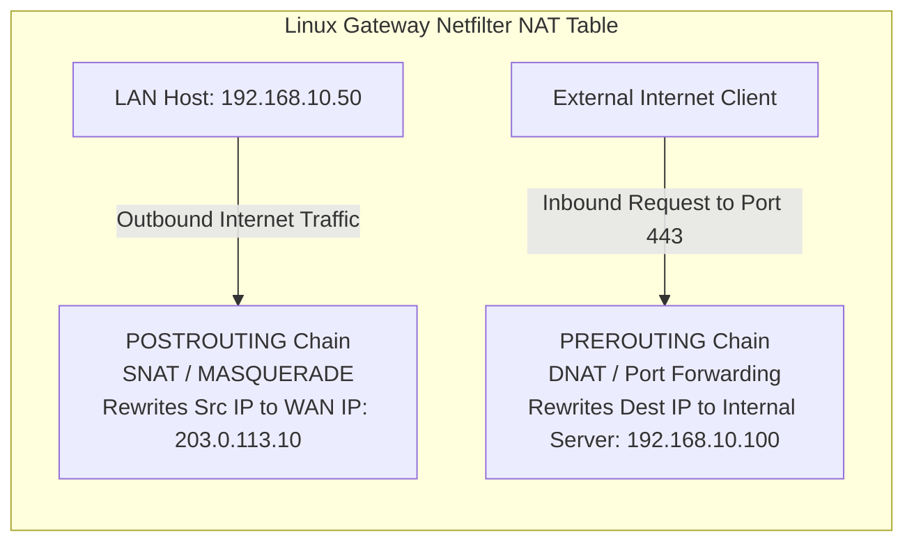
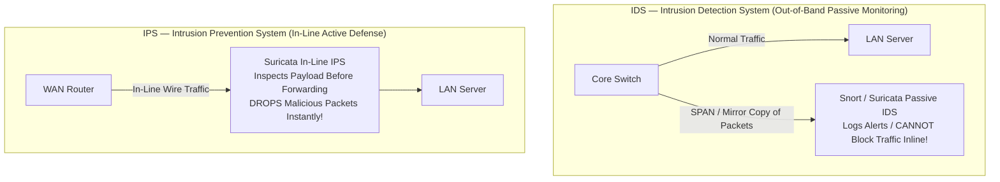

# PART 9 — Firewall, IDS & IPS

## 1. Stateful vs. Stateless Firewalls (Linux Netfilter Architecture)
A **Firewall** is a security enforcement subsystem deployed at network boundaries to monitor, filter, and control ingress and egress traffic based on predefined security policies.

In Linux, packet filtering is implemented via the **Netfilter** kernel architecture, controlled in user space by **`iptables`** (legacy) or **`nftables`** (modern standard).

```mermaid
graph TD
    subgraph "Stateless Packet Filtering (Legacy ACLs — Evaluates isolated packets)"
        PKT1[Incoming Packet: TCP SYN-ACK from 93.184.216.34:443 to 192.168.10.50:54321] --> ACL{Stateless Rule Check:<br>Is Inbound Port 1024-65535 Allowed?}
        ACL -->|If Yes: PERMIT (Even if spoofed by attacker!)| PASS1[Packet Allowed into LAN]
        ACL -->|If No: DROP (Breaks legitimate web browsing!)| DROP1[Packet Dropped]
    end

    subgraph "Stateful Inspection (Linux Netfilter nf_conntrack — Evaluates session state!)"
        PKT2[Incoming Packet: TCP SYN-ACK from 93.184.216.34:443 to 192.168.10.50:54321] --> CONN{Check nf_conntrack State Table in Kernel RAM:<br>Does tuple match an active outbound ESTABLISHED session?}
        CONN -->|Match Found: State ESTABLISHED / RELATED| PASS2[Packet Permitted Automatically without Inbound Rule!]
        CONN -->|No Match Found: State INVALID / NEW unsolicited| DROP2[Packet Dropped Instantly as Spoofed / Attack!]
    end
```

### Why Stateless Firewalls Are Insecure
A **Stateless Firewall** evaluates each packet individually in isolation without any memory or context of previous packets or established connections. It filters purely on Layer 3 and Layer 4 header fields: Source IP, Destination IP, Protocol, Source Port, and Destination Port.
* **The Vulnerability**: When an internal employee at `192.168.10.50` browses an external web server (`93.184.216.34:443`), the employee's OS assigns a random ephemeral source port (`54321`). When the web server replies, the incoming packet is addressed to `192.168.10.50:54321`. To allow this return traffic through a stateless firewall, **an administrator must open inbound TCP ports `1024 - 65535` from the entire Internet back into the corporate LAN!** This leaves the network wide open to external port scanning and spoofed ACK scanning attacks.

### How Linux `nf_conntrack` Powers Stateful Inspection
Modern Linux firewalls rely on Netfilter's connection tracking engine: **`nf_conntrack`**.
* **The State Table**: The kernel maintains a dynamic hash table in RAM (`/proc/net/nf_conntrack`) tracking every active TCP, UDP, and ICMP flow across the system!
* **Connection States**:
  * **`NEW`**: A packet initiating a new connection (e.g., an outbound TCP SYN or an initial IKEv2 UDP 500 packet). Checked strictly against your firewall rules!
  * **`ESTABLISHED`**: A packet belonging to an active session that has already seen bidirectional traffic (e.g., the returning TCP SYN-ACK or subsequent HTTP data). **Permitted automatically by a single stateful firewall rule!**
  * **`RELATED`**: A packet starting a new connection that is dynamically associated with an existing established connection (e.g., an ICMP Type 3 Code 4 Path MTU Discovery error message, or FTP data channels!).
  * **`INVALID`**: A packet that does not match any known connection and does not form a valid new connection (e.g., an unsolicited TCP ACK or out-of-window sequence number). **Always dropped immediately!**

---

## 2. Deep-Dive: NAT, DNAT, SNAT & MASQUERADE in Linux
In our **TunnelPoint VPN Gateway**, we must perform Network Address Translation (NAT) so internal office LAN computers (`192.168.10.0/24`) can access the Internet. However, **we must write strict rules to EXEMPT IPsec VPN traffic from NAT!**



1. **SNAT (Source NAT)**: Configured in the Netfilter `POSTROUTING` hook. Rewrites the private Source IP of outbound packets to our gateway's static public WAN IP (`203.0.113.10`).
2. **MASQUERADE**: A specialized SNAT target for dynamic public WAN interfaces (DHCP/PPPoE modems where the public IP changes). If the WAN interface goes down, MASQUERADE automatically flushes all connection tracking entries so sessions don't get stuck!
3. **DNAT (Destination NAT / Port Forwarding)**: Configured in the Netfilter `PREROUTING` hook. Rewrites the Destination IP of incoming Internet requests (e.g., mapping external public IP `203.0.113.10:443` directly to an internal web server at `192.168.10.100:443`).

---

## 3. Production Firewall Rulesets: `iptables` vs. `nftables`
Below are your complete, line-by-line enterprise firewall rulesets for **TunnelPoint Gateway A**, implemented in both legacy `iptables` and modern `nftables`.

### Option A: The Complete Enterprise `iptables` Ruleset (`/config/firewall/iptables.rules`)
```bash
#!/usr/bin/env bash
# TunnelPoint Enterprise IPTables Firewall & NAT Script (Gateway A)
# Interfaces: WAN = eth0 (203.0.113.10), LAN = eth1 (192.168.10.1/24)
# Remote Office B LAN = 192.168.20.0/24

# 1. Flush existing rules and delete custom chains
iptables -F
iptables -t nat -F
iptables -t mangle -F
iptables -X

# 2. Set Default Policies to DROP! (Zero-Trust Perimeter Defense)
iptables -P INPUT DROP
iptables -P FORWARD DROP
iptables -P OUTPUT ACCEPT

# ==========================================
# INPUT Chain (Traffic destined for Gateway OS itself)
# ==========================================
# Allow loopback interface (essential for local IPC and daemons)
iptables -A INPUT -i lo -j ACCEPT

# Allow ESTABLISHED and RELATED stateful return traffic automatically!
iptables -A INPUT -m conntrack --ctstate ESTABLISHED,RELATED -j ACCEPT

# Drop all INVALID packets immediately
iptables -A INPUT -m conntrack --ctstate INVALID -j DROP

# Allow SSH from Internal LAN only (Never allow SSH from public Internet!)
iptables -A INPUT -i eth1 -p tcp --dport 22 -m conntrack --ctstate NEW -j ACCEPT

# ALLOW STRONGSWAN IKEv2 & IPsec PROTOCOLS FROM PUBLIC WAN!
# UDP Port 500: IKEv2 Key Exchange Handshake
iptables -A INPUT -i eth0 -p udp --dport 500 -j ACCEPT
# UDP Port 4500: IPsec NAT Traversal (NAT-T) ESP Encapsulation
iptables -A INPUT -i eth0 -p udp --dport 4500 -j ACCEPT
# IP Protocol 50: Raw Encapsulating Security Payload (ESP) when no NAT is present
iptables -A INPUT -i eth0 -p esp -j ACCEPT

# Allow ICMP Ping (with rate-limiting to prevent ICMP Flood DoS)
iptables -A INPUT -p icmp --icmp-type echo-request -m limit --limit 5/second -j ACCEPT

# ==========================================
# FORWARD Chain (Traffic passing across Gateway: LAN <-> WAN <-> VPN)
# ==========================================
# Allow ESTABLISHED and RELATED transit traffic
iptables -A FORWARD -m conntrack --ctstate ESTABLISHED,RELATED -j ACCEPT

# ALLOW SITE-TO-SITE VPN TRAFFIC (The XFRM Re-Injection Loop!)
# Allow traffic originating from our LAN heading to Remote Office B LAN across VPN
iptables -A FORWARD -i eth1 -s 192.168.10.0/24 -d 192.168.20.0/24 -j ACCEPT
# Allow decrypted incoming VPN traffic from Remote Office B LAN heading to our LAN
iptables -A FORWARD -s 192.168.20.0/24 -d 192.168.10.0/24 -o eth1 -j ACCEPT

# Allow general Internet browsing from internal LAN out to public WAN
iptables -A FORWARD -i eth1 -o eth0 -s 192.168.10.0/24 -j ACCEPT

# ==========================================
# MANGLE Chain (TCP MSS Clamping to prevent Fragmentation Black Holes!)
# ==========================================
# Dynamically shrink TCP Maximum Segment Size on SYN packets passing across VPN tunnel to match link MTU!
iptables -t mangle -A FORWARD -p tcp --tcp-flags SYN,RST SYN -s 192.168.10.0/24 -d 192.168.20.0/24 -j TCPMSS --clamp-mss-to-pmtu
iptables -t mangle -A FORWARD -p tcp --tcp-flags SYN,RST SYN -s 192.168.20.0/24 -d 192.168.10.0/24 -j TCPMSS --clamp-mss-to-pmtu

# ==========================================
# NAT Table (POSTROUTING - Internet Access & IPsec Exemption!)
# ==========================================
# CRITICAL RULE: EXEMPT IPsec VPN TRAFFIC FROM NAT!
# If traffic is heading from local LAN (192.168.10.0/24) to remote LAN (192.168.20.0/24), ACCEPT it in NAT table WITHOUT translating Source IP!
iptables -t nat -A POSTROUTING -s 192.168.10.0/24 -d 192.168.20.0/24 -j ACCEPT

# Apply SNAT / MASQUERADE to all other general Internet traffic leaving WAN interface eth0!
iptables -t nat -A POSTROUTING -o eth0 -s 192.168.10.0/24 -j MASQUERADE
```

### Option B: The Modern Enterprise `nftables` Equivalent (`/config/firewall/nftables.conf`)
```ini
#!/usr/sbin/nft -f
# TunnelPoint Enterprise nftables Firewall & NAT Configuration (Gateway A)

flush ruleset

table inet filter {
    chain input {
        type filter hook input priority filter; policy drop;

        # Allow loopback
        iifname "lo" accept

        # Allow stateful established/related traffic
        ct state established,related accept
        ct state invalid drop

        # Allow internal LAN SSH
        iifname "eth1" tcp dport 22 ct state new accept

        # ALLOW STRONGSWAN IKEv2 & IPsec PROTOCOLS FROM PUBLIC WAN!
        iifname "eth0" udp dport 500 accept
        iifname "eth0" udp dport 4500 accept
        iifname "eth0" ip protocol esp accept

        # Rate-limited ICMP Ping
        icmp type echo-request limit rate 5/second accept
    }

    chain forward {
        type filter hook forward priority filter; policy drop;

        # Allow stateful established/related traffic
        ct state established,related accept

        # ALLOW SITE-TO-SITE VPN TRAFFIC
        iifname "eth1" ip saddr 192.168.10.0/24 ip daddr 192.168.20.0/24 accept
        ip saddr 192.168.20.0/24 ip daddr 192.168.10.0/24 oifname "eth1" accept

        # Allow general Internet browsing from LAN out WAN
        iifname "eth1" oifname "eth0" ip saddr 192.168.10.0/24 accept
    }

    chain output {
        type filter hook output priority filter; policy accept;
    }
}

table ip nat {
    chain postrouting {
        type nat hook postrouting priority srcnat; policy accept;

        # CRITICAL RULE: EXEMPT IPsec VPN TRAFFIC FROM NAT!
        ip saddr 192.168.10.0/24 ip daddr 192.168.20.0/24 accept

        # Masquerade general Internet traffic out WAN interface
        oifname "eth0" ip saddr 192.168.10.0/24 masquerade
    }
}

table ip mangle {
    chain forward {
        type filter hook forward priority mangle; policy accept;

        # TCP MSS Clamping to prevent MTU fragmentation black holes across VPN tunnel!
        tcp flags & (syn|rst) == syn ip saddr 192.168.10.0/24 ip daddr 192.168.20.0/24 tcp option maxseg size set rt mtu
        tcp flags & (syn|rst) == syn ip saddr 192.168.20.0/24 ip daddr 192.168.10.0/24 tcp option maxseg size set rt mtu
    }
}
```

---

## 4. IDS vs. IPS (Intrusion Detection & Prevention Systems)
While a stateful firewall inspects packet headers (IPs, Ports, States), an **Intrusion Detection/Prevention System (IDS/IPS)** performs **Deep Packet Inspection (DPI)** up to Layer 7, analyzing the actual application payload data to identify zero-day exploits, SQL injections, buffer overflows, and malware command-and-control streams.



### 1. IDS (Intrusion Detection System — Out-of-Band)
* **Deployment**: Connected passively to a switch **SPAN (Switched Port Analyzer) / Mirror Port** or optical network tap.
* **Operation**: The switch sends a duplicate copy of every frame to the IDS. The IDS inspects the payload against threat signatures and generates security alerts in your SIEM (e.g., Splunk, Elasticsearch).
* **Limitation**: Because it sits out-of-band analyzing copies of packets, **an IDS CANNOT block or drop a malicious packet!** By the time the IDS logs an alert, the exploit has already hit the destination server!

### 2. IPS (Intrusion Prevention System — In-Line)
* **Deployment**: Installed directly **in-line** in the active packet forwarding path (either as a Layer 2 bridge or integrated into a Next-Generation Firewall / Router).
* **Operation**: Every single packet must pass through the IPS engine *before* it is forwarded to the destination. If Suricata detects a malicious payload signature (e.g., an Log4j exploit attempt), **the IPS instantly drops the packet, resets the TCP connection (`RST`), and blocks the attacker's IP address!**

### 3. Signature vs. Anomaly Detection
* **Signature-Based Detection**: Compares byte sequences in packet payloads against a database of known exploit patterns (similar to antivirus definitions). Extremely fast and accurate for known malware, but completely blind to brand new zero-day attacks!
* **Anomaly-Based Detection (Behavioral / ML)**: Builds a statistical baseline of normal network behavior (e.g., normal database query volume between 2 AM and 4 AM is 5 MB). If a compromised server suddenly attempts to exfiltrate 50 GB of data to an unknown Russian IP address at 3 AM, the anomaly engine flags and blocks the deviation!

---

## 5. Snort & Suricata Architecture & Rule Syntax
In enterprise Linux environments, **Suricata** and **Snort** are the industry-standard open-source IDS/IPS engines.
* **Why Suricata Dominated Snort 2**: Legacy Snort 2 was single-threaded—it could only utilize 1 CPU core, bottlenecking at ~500 Mbps. Suricata was engineered from day one with a **multi-threaded architecture utilizing `AF_PACKET` and eBPF (Extended Berkeley Packet Filter) zero-copy ring buffers**, scaling effortlessly across 64+ CPU cores to process 40 Gbps+ of wire traffic!

### Anatomy of an IDS/IPS Rule
Whether using Snort or Suricata, signature rules follow a strict syntax structure:
```
alert tcp $EXTERNAL_NET any -> $HOME_NET 22 (msg:"SECURITY ALERT: SSH Brute Force Login Attack Detected"; flags:S; threshold:type threshold, track by_src, count 5, seconds 60; classtype:attempted-recon; sid:1000001; rev:1;)
```
* **Action (`alert`)**: What to do when triggered (`alert`, `log`, `drop`, `reject`). In an inline IPS, changing this to **`drop`** blocks the attack!
* **Protocol (`tcp`)**: Layer 4 protocol to inspect (`tcp`, `udp`, `icmp`, `ip`, `http`, `dns`, `tls`).
* **Source (`$EXTERNAL_NET any`)**: Source IP subnet (defined in `suricata.yaml` as any IP outside corporate LAN) and Source Port (`any`).
* **Direction (`->`)**: Direction of traffic flow (`->` for unidirectional, `<->` for bidirectional).
* **Destination (`$HOME_NET 22`)**: Destination corporate LAN subnet and Destination Port (`22` SSH).
* **Rule Options (Inside parentheses)**:
  * `msg:"..."`: The human-readable security alert logged to the SIEM dashboard.
  * `flags:S;`: Inspect only TCP packets with the **SYN flag** set (connection initiation).
  * `threshold:type threshold, track by_src, count 5, seconds 60;`: **Rate-Limiting Trigger!** Only fire this alert if the exact same source IP sends 5 or more SYN packets to port 22 within a 60-second window! (Prevents alerting on single accidental connection typos).
  * `sid:1000001;`: **Signature ID** (Unique numerical identifier; rules written by administrators must use SIDs $\ge 1,000,000$).
  * `rev:1;`: Revision version of the rule.

---

## 6. Phase 9 Practical Exercises & Quiz Checkpoint 🏁

### Practical Exercises
1. **Firewall Inspection**: Run `sudo iptables -L -n -v --line-numbers` and `sudo iptables -t nat -L -n -v` on your Linux system to inspect live packet counters, connection tracking matches, and NAT postrouting rules.
2. **Conntrack Table Inspection**: View real-time stateful sessions tracked in kernel RAM by running `sudo conntrack -L` or `cat /proc/net/nf_conntrack | head -n 20`. Locate entries marked `ESTABLISHED` and `NEW`!
3. **Simulating IDS Rules**: Create a simple test file containing the word `"MALWARE_TEST_STRING"` and observe how `grep` or file-parsing utilities mimic signature scanning across byte streams.

### Quiz Questions
1. **Stateful vs. Stateless Vulnerabilities**: Why does deploying a stateless packet filter (ACL) on an enterprise WAN edge force administrators to open inbound TCP ports `1024-65535` to the entire public Internet? Explain how Linux `nf_conntrack` eliminates this vulnerability!
2. **The IPsec NAT Exemption Rule**: In our `iptables` NAT table, why must we place the rule `iptables -t nat -A POSTROUTING -s 192.168.10.0/24 -d 192.168.20.0/24 -j ACCEPT` *before* our general `MASQUERADE` rule? What catastrophic failure occurs if VPN traffic is accidentally source-NATted to the public WAN IP before reaching the XFRM encryption engine?
3. **IDS vs. IPS Deployment**: An enterprise CTO asks why we cannot simply plug our new Suricata intrusion prevention box into the core switch's SPAN / Mirror port to block zero-day attacks without risking network latency. As the Senior Infrastructure Architect, how do you explain the architectural difference between out-of-band monitoring and in-line prevention?
4. **Suricata Rule Syntax**: Look at the following IDS rule: `drop tcp any any -> 192.168.10.0/24 5432 (msg:"SQL Injection Attempt"; content:"DROP TABLE"; nocase; sid:1000055; rev:1;)`. If Suricata is deployed as an in-line IPS, what exact action will it take when an external IP sends a packet containing the text `"drop table users"` to port 5432? Why did the string match even though the rule specified uppercase letters?
5. **TCP MSS Clamping in iptables**: Explain the exact purpose of the rule `iptables -t mangle -A FORWARD -p tcp --tcp-flags SYN,RST SYN -j TCPMSS --clamp-mss-to-pmtu` in our VPN gateway. Which Netfilter table and chain does this rule execute in, and why must it inspect packets during the initial TCP SYN handshake?
