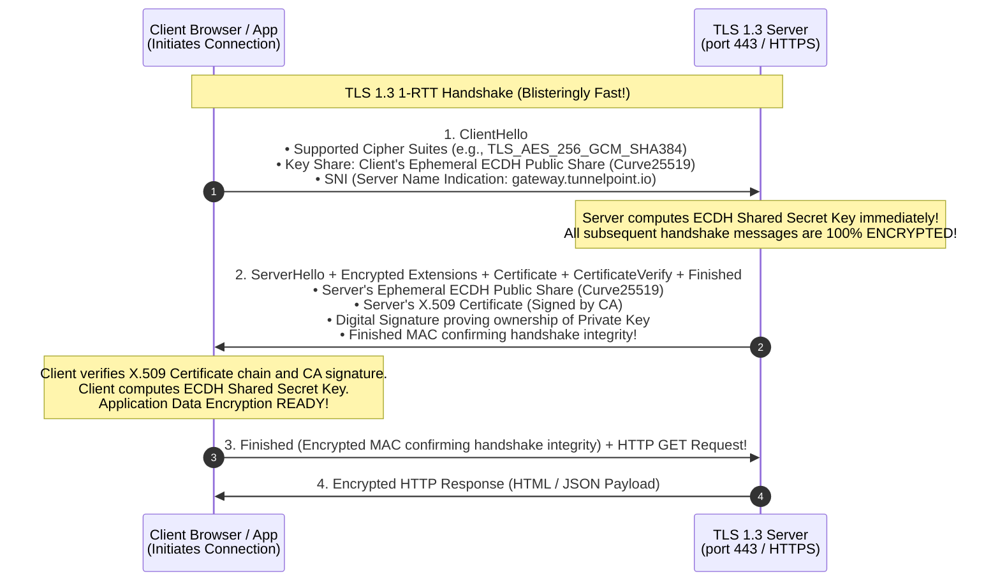
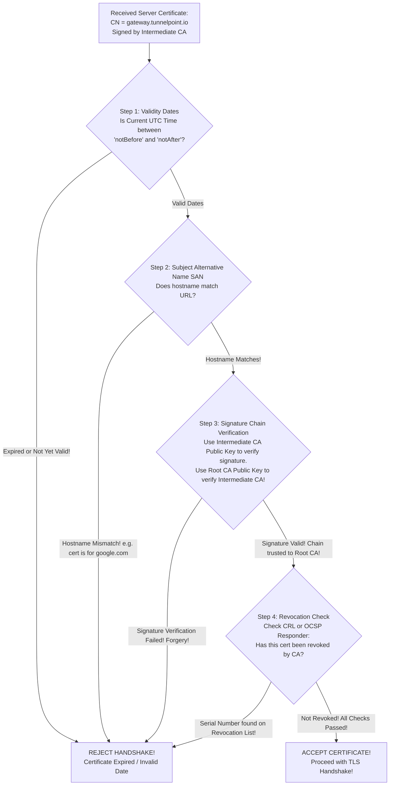

# PART 10 — TLS & HTTPS

## 1. TLS 1.3 Handshake Architecture (RFC 8446)
**Transport Layer Security (TLS)** is the cryptographic protocol that secures application-layer communication across the Internet (powering HTTPS, FTPS, SMTPS, and SSL VPNs).

In 2018, the IETF released **TLS 1.3 (RFC 8446)**, representing the most radical overhaul in the protocol's 25-year history. TLS 1.3 abolished legacy insecure cryptographic primitives (RSA static key exchange, CBC mode ciphers, SHA-1, MD5, RC4) and slashed handshake latency from 2 Round-Trip Times (2-RTT) down to **1 Round-Trip Time (1-RTT)**—and even **0-RTT** for session resumption!



### Why TLS 1.3 Eliminated Static RSA Key Exchange
In legacy TLS 1.2, a client could encrypt a random session key using the server's static X.509 RSA Public Key and send it across the wire.
* **The Fatal Flaw**: This violated **Perfect Forward Secrecy (PFS)**! If an intelligence agency recorded years of encrypted TLS 1.2 web traffic and later stole the server's RSA Private Key, they could retroactively decrypt every single historical session!
* **The TLS 1.3 Mandate**: In TLS 1.3, **static RSA key exchange is completely illegal and banned!** All key exchanges MUST use ephemeral Diffie-Hellman (**ECDHE / Curve25519**). The server's X.509 RSA/ECDSA certificate is used *strictly* for authentication (signing the handshake), guaranteeing 100% Perfect Forward Secrecy across every session!

---

## 2. HTTPS & Mutual TLS (mTLS)
**HTTPS (HTTP over TLS - RFC 2818)** simply encapsulates standard HTTP request/response text messages inside an encrypted TLS byte stream over **TCP Port 443**.

### Standard HTTPS vs. Mutual TLS (mTLS)
* **Standard HTTPS (One-Way Authentication)**: When you visit `https://www.bank.com`, your browser validates the bank's X.509 certificate to prove the server's identity. However, **the bank server does not authenticate your computer!** Anyone on Earth can establish a TLS connection to the bank server; user authentication happens later at Layer 7 via login passwords or session cookies.
* **Mutual TLS (mTLS / Two-Way Authentication)**: In high-security enterprise environments (such as zero-trust Kubernetes service meshes, API gateways, and **TunnelPoint Remote Access VPNs**), one-way authentication is insufficient. In **mTLS**, both the server AND the client present X.509 certificates signed by a trusted corporate Root CA!
  * If a hacker attempts to connect to our API gateway without a valid client certificate signed by our internal PKI, **the TLS handshake is rejected at Layer 4 during the ServerHello phase!** The hacker cannot even reach the HTTP application layer!

---

## 3. Cipher Suites & Session Keys
In TLS 1.3, cipher suites were drastically simplified. A TLS 1.3 cipher suite name defines only two components: **the Authenticated Encryption with Associated Data (AEAD) cipher** and **the HKDF Hash Algorithm**.

### Decoding Standard TLS 1.3 Cipher Suites
1. **`TLS_AES_256_GCM_SHA384`**: Uses 256-bit AES in Galois/Counter Mode (AEAD encryption + auth tag) paired with SHA-384 for Key Derivation (HKDF). **This is our top recommended cipher for enterprise servers with Intel AES-NI hardware acceleration!**
2. **`TLS_CHACHA20_POLY1305_SHA256`**: Uses 256-bit ChaCha20 stream cipher with Poly1305 authenticator paired with SHA-256. **Recommended for mobile clients, IoT endpoints, and routers lacking hardware AES acceleration!**
3. **`TLS_AES_128_GCM_SHA256`**: Uses 128-bit AES-GCM paired with SHA-256. Highly secure and delivers maximum throughput on resource-constrained systems.

---

## 4. X.509 Certificate Validation Workflow
When a client receives a server certificate during step 2 of the TLS handshake, how does it mathematically verify that the certificate is valid and not a forgery?



### The 4 Mandatory Validation Steps
1. **Date Validation**: Checks if current system UTC time falls within the certificate's `notBefore` and `notAfter` timestamps. *(Why NTP time synchronization via `chrony` or `ntpd` is mandatory on VPN gateways—if a server's clock is off by 1 year, all X.509 certificates fail validation!).*
2. **Subject Alternative Name (SAN) Matching**: Checks if the hostname requested by the client (e.g., `gateway-a.tunnelpoint.io`) matches an entry in the certificate's **SAN extension**. *(Note: Matching against the legacy Common Name / CN field was deprecated in RFC 2818; modern browsers and StrongSwan daemons require SAN entries!).*
3. **Cryptographic Chain of Trust Verification**: The client takes the digital signature attached to the server certificate and decrypts it using the **Intermediate CA's Public Key**. It then calculates its own SHA-384 hash of the certificate. If the decrypted hash matches the calculated hash, the signature is genuine! This process repeats up the chain until reaching a **Root CA** installed in the client operating system's trusted root store!
4. **Revocation Checking (CRL & OCSP)**: What if an employee's laptop is stolen? The certificate is valid and unexpired, but must be blocked!
   * **CRL (Certificate Revocation List)**: A text file published by the CA containing serial numbers of revoked certificates. Clients download and check this list.
   * **OCSP (Online Certificate Status Protocol - RFC 6960)**: Instead of downloading a massive CRL file, the client queries an online OCSP responder in real-time: *"Is serial number `0x7AA892...` currently valid?"*

---

## 5. Comprehensive Comparison: TLS vs. IPsec
As an Infrastructure Architect, you will constantly face the interview and architectural question: **"Should we use TLS/SSL or IPsec for our enterprise network?"**

Here is your definitive, senior-level engineering comparison matrix:

| Architectural Metric | TLS / HTTPS (Transport Layer Security - RFC 8446) | IPsec / IKEv2 (Internet Protocol Security - RFC 4301 / 7296) |
| :--- | :--- | :--- |
| **OSI Layer of Operation** | **Layer 4 / Layer 7 (Application & Socket Layer)**. Operates directly above TCP (or UDP via DTLS/QUIC). | **Layer 3 (Network Layer)**. Operates directly on raw IP packets inside the kernel routing table. |
| **Scope of Protection** | **Stream-Specific / Application-Specific**. Encrypts only the specific application socket connection (e.g., one web browser tab communicating with one web server on port 443). | **Network-Wide / Transparent Subnet Overlay**. Encrypts 100% of all traffic flowing between entire office subnets (`192.168.10.0/24` $\leftrightarrow$ `192.168.20.0/24`) regardless of application, port, or protocol! |
| **Application Transparency** | **NOT Transparent**. Applications must be explicitly programmed with TLS libraries (OpenSSL, BoringSSL) or placed behind reverse proxies (Nginx, Envoy) to use TLS. | **100% Transparent**. End-user laptops, database servers, and VoIP phones have zero awareness of IPsec. They send plaintext packets; the Linux kernel XFRM gateway encrypts them transparently! |
| **Execution Space & Performance** | **Ring 3 User Space**. Cryptography runs in user-space libraries. Requires copying data between kernel and user memory buffers, creating CPU overhead at multi-gigabit speeds. | **Ring 0 Kernel Space (XFRM Engine)**. Runs directly inside the Linux kernel data plane with zero-copy `sk_buff` manipulation and hardware AES-NI acceleration, delivering absolute wire-speed throughput! |
| **Firewall & NAT Traversal** | **Effortless**. Operates over standard **TCP Port 443 (HTTPS)**. Passes transparently through 99.9% of corporate firewalls, NAT modems, and proxy servers without special configuration. | **Requires NAT-T**. Uses **UDP Port 500 (IKE)** and **Protocol 50 (ESP)**. When NAT is present, must dynamically switch to **UDP Port 4500 (NAT-T)**. Can be blocked by restrictive hotel or guest firewalls! |
| **Primary Enterprise Use Case** | Securing public web applications (HTTPS), microservice REST/gRPC APIs, mobile app backends, and road-warrior remote access VPNs (OpenVPN / AnyConnect). | **Connecting enterprise data centers, branch office LANs, and cloud VPCs (AWS Transit Gateway / Azure VPN Gateway) via permanent Site-to-Site virtual trunks!** |

---

## 6. Phase 10 Practical Exercises & Quiz Checkpoint 🏁

### Practical Exercises
1. **Inspecting Live TLS Handshakes**: Use OpenSSL's diagnostic client to connect to a live web server and inspect its X.509 certificate chain, negotiated TLS 1.3 cipher suite, and SAN entries:
   ```bash
   openssl s_client -connect www.cloudflare.com:443 -tls1_3
   ```
2. **Inspecting Local Certificate Stores**: On your Linux terminal, check the directory `/etc/ssl/certs/` or `/etc/pki/tls/certs/` to see the hundreds of trusted global Root CA certificates pre-installed in your operating system!
3. **Testing Certificate Expiration & SANs**: Use OpenSSL to parse a local or remote certificate and extract its exact validity dates and Subject Alternative Names:
   ```bash
   echo | openssl s_client -servername google.com -connect google.com:443 2>/dev/null | openssl x509 -noout -dates -ext subjectAltName
   ```

### Quiz Questions
1. **TLS 1.3 vs. TLS 1.2 Key Exchange**: Why did the IETF strictly ban static RSA key exchange in **TLS 1.3 (RFC 8446)**, mandating ephemeral Diffie-Hellman (**ECDHE**) across all sessions? Explain how static RSA key exchange violated Perfect Forward Secrecy (PFS)!
2. **Mutual TLS (mTLS) Architecture**: In a standard HTTPS banking transaction, why does the server authenticate its identity to the client browser using an X.509 certificate, while the browser does *not* present a certificate to the server? Explain a specific enterprise scenario where **Mutual TLS (mTLS)** is mandatory!
3. **Certificate Chain Verification**: When Gateway A receives an X.509 certificate from Gateway B signed by "TunnelPoint Intermediate CA," explain the exact cryptographic mathematics Gateway A executes using public keys and SHA-384 hashes to verify that the certificate is genuine and trusted up to the offline Root CA!
4. **TLS vs. IPsec Scope**: A software engineer asks why we cannot simply use HTTPS/TLS across all our office computers instead of building a complex StrongSwan IPsec Site-to-Site VPN Gateway between New York and London. Give two major architectural reasons why TLS is incapable of replacing an IPsec subnet overlay for enterprise branch connectivity!
5. **The NTP Time Synchronization Flaw**: An administrator deploys a brand new Linux VPN Gateway, generates valid X.509 certificates from the corporate Root CA, but forgets to install and configure an NTP time synchronization daemon (`chrony`). When the gateway attempts an IKEv2 or TLS handshake, the connection fails with a certificate validation error. What exact check in the X.509 validation workflow caused this failure?
